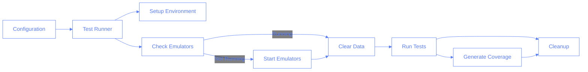
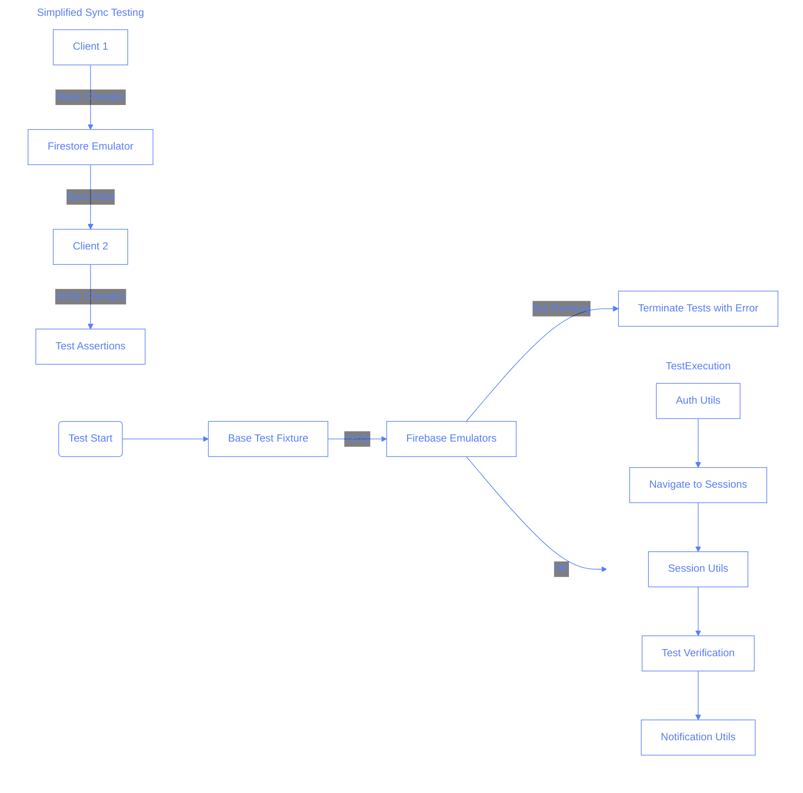

# Pilates Studio App Testing Documentation

## Overview

This document provides comprehensive guidance on testing for the Pilates Studio App. It covers test structure, utilities, best practices, and key testing scenarios.

## Simplified Test Structure

### Directory Organization

```
pilates-studio-app/tests/
├── fixtures/           # Test fixtures and extensions
│   ├── base-test.ts    # Base test with emulator verification
│   └── test-template.ts # Template for new test files
├── setup/              # Global setup for tests
├── sync/               # Tests specific to synchronization features
│   ├── user-sync.spec.ts            # User data synchronization tests
│   └── redux-sync.spec.ts           # Redux state synchronization tests
├── utils/              # Testing utilities and helpers
│   ├── auth.ts             # Authentication utilities
│   ├── emulator.ts         # Firebase emulator utilities (consolidated)
│   ├── notifications.ts    # Toast notification utilities
│   ├── sessions.ts         # Session management utilities
│   └── setupScreenshots.ts # Screenshot utilities
└── [feature].spec.ts   # Individual feature tests
```

### Test Categories

#### Sync Feature Tests

Tests related to the sync feature are in the `sync/` directory:

- `user-sync.spec.ts` - Tests for user data synchronization between different clients

  - Tests creating, updating, and deleting sessions from different users
  - Verifies changes made by one user are visible to another user

- `redux-sync.spec.ts` - Tests for Redux state synchronization
  - Verifies Redux store is properly updated when remote changes occur
  - Tests that temporary and permanent sessions are handled correctly
  - Validates that the Redux middleware correctly processes updates

#### Feature Tests

Individual feature tests in the root directory:

- `session-creation.spec.ts` - Tests for creating new sessions
- `duplicate-session-prevention.spec.ts` - Tests for preventing duplicate sessions
- `navigation.spec.ts` - Tests for navigation within the app
- `firestore-rules.spec.ts` - Tests for Firestore security rules
- `double-save-error-handling.spec.ts` - Tests for handling double-save errors

#### Coverage Tests

Tests for ensuring proper test coverage:

- `coverage-check.spec.ts` - Tests to verify coverage metrics
- `coverage-verification.spec.ts` - Tests to verify critical paths are covered

## What NOT to Test

This section outlines specific scenarios that do not require automated testing:

1. **Simultaneous Edits**: We do not need to test simultaneous editing scenarios as these are not a core feature of our application. Users are not expected to edit the same record simultaneously.

2. **Data Migration**: Migration tests are not necessary as migration happens only once and can be verified visually. We do not need migration persistence tests or any automated testing for migration flows.

3. **Critical Flows as Separate Tests**: Rather than having a separate critical-flows directory, we incorporate critical user flows into the relevant feature tests directly.

4. **Trainee Management**: Trainee addition functionality has been omitted from the application, so we do not need tests related to adding or managing trainees.

## Key Testing Features

### Emulator Verification

All tests rely on Firebase emulators for Firestore and Auth services. The testing framework includes a robust emulator verification system that ensures tests only run when the emulators are properly functioning.

#### Key Features

- **Automatic Verification**: Every test imports and uses our base test fixture that automatically verifies emulators are running.
- **Multiple Verification Methods**: Uses both HTTP requests and port checking for reliable detection.
- **HTTP Status Checking**: Verifies both Firestore (port 8081) and Auth (port 9099) emulators using HTTP requests.
- **Fallback Verification**: Falls back to TCP port checking if HTTP verification fails.
- **Auto-start Capability**: Can automatically start emulators if they're not running.
- **Retry Logic**: Implements automatic retries with exponential backoff to handle temporary service unavailability.
- **Timeout Protection**: Multiple levels of timeouts prevent tests from hanging indefinitely.
- **Clear Error Messages**: Provides detailed logging and error messages for easier debugging.

#### Emulator Utilities

The consolidated `emulator.ts` file in `tests/utils` provides the following key functions:

```typescript
// Check if emulators are running using multiple strategies
checkEmulatorsRunning(): Promise<boolean>

// Ensure emulators are running, starting them if needed
ensureEmulatorsRunning(options?: {
  maxWaitTimeMs?: number;  // Max time to wait for verification
  autoStart?: boolean;     // Whether to start emulators if not running
  maxRetries?: number;     // Max number of restart attempts
  retryDelay?: number;     // Delay between retries
}): Promise<void>

// Clear emulator data
clearEmulator(): Promise<void>

// Seed emulator with test data
seedEmulator(): Promise<void>
```

#### How to Use

For any test file:

```typescript
// Import the base test fixtures instead of directly from Playwright
import { test, expect } from "./fixtures/base-test";

test.describe("My Tests", () => {
	test("should do something", async ({ page, emulatorsRunning }) => {
		// Verify emulators are available (automatically checked by the fixture)
		expect(emulatorsRunning).toBe(true);

		// Test code...
	});
});
```

If you need to use the emulator utilities directly:

```typescript
import { ensureEmulatorsRunning, clearEmulator } from "../utils/emulator";

// In your setup function
await ensureEmulatorsRunning({
	maxWaitTimeMs: 15000,
	autoStart: true,
});

// Clear emulator data before tests
await clearEmulator();
```

### Screenshot Utility

The framework includes a screenshot utility to capture the state of the UI at various points during test execution:

```typescript
// Import the screenshot utility
import { setupScreenshots } from "./utils/setupScreenshots";

test("my test", async ({ page }) => {
	// Set up screenshot utility with test name
	const screenshot = setupScreenshots("test-name");

	// Take screenshots at key points
	await screenshot.take(page, "step-1");
	// ... test steps
	await screenshot.take(page, "step-2");
});
```

The screenshots are saved to the `screenshots/` directory with the following structure:

```
screenshots/
├── [test-name]/
│   └── [timestamp]/
│       └── [screenshot-name].png
```

### Base Test Fixture

The most important improvement is the base test fixture that automatically verifies emulators are running for every test:

```typescript
// fixtures/base-test.ts
import { test as base } from "@playwright/test";
import { ensureEmulatorsRunning } from "../utils/emulator";

// Extend the base test to create a test fixture that ensures emulators are running
export const test = base.extend({
	// Ensure emulators are running before the first test
	emulatorsRunning: [
		async ({}, use) => {
			console.log(
				"🚦 Verifying Firebase emulators are running for this test..."
			);
			await ensureEmulatorsRunning({
				maxWaitTimeMs: 15000,
				autoStart: true,
			});
			console.log("✅ All required emulators are running");
			// Call use() to provide the fixture value
			await use(true);
		},
		{ scope: "worker" },
	],
});

// Re-export expect for convenience
export { expect } from "@playwright/test";
```

This approach means:

1. Every test gets emulator verification automatically
2. Test authors don't need to remember to add verification code
3. Tests have a consistent structure
4. Verification happens once per worker, making tests more efficient

### Test Template

To make it easier to follow the pattern, we provide a template file that test authors can copy:

```typescript
// tests/fixtures/test-template.ts
import { test, expect } from "./base-test";
import { login } from "../utils/auth";
import { setupScreenshots } from "../utils/setupScreenshots";

test.describe("Test Suite Name", () => {
	test("test case name", async ({ page, emulatorsRunning }) => {
		// Ensure emulators are running
		expect(emulatorsRunning).toBe(true);

		// Set up screenshots for test
		const saveScreenshot = setupScreenshots("test-name");

		// Login (if needed)
		await login(page);

		// Test steps go here...
	});
});
```

## Testing Utilities

The testing framework offers several utilities to simplify common testing tasks:

### Authentication

```typescript
// Login helper
import { login } from "./utils/auth";

test("my test", async ({ page }) => {
	await login(page);
	// Test continues after successful login
});
```

### Session Management

```typescript
import {
	addNewSession,
	fillBasicSessionForm,
	selectHour,
} from "./utils/sessions";

test("session creation", async ({ page }) => {
	await addNewSession(page);
	await fillBasicSessionForm(page, { trainee: "John Doe", type: "Private" });
	await selectHour(page, "09:00");
	// Continue with session creation test
});
```

### Notifications

```typescript
import { waitForToastNotification } from "./utils/notifications";

test("error notification", async ({ page }) => {
	// Perform action that should trigger notification
	await page.click("#submit-button");

	// Wait for and verify toast notification
	const notificationShown = await waitForToastNotification(
		page,
		"Session saved successfully"
	);
	expect(notificationShown).toBe(true);
});
```

### Synchronization Utilities

For testing synchronization, specialized utilities help with waiting for sync to complete:

```typescript
import { waitForSyncToComplete } from "./utils/sync";

test("data syncs between clients", async ({ page, context }) => {
	// Make changes in first client
	await addNewSession(page);

	// Open second client
	const secondPage = await context.newPage();
	await login(secondPage);

	// Wait for sync to complete
	await waitForSyncToComplete(secondPage);

	// Verify changes are visible in second client
	// ...
});
```

## Key Testing Scenarios

The following are critical testing scenarios that should be validated:

### Essential Flows

- User login & logout
- Session creation & editing
- Scheduling functionality
- Basic data synchronization between devices (changes by one user visible to others)

### Synchronization Testing

- Data creation, updates, and deletion syncing between clients
- Redux store synchronization with Firestore

### Session Management

- Creating sessions at specific time slots
- Preventing double-booking of time slots
- Editing session details
- Session navigation and pagination
- Session deletion

### User Interface

- Navigation between app sections
- Form validation and submission
- Toast notifications for actions
- Modal dialogs and confirmation flows
- Responsive design across device sizes

## Running Tests

### Running All Tests

To run all tests:

```bash
npm run test
```

To run all Playwright tests:

```bash
npm run test:all
```

### Consolidated Test Runner

The application uses a consolidated TypeScript test runner (`scripts/run-tests.ts`) that replaces multiple shell scripts with a single, flexible approach. This test runner handles all aspects of test execution, including environment setup, emulator verification, and test execution.

#### Architecture



#### Benefits Over Shell Scripts

The consolidated test runner offers several advantages over the previous shell script approach:

1. **Type Safety**: Uses TypeScript for better error detection and IDE support
2. **Improved Configuration**: Supports multiple options with sensible defaults
3. **Code Reuse**: Leverages the consolidated emulator utilities
4. **Better Error Handling**: Structured error handling and reporting
5. **Simplified Maintenance**: One file instead of multiple shell scripts
6. **Integration with package.json**: First-class citizen in the project's workflow
7. **Cross-Platform Compatibility**: Works consistently across different operating systems

#### Implementation Details

The test runner performs the following steps:

1. **Parse configuration** from command line arguments
2. **Set up environment variables** including test-specific settings
3. **Check if emulators are running** using the consolidated emulator utility
4. **Start emulators if needed** and verify they're responsive
5. **Clear emulator data** if configured to do so
6. **Run the requested tests** using Playwright
7. **Generate coverage reports** if coverage is enabled
8. **Clean up resources** including shutting down emulators if started by the runner

### Running Sync Tests

You can run sync tests using:

```bash
# Run all sync tests
npm run test:sync

# Run sync tests with headed browser
npm run test:sync:headed

# Run sync tests with coverage tracking
npm run test:sync:coverage

# Run a specific sync test file
npm run test:sync:file -- --file=user-sync
```

### Test Runner Configuration

The consolidated test runner supports multiple configuration options:

```bash
npm run test:sync -- [options]
```

Available options:

| Option                       | Description                          | Default     |
| ---------------------------- | ------------------------------------ | ----------- |
| `--coverage=true`            | Enable coverage tracking             | false       |
| `--headed=true`              | Run tests with browser visible       | false       |
| `--file=filename`            | Run a specific test file             | (all files) |
| `--debug=true`               | Run tests in debug mode              | false       |
| `--workers=N`                | Number of worker processes           | 1           |
| `--retries=N`                | Number of retries for failed tests   | 1           |
| `--timeout=N`                | Timeout in milliseconds              | 180000      |
| `--clear-data=false`         | Skip clearing emulator data          | true        |
| `--project=name`             | Project to run (sync, critical, all) | all         |
| `--skip-emulator-check=true` | Skip emulator verification           | false       |

### Examples

#### Running Tests for Development

During development, you might want to run tests with the browser visible and debug mode enabled:

```bash
npm run test:sync -- --headed=true --debug=true
```

#### Running Tests for Continuous Integration

For CI environments, you might want to run all tests with coverage and no UI:

```bash
npm run test:sync -- --coverage=true --workers=4
```

#### Running a Single Test File

To focus on a specific test during development:

```bash
npm run test:sync:file -- --file=user-sync --headed=true
```

### Coverage Reports

Coverage reports track which critical paths have been tested. The goal is at least 85% coverage for critical features, with tests verified by:

- `coverage-check.spec.ts` - Verifies coverage metrics
- `coverage-verification.spec.ts` - Verifies critical paths are covered

To generate a coverage report:

```bash
npm run test:sync:coverage
```

### Extending the Test Runner

To add support for new test types or configuration options:

1. Update the `TestRunnerConfig` interface with new options
2. Add case handling in the `parseArgs` function
3. Modify the `getTestFiles` function to support new project types
4. Update package.json with convenient scripts for common configurations

## Best Practices for Writing Tests

1. **Always use the base test fixture**: Import from "./fixtures/base-test" to get automatic emulator verification.
2. **Take frequent screenshots**: Capture UI state at key points for easier debugging.
3. **Use dedicated utility functions**: Prefer the utility functions over writing custom code when possible.
4. **Check emulator status**: Always verify `emulatorsRunning` is `true` before proceeding with tests.
5. **Implement proper timeouts**: Add reasonable timeouts for async operations to prevent test flakiness.
6. **Use multiple selector strategies**: Include fallback selectors for UI elements to improve test robustness.
7. **Implement proper error handling**: Add try/catch blocks for critical operations with appropriate fallbacks.
8. **Provide detailed logging**: Include clear, emoji-prefixed console messages to aid debugging.
9. **Use data-testid attributes**: Add data-testid attributes to components for more reliable selection.
10. **Verify both UI state and Redux state**: For Redux-connected components, check both the UI and the underlying store.
11. **Design independent tests**: Tests should not rely on state from other tests.
12. **Verify actual functionality**: Check for actual functionality, not just the presence of elements.
13. **Focus on common use cases**: Don't test edge cases that are unlikely to occur in real-world usage.
14. **Skip complex concurrent scenarios**: Don't test simultaneous edits or complex race conditions.

## Test Analysis and Debugging

When analyzing failing tests, a systematic approach helps identify root causes quickly and accurately. This section outlines best practices for test analysis derived from real debugging experience.

### Systematic Test Flow Analysis

Follow a structured approach when analyzing failed tests:

1. **Create a sequential step timeline**:

   ```
   Step | Expected Action | Actual Outcome | Evidence
   -----|----------------|----------------|----------
   1    | Navigate to page | Success | Screenshot #1
   2    | Fill form fields | Missing email field | Screenshot #2, logs
   ```

2. **Cross-reference logs with test code**:

   - Match each log entry with its corresponding test step
   - Identify missing steps or unexpected outcomes
   - Look for absence of expected logging as a clue

3. **Analyze screenshots chronologically**:
   - Compare state before and after each action
   - Look for unexpected UI elements or missing components
   - Check for form field values and validation messages

### Form Interaction Verification

For tests involving forms:

1. **Catalog all form fields**:

   - Verify each required input field is present
   - Confirm each field is filled with appropriate values
   - Check for proper sequence (fill fields before submission)

2. **Field interaction checklist**:

   ```
   Field Type | Found? | Filled? | Value Used | Validation Errors
   -----------|--------|---------|------------|------------------
   Email      | Yes/No | Yes/No  | Value      | Any errors
   Password   | Yes/No | Yes/No  | Value      | Any errors
   ```

3. **Verify proper form submission**:
   - Check that all required fields are filled
   - Confirm the submit button was found and clicked
   - Look for submission success/failure indicators

### Success Verification Framework

Implement multi-level verification for critical flows:

1. **Primary verification**:

   - Did the test reach its final assertion point?
   - Was the expected state achieved (e.g., new data created)?

2. **Secondary verification**:

   - Are success indicators present in the UI?
   - Did navigation occur to expected locations?
   - Are authentication tokens or state properly set?

3. **Tertiary verification**:
   - Check for any inconsistencies in system state
   - Verify error logs don't contain unexpected warnings
   - Check that side effects occurred as expected

### Authentication Testing Specifics

For authentication tests:

1. **Complete credential verification**:

   - Verify both email AND password fields are found and filled
   - Check for proper credential values (use standard test credentials)
   - Look for explicit login success indicators

2. **Authentication state checks**:

   - Verify navigation to authenticated-only areas
   - Check for presence of authenticated-only UI elements
   - Verify absence of login prompts after authentication

3. **Auth failure debugging**:

   - Capture detailed state when auth fails (screenshots, logs)
   - Log full page content when selector failures occur
   - Use multiple selector strategies for finding login elements

4. **Standard Test Credentials**:

   ```typescript
   // Always use these test credentials for consistency across tests
   export const TEST_CREDENTIALS = {
   	email: "ASDF@ASDF.com",
   	password: "asdfdsa", // IMPORTANT: Must match what's configured in emulator
   };

   // Example usage in tests
   await login(page, {
   	email: TEST_CREDENTIALS.email,
   	password: TEST_CREDENTIALS.password,
   });
   ```

   > ⚠️ **Important**: If login tests are failing, verify that these credentials match what's configured in the Firebase Auth emulator. Credential mismatches are a common cause of authentication test failures.

### Improved Visual Evidence Usage

Better utilize screenshots for debugging:

1. **Strategic screenshot placement**:

   - Before and after each critical action
   - When entering new pages or states
   - After form completion but before submission
   - After receiving any server response

2. **Screenshot naming conventions**:

   ```typescript
   // Descriptive, action-based screenshot names
   await screenshots.take(page, "pre-login-form");
   await screenshots.take(page, "credentials-filled");
   await screenshots.take(page, "post-login-attempt");
   ```

3. **Compare visual states**:
   - Use screenshots to verify visible state changes
   - Check for error messages or validation indicators
   - Verify UI components appear as expected

### Enhanced Error Context Gathering

Gather maximum context when errors occur:

1. **Rich error logging**:

   ```typescript
   try {
   	// Operation that might fail
   } catch (error) {
   	console.error("❌ Operation failed:", error);
   	console.error("📍 Current URL:", page.url());
   	console.error("📑 Page state:", await getDebugState(page));
   	await screenshots.take(page, "error-state");
   	throw error;
   }
   ```

2. **Debug helper function**:

   ```typescript
   async function getDebugState(page: Page) {
   	return {
   		url: page.url(),
   		title: await page.title(),
   		visibleText: await page.textContent("body").slice(0, 500),
   		formFields: await page.locator("input, select, textarea").count(),
   	};
   }
   ```

3. **Fallback selector strategies**:
   ```typescript
   // Try multiple selector approaches when finding critical elements
   const loginButton = await page.locator("button:has-text('Login')");
   if ((await loginButton.count()) === 0) {
   	// Try alternative selectors
   	const altButton = await page.locator(
   		"[data-testid='login-button'], button[type='submit']"
   	);
   	// Log the fallback attempt
   	console.log(
   		`🔍 Primary selector failed, found ${await altButton.count()} with fallback`
   	);
   }
   ```

### Common Debugging Pitfalls

Avoid these common test analysis mistakes:

1. **Focusing only on the assertion error**:

   - The visible error often occurs far from the root cause
   - Check all steps leading up to the failure

2. **Assuming steps succeeded**:

   - Verify each step has explicit success indicators
   - Don't assume form filling succeeded without verification

3. **Missing required field detection**:

   - Always check all required fields are found and filled
   - For login forms, ensure both username/email AND password are handled

4. **Overlooking timing issues**:

   - Check if actions occur before page is ready
   - Look for missing waits for network requests
   - Verify appropriate timeouts for async operations

5. **Ignoring partial success**:
   - Tests may partially succeed before failing
   - Identify exactly where divergence occurred

### Debugging Tools

The project includes several utilities to help with debugging:

1. **Authentication helper with rich logging**:

   ```typescript
   await login(page, {
   	email: "ASDF@ASDF.com",
   	password: "123",
   	takeScreenshots: true,
   	screenshotPrefix: "auth-debug",
   });
   ```

2. **Enhanced screenshots**:

   ```typescript
   const screenshots = setupScreenshots("debug-session");
   await screenshots.take(page, "initial-state");
   // Perform actions...
   await screenshots.take(page, "after-action");
   ```

3. **Fallback element selectors**:
   ```typescript
   // Try generic selectors when specific ones fail
   if (sessionElements.length === 0) {
   	const cards = await page.locator(".card, [data-testid*='session']").all();
   	console.log(
   		`Found ${cards.length} potential session cards with fallback selector`
   	);
   }
   ```

## Creating New Test Utilities

Consider creating a new utility function when:

1. You find yourself repeating the same code in multiple tests
2. The operation is complex and would benefit from abstraction
3. The functionality might be used in future tests
4. It would make test code more readable by hiding implementation details

## Test Writing Prompt Template

When writing tests using AI assistance, include the following key points in your prompt:

```
Please create a Playwright test for [feature] in the Pilates Studio App. The test should:

1. Import from the base test fixture (./fixtures/base-test)
2. Verify emulators are running via the emulatorsRunning fixture
3. Set up screenshots using setupScreenshots
4. Use the login utility to authenticate
5. Test [specific functionality] with multiple selector strategies
6. Include proper error handling with try/catch blocks
7. Use appropriate utilities from tests/utils/ for common operations
8. Verify results with clear, specific assertions
9. Include detailed console logging for debugging
10. Avoid testing simultaneous edits or migration scenarios
11. Focus on common user workflows rather than edge cases
12. Do not test trainee management functionality as it has been omitted

The test should be placed in the root tests directory and follow our naming convention of [feature].spec.ts.
```

## Answers to Common Test Questions

1. Why use a base test fixture instead of a beforeAll hook?

   - [ ] A. It's faster
   - [x] B. It's automatically applied to all tests that use it and only runs once per worker
   - [ ] C. It's easier to implement
   - [ ] D. It's required by Playwright

2. What happens if the Firebase emulators aren't running?

   - [ ] A. Tests continue but skip emulator-dependent tests
   - [ ] B. Tests continue but may fail later with unclear errors
   - [x] C. Tests terminate immediately with a clear error message
   - [ ] D. Tests pause and wait for emulators to start

3. Why use a two-step processing approach?

   - [ ] A. It's faster
   - [x] B. It's clearer and more maintainable
   - [ ] C. It uses less memory
   - [ ] D. It's required by TypeScript

4. What's the recommended approach for creating a new test file?

   - [ ] A. Write it from scratch
   - [x] B. Copy the test-template.ts file and modify it
   - [ ] C. Duplicate an existing test file
   - [ ] D. Use the Playwright test generator

5. How should UI elements be selected in tests?

   - [ ] A. Using only CSS selectors
   - [ ] B. Using only data-testid attributes
   - [ ] C. Using only role-based selectors
   - [x] D. Using multiple selector strategies with fallbacks

6. Should we test simultaneous edits by multiple users?

   - [ ] A. Yes, it's a critical test scenario
   - [x] B. No, it's not a core feature and doesn't need testing
   - [ ] C. Only if we have extra time
   - [ ] D. Only in production

7. Do we need to test data migration processes?

   - [ ] A. Yes, with automated tests
   - [ ] B. Yes, but only the basics
   - [x] C. No, visual verification is sufficient as it happens once
   - [ ] D. Yes, but only on production databases

8. Should we test trainee management functionality?
   - [ ] A. Yes, it's a core feature
   - [x] B. No, this functionality has been omitted from the application
   - [ ] C. Only the basic trainee listing
   - [ ] D. Only trainee selection in session creation

## Technical Test Architecture Diagram



## Additional Resources

- Playwright documentation: https://playwright.dev/docs/intro
- Firebase Emulator Suite: https://firebase.google.com/docs/emulator-suite
- Code coverage with NYC: https://github.com/istanbuljs/nyc
