# Async State Logging Gotchas in React

## Overview

This document covers a common pitfall when logging React state updates and how to properly debug state changes. We'll explore why immediate logging after state updates might be misleading and the best practices for debugging state changes.

## The Problem: Async State Updates vs Synchronous Logging

### The Diary Analogy

Imagine you're writing in a diary:

- When you first write something (state update), the ink hasn't dried yet (state hasn't updated)
- If you try to read it immediately (console.log), you'll see the old page
- Only after the ink dries (state update completes) can you see your new writing

### Technical Explanation

```mermaid
%%{init: {'theme': 'base', 'themeVariables': {
'primaryColor': '#ffffff',
'primaryTextColor': '#597ef7',
'primaryBorderColor': '#597ef7',
'lineColor': '#597ef7',
'textColor': '#597ef7',
'mainBkg': 'transparent',
'nodeBorder': '#597ef7',
'clusterBkg': 'transparent',
'labelTextColor': '#597ef7',
'titleColor': '#597ef7',
'clusterBorder': '#fff',
'edgeLabelBackground': 'transparent'
}}}%%
graph LR
    A[State Update Triggered] --> B[setState Called]
    B --> C[Console.log Executes]
    C --> D[React Schedules Update]
    D --> E[State Actually Updates]
    style A fill:transparent
    style B fill:transparent
    style C fill:transparent
    style D fill:transparent
    style E fill:transparent
```



### Code Example - The Problem

```typescript
const handleCategoryUpdate = (category: string, value: string) => {
	setSessionForm((prev) => ({
		...prev,
		categories: {
			...prev.categories,
			[category]: value,
		},
	}));
	console.log("session form", sessionForm); // 🚫 Will show old state!
};
```

## The Solution: Proper State Logging

### Best Practices

1. Log inside setState callback
2. Use useEffect for state change monitoring
3. Use proper logging utilities
4. Consider React DevTools for state inspection

### Code Example - The Solution

```typescript
// Solution 1: Log inside setState callback
setSessionForm((prev) => {
	const newState = {
		...prev,
		categories: {
			...prev.categories,
			[category]: value,
		},
	};
	Logger.debug("New session form state:", newState);
	return newState;
});

// Solution 2: Use useEffect
useEffect(() => {
	Logger.debug("Session form updated:", sessionForm);
}, [sessionForm]);
```

### Visual Flow of Correct Logging

```mermaid
%%{init: {'theme': 'base', 'themeVariables': {
'primaryColor': '#ffffff',
'primaryTextColor': '#597ef7',
'primaryBorderColor': '#597ef7',
'lineColor': '#597ef7',
'textColor': '#597ef7',
'mainBkg': 'transparent',
'nodeBorder': '#597ef7',
'clusterBkg': 'transparent',
'labelTextColor': '#597ef7',
'titleColor': '#597ef7',
'clusterBorder': '#fff',
'edgeLabelBackground': 'transparent'
}}}%%
graph LR
    A[State Update Triggered] --> B[setState Called with Callback]
    B --> C[Callback Executes & Logs]
    C --> D[React Updates State]
    D --> E[useEffect Logs Updated State]
    style A fill:transparent
    style B fill:transparent
    style C fill:transparent
    style D fill:transparent
    style E fill:transparent
```



## Comprehension Check

### Question 1: State Updates

Which statement is correct about React state updates?

- [ ] A) State updates are always synchronous
- [x] B) State updates are asynchronous and batched for performance
- [ ] C) Console.log immediately after setState shows the new state
- [ ] D) State updates happen before the next line of code executes

### Question 2: Best Practices

What is the recommended way to debug state updates?

- [ ] A) Use multiple console.log statements after setState
- [ ] B) Use setTimeout to delay logging
- [x] C) Use useEffect or setState callback for logging
- [ ] D) Use alert() to show state changes

### Question 3: Code Implementation

In the following code, what will be logged?

```typescript
setCount(count + 1);
console.log(count);
```

- [x] A) The previous value of count
- [ ] B) The new value of count
- [ ] C) undefined
- [ ] D) An error

### Common Mistake: Logging Wrong Variable in Callback

❌ Wrong way:

```typescript
setSessionForm((prev) => {
	const newState = {
		...prev,
		categories: {
			...prev.categories,
			[category]: value,
		},
	};
	console.log("session form", sessionForm); // 🚫 Still logs old state!
	return newState;
});
```

✅ Correct way:

```typescript
setSessionForm((prev) => {
	const newState = {
		...prev,
		categories: {
			...prev.categories,
			[category]: value,
		},
	};
	console.log("session form (new state):", newState); // ✅ Logs new state
	return newState;
});
```

### Question 4: Callback Logging

When logging inside a setState callback, which variable should you log?

- [ ] A) The current state variable (e.g., sessionForm)
- [ ] B) The prev parameter
- [x] C) The new state object you're returning
- [ ] D) Both A and B

## Key Takeaways

1. React state updates are asynchronous
2. Don't rely on console.log right after setState
3. Use proper logging techniques:
   - setState callback
   - useEffect
   - React DevTools
4. Always use the project's Logger utility for consistent debugging
5. Consider the asynchronous nature of state updates when debugging

## Related Documentation

- [Session State Management](../session-state-management.md)
- [Hooks State Management Lessons](../hooks-state-management-lessons.md)
- [Component State Lessons](../component-state-lessons.md)
