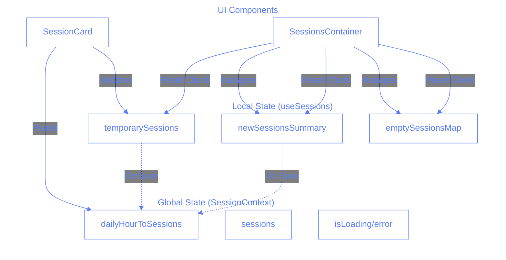
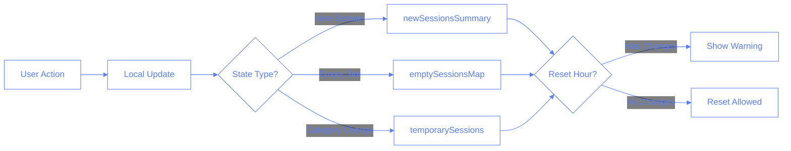
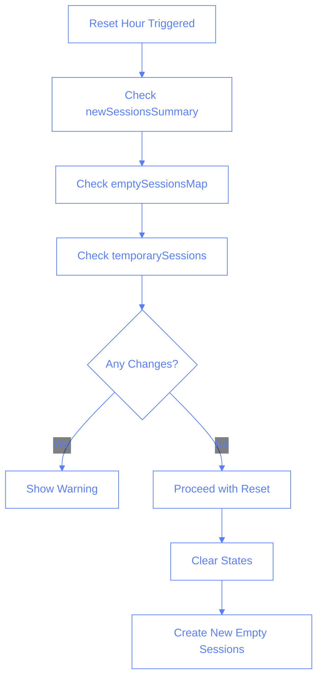

# Local vs Global State Tracking in React

## Overview

This document covers a common pitfall when managing local state changes that need to be tracked globally. We'll explore how to properly coordinate between local component state and global application state.

## The Problem: Local Changes vs Global Awareness

### The Restaurant Analogy

Imagine a restaurant:

- Waiters (Components) take orders on notepads (Local State)
- Kitchen (Global State) needs to know about all pending orders
- Manager (Reset Function) needs to check all orders before closing
- Order tracking system (temporarySessions) keeps track of orders not yet sent to kitchen

### State Management Architecture



### Data Flow - Session Updates



### Reset Hour Check Flow



## The Solution: Using Existing State Management

Instead of creating new state management, we leverage existing patterns:

1. `temporarySessions` in useSessions hook
2. `newSessionsSummary` in SessionsContainer
3. `emptySessionsMap` in SessionsContainer

### Code Example - Reset Hour Check

```typescript
const handleResetHour = () => {
	const hasUnsavedChanges =
		// Check newSessionsSummary
		newSessionsSummary.some((session) => {
			const [, sessionHour] = session.datetime.split(" ");
			return sessionHour === selectedHour && session.traineeId;
		}) ||
		// Check emptySessionsMap
		emptySessionsMap[selectedHour]?.some((session) => session.traineeId) ||
		// Check temporarySessions
		temporarySessions.some((session) => {
			const [, sessionHour] = session.datetime.split(" ");
			return (
				sessionHour === selectedHour &&
				Object.keys(session.categories || {}).length > 0
			);
		});

	if (hasUnsavedChanges) {
		toast({
			title: "Unsaved Changes",
			description: "Please save your changes before resetting.",
			variant: "destructive",
		});
		return;
	}
	// ... proceed with reset
};
```

## Comprehension Check

### Question 1: State Types

Which states need to be checked before resetting an hour?

- [ ] A) Only global state
- [ ] B) Only temporarySessions
- [x] C) temporarySessions, newSessionsSummary, and emptySessionsMap
- [ ] D) Only newSessionsSummary

### Question 2: Change Detection

What constitutes an unsaved change in temporarySessions?

- [ ] A) Any session in the selected hour
- [ ] B) Sessions with a traineeId
- [x] C) Sessions with non-empty categories
- [ ] D) All temporary sessions

### Question 3: State Management

Why do we use multiple state stores instead of one?

- [ ] A) It's a mistake that should be fixed
- [x] B) Each serves a different purpose (temporary changes, new sessions, empty slots)
- [ ] C) To improve performance
- [ ] D) To make debugging easier

## Key Takeaways

1. Use existing state management patterns when possible
2. Different states serve different purposes:
   - `temporarySessions`: Track category changes
   - `newSessionsSummary`: Track new session creation
   - `emptySessionsMap`: Track empty slot assignments
3. Check all relevant states before operations that could lose changes
4. Use proper logging to track state changes
5. Keep state management consistent across similar operations

## Related Documentation

- [Session State Management](../session-state-management.md)
- [Component State Lessons](../component-state-lessons.md)
