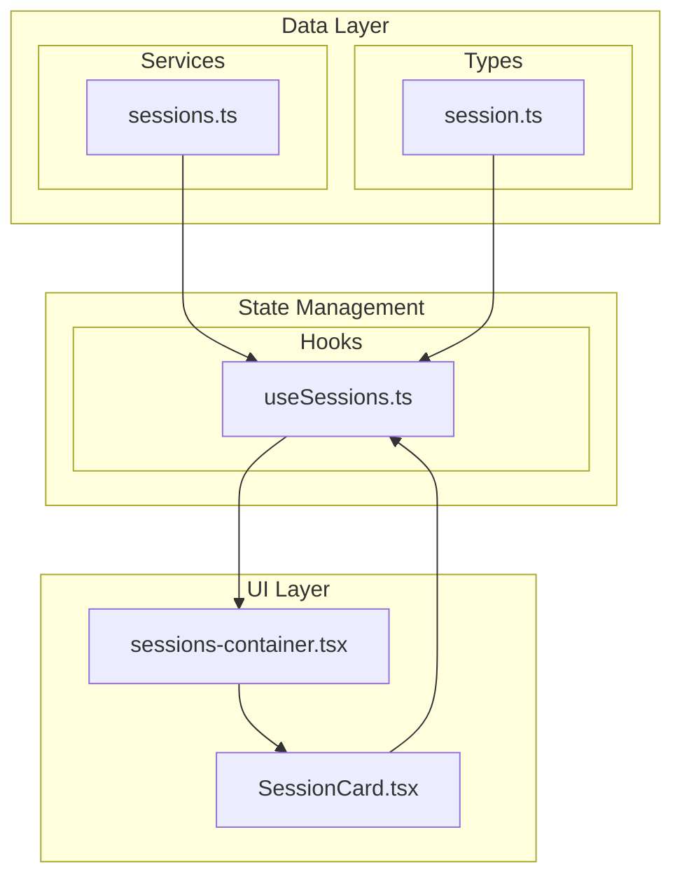
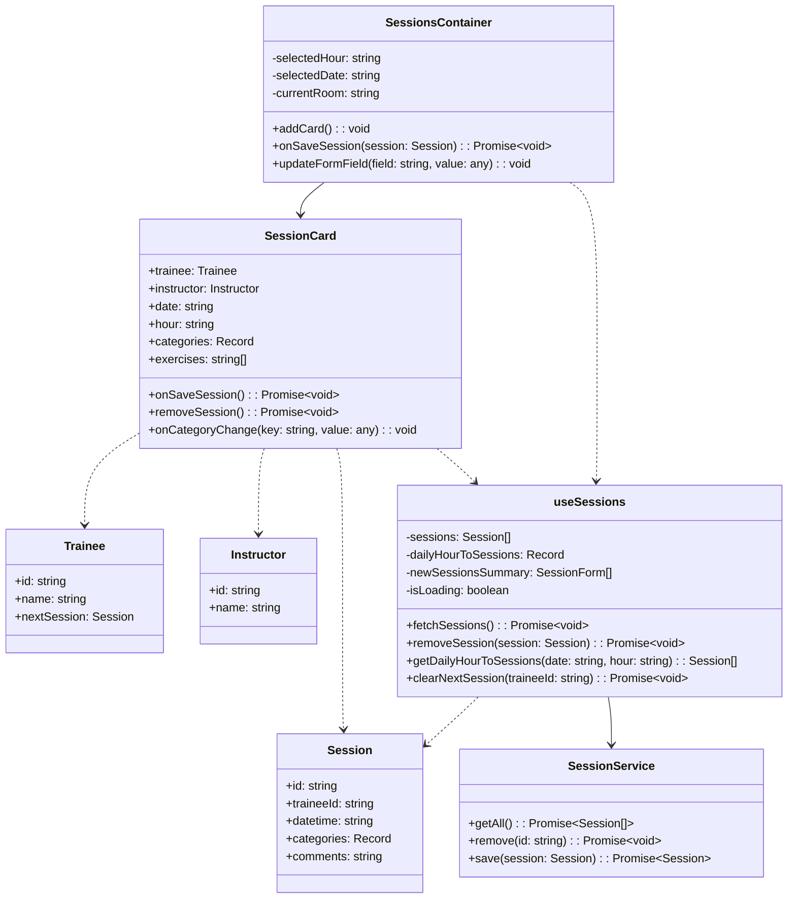

# Refactoring Journey: From Monolith to Modular

## The Basketball Team Analogy 🏀

Imagine our initial `sessions-container.tsx` file was like a star player trying to do everything on the court. They're:

- Managing all the plays (session state)
- Coordinating with every teammate (trainee data)
- Calling all the shots (instructor assignments)
- Even handling ticket sales (UI rendering)

That's exhausting and prone to mistakes!

## What We Did Today 🛠️

### 1. Created Specialized Players (Custom Hooks)

```typescript
// Before: One star player doing everything
const SessionsContainer = () => {
	const [trainees, setTrainees] = useState([]);
	const [instructors, setInstructors] = useState([]);
	const [sessions, setSessions] = useState([]);
	// 700+ lines of mixed responsibilities!
};

// After: Specialized players with clear roles
const SessionsContainer = () => {
	const { trainees } = useTrainees(); // Point Guard
	const { instructors } = useInstructors(); // Shooting Guard
	const { sessions } = useSessions(); // Center
	// Now just ~300 lines focusing on coordination!
};
```

### 2. Our Starting Five (Custom Hooks)

#### Point Guard (`useTrainees.ts`)

```typescript
export function useTrainees() {
	const [traineeIdToTrainee, setTraineeIdToTrainee] = useState({});
	// Handles trainee data management
	return { traineeIdToTrainee };
}
```

#### Shooting Guard (`useInstructors.ts`)

```typescript
export function useInstructors() {
	const [instructors, setInstructors] = useState([]);
	// Manages instructor assignments
	return { instructors };
}
```

#### Center (`useSessions.ts`)

```typescript
export function useSessions(currentRoom: string) {
	const [sessions, setSessions] = useState([]);
	const removeSession = async (session) => {
		/* ... */
	};
	// Core session management logic
	return { sessions, removeSession };
}
```

## Why This Worked 💪

### 1. Single Responsibility

Just like how a point guard focuses on playmaking:

```typescript
// Each hook has ONE clear purpose
function useTrainees() {
	// Only trainee-related logic lives here
}
```

### 2. Better State Management

Like keeping the ball with your best handler, custom hooks help us manage state better in several ways:

#### a) Colocation of State and Logic

```typescript
// File: src/hooks/useSessions.ts
function useSessions() {
  // State and its related operations live together
  const [sessions, setSessions] = useState([]);
  const [dailyHourToSessions, setDailyHourToSessions] = useState({});

  // Operations that modify this state live here too
  const removeSession = async (session) => {
    await sessionsService.remove(session.id);
    setDailyHourToSessions((prev) => /* update logic */);
  };

  return { sessions, dailyHourToSessions, removeSession };
}
```

#### b) Encapsulated State Updates

```typescript
// File: src/pages/sessions-container.tsx
// Before: Component had to know how to update state
const SessionsContainer = () => {
	const [sessions, setSessions] = useState([]);

	const removeSession = async (session) => {
		await sessionsService.remove(session.id);
		setSessions(/* complex update logic */);
	};
};

// After: Component just calls the hook's method
const SessionsContainer = () => {
	const { removeSession } = useSessions();
	// Component doesn't need to know HOW the state is updated
};
```

#### c) Consistent State Updates

```typescript
// File: src/hooks/useSessions.ts
function useSessions() {
	// All state updates for sessions happen in one place
	// This prevents inconsistent state updates across components
	const updateSession = (session) => {
		setSessions(/* ... */);
		setDailyHourToSessions(/* ... */);
		// Any other related state updates
	};
}
```

#### d) Easier State Sharing

```typescript
// Files: src/pages/sessions-container.tsx & src/components/session-card/SessionCard.tsx
// Multiple components can use the same state management
const SessionsPage = () => {
	const { sessions } = useSessions();
};

const SessionCard = () => {
	const { sessions } = useSessions();
};
```

This approach:

- Reduces bugs from inconsistent state updates
- Makes state changes more predictable
- Simplifies component logic
- Makes testing easier since state logic is isolated

### 3. Easier Testing

Like practicing specific plays:

```typescript
test("useTrainees hook", () => {
	const { result } = renderHook(() => useTrainees());
	expect(result.current.traineeIdToTrainee).toBeDefined();
});
```

## State Flow Diagram 📊

Here's how state flows in our refactored application, using `useSessions` as an example:



- **Types** define the shape of our data
- **Services** handle API communication
- **Hooks** manage state and operations
- **Components** use state and trigger actions

## Class Diagram 📐



## Results 📊

1. **Code Size Reduction**

   - sessions-container.tsx: 700+ → ~300 lines
   - Clearer responsibility boundaries
   - Easier to maintain

2. **Better Error Handling**

   - Each hook manages its own errors
   - Clear error boundaries
   - Like each player knowing their recovery moves

3. **Improved Developer Experience**
   - Easier to understand
   - Easier to modify
   - Clear separation of concerns

## Next Steps 🏃‍♂️

1. **Further Hook Extraction**

   - Create useSessionForm for form logic
   - Extract validation logic
   - Like developing specialized plays

2. **Add Error Boundaries**
   - Implement React Error Boundaries
   - Add fallback UI
   - Like having backup plays ready

## Remember 🧠

Just as a basketball team needs different players with specialized skills:

- Don't make one component do everything
- Use custom hooks for specific logic
- Keep components focused on their primary role
- Test each piece independently

The key is to identify distinct responsibilities and create focused hooks that handle them well - just like how each basketball player masters their position!
