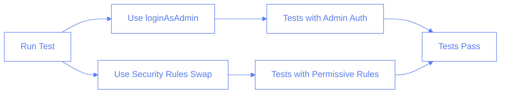

# Authentication and Firestore Testing Guidelines

This document provides guidance on proper authentication for tests that interact with Firestore data in the Pilates Studio app.

## Authentication Requirements

The Pilates Studio app uses Firebase Authentication and Firestore with security rules that require admin permissions for most operations. These security rules are defined in `firestore.rules`:

```javascript
// Allow admin access to everything
match /{document=**} {
  allow read, write: if isAdmin();
}
```

## Choosing the Right Authentication Function

We provide two authentication functions for tests:

### 1. `loginAsAdmin()` (Recommended for Most Tests)

```typescript
// Import
import { loginAsAdmin } from "./utils/auth";

// Usage
await loginAsAdmin(page, {
	navigateToSessions: true,
	takeScreenshots: true,
});
```

**When to use:** Use `loginAsAdmin()` for any test that:

- Accesses Firestore collections
- Creates, reads, updates or deletes sessions
- Works with trainee data
- Needs to update knowledge records
- Requires admin permissions

### 2. `login()` (Limited Use Cases)

```typescript
// Import
import { login } from "./utils/auth";

// Usage
await login(page, {
	email: "user@example.com",
	password: "password",
	navigateToSessions: true,
});
```

**When to use:** Use `login()` ONLY for:

- Tests that do not interact with Firestore
- Tests specifically checking behavior for non-admin users
- UI tests that don't need to persist data

⚠️ **Warning**: Using `login()` for tests that require Firestore access will result in this error:

```
Error fetching temporary sessions: FirebaseError: false for 'list' @ L22
```

## Common Authentication Issues

### Identifying Authentication Problems

If your test is failing with errors like:

- `FirebaseError: false for 'list' @ L22`
- `Access denied: Session data requires admin permissions`
- `Error refreshing temporary sessions: FirebaseError: false for 'list' @ L22`

These indicate that the test is trying to access Firestore collections without admin permissions.

### Resolution

1. Change from `login()` to `loginAsAdmin()`
2. Ensure admin credentials are properly set in the environment
3. Wait for authentication to complete before accessing Firestore

## Testing with Alternative Security Rules

For cases where modifying authentication is not feasible, we provide a mechanism to swap Firestore security rules during testing:

```bash
# Run tests with more permissive rules
npm run test:rules
```

This temporarily replaces the production rules with test-specific rules that allow all operations, then restores the original rules when tests complete.



## Answers

1. What's the primary reason for Firestore access errors in tests?

   - [ ] A. The Firestore emulator is not running
   - [x] B. Using login() instead of loginAsAdmin() for tests that need admin permissions
   - [ ] C. Network connectivity issues
   - [ ] D. Incorrect Firestore collection names

2. When should you use loginAsAdmin() versus login()?

   - [x] A. Use loginAsAdmin() for any test that accesses Firestore collections
   - [ ] B. Use login() for any test that accesses Firestore collections
   - [ ] C. loginAsAdmin() and login() are interchangeable
   - [ ] D. Only use loginAsAdmin() in production

3. What error indicates missing admin permissions in tests?

   - [x] A. "FirebaseError: false for 'list' @ L22"
   - [ ] B. "Network Error: Unable to connect to Firestore"
   - [ ] C. "Invalid credentials"
   - [ ] D. "Timeout waiting for connection"

4. What are two ways to resolve Firestore permission issues in tests?
   - [x] A. Use loginAsAdmin() instead of login()
   - [x] B. Use security rules swapping for testing
   - [ ] C. Disable security rules entirely in production
   - [ ] D. Use a different database for testing
