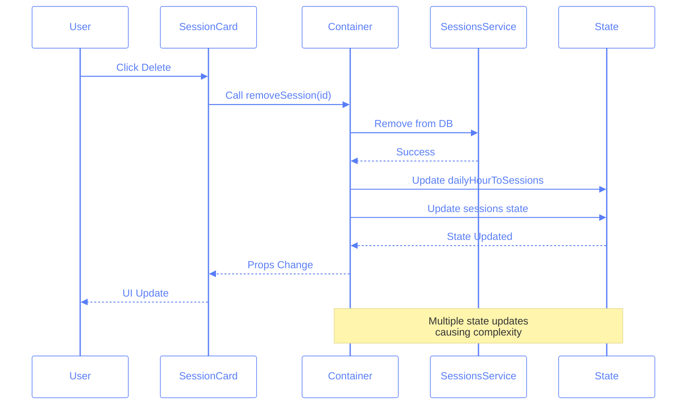
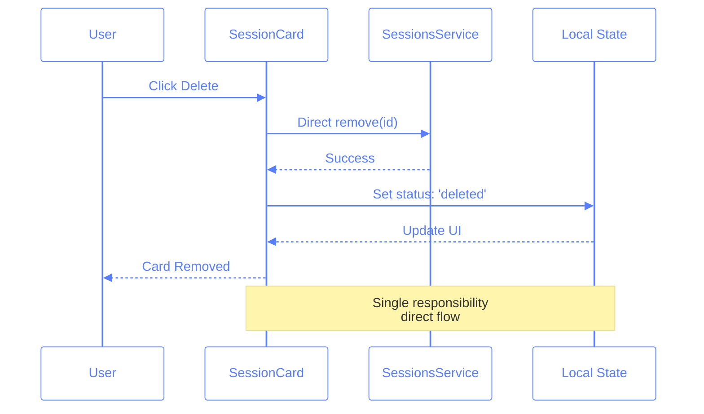
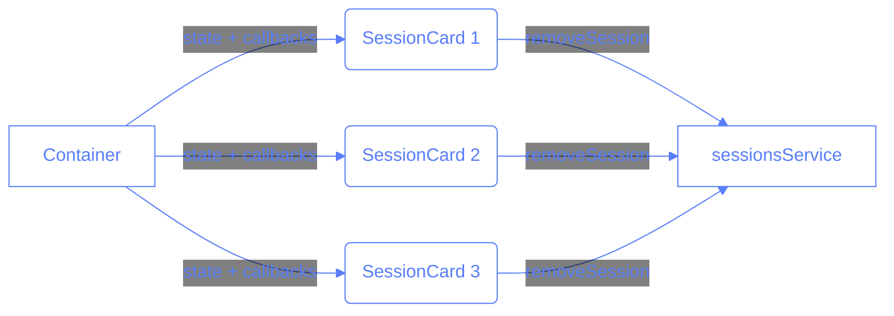
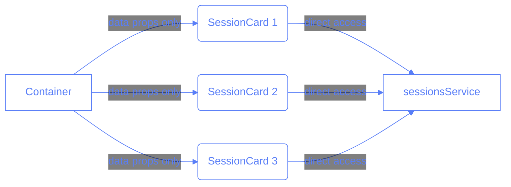

# Component State Management Lessons

## Context: The Session Removal Bug

We encountered a bug where session removal wasn't working properly when managed through the container component. The initial approach was to pass down a removal function from the container to each `SessionCard`. After multiple attempts to fix it through the container, we solved it by moving the removal logic directly into the `SessionCard` component.

### Before: Complex Container-Managed Flow



### Comprehension Check: Flow Patterns

Q: Why was the container-managed flow problematic?

- [ ] A. It was slower in performance
- [x] B. It required multiple state updates and complex synchronization
- [ ] C. It used too many components
- [ ] D. The database calls were inefficient

## The Journey

### Initial Approach (Container-Managed State)

```typescript
// In SessionsContainer
const handleRemoveSession = useCallback(
	async (sessionId: string) => {
		await sessionsService.remove(sessionId);
		setDailyHourToSessions((prev) => {
			// Complex state updates
		});
		setState((prev) => {
			// More state updates
		});
	},
	[
		/* dependencies */
	]
);

// Passing down through props
<SessionCard removeSession={handleRemoveSession} />;
```

### After: Simplified Component-Level Flow



### Comprehension Check: Component-Level Flow

Q: What is the main benefit of the simplified component-level flow?

- [ ] A. Faster database operations
- [ ] B. Better error handling
- [x] C. Direct responsibility and simpler state management
- [ ] D. More reusable components

### Final Solution (Component-Level State)

```typescript
// In SessionCard
const handleRemove = async () => {
	if (!sessionForm.id) return;

	await sessionsService.remove(sessionForm.id);
	setSessionForm((prev) => ({
		...prev,
		status: "deleted",
	}));
};
```

## Component Communication Patterns

### Before: Prop Drilling and State Lifting



### After: Direct Component Responsibility



### Comprehension Check: Communication Patterns

Q: In the improved design, what is the key change in how SessionCards interact with services?

- [ ] A. They use a global state manager
- [x] B. They communicate directly with services instead of through the container
- [ ] C. They don't communicate with services at all
- [ ] D. They use event emitters

## Key Lessons

### 1. State Management Principles

```typescript
// 🚫 Bad: Multiple state objects and updates
const Container = () => {
	const [dailyHourToSessions, setDailyHourToSessions] = useState({});
	const [sessions, setSessions] = useState([]);
	const [errors, setErrors] = useState({});

	const removeSession = (id) => {
		setDailyHourToSessions((prev) => {
			/*complex update*/
		});
		setSessions((prev) => {
			/*another update*/
		});
		setErrors((prev) => {
			/*yet another update*/
		});
	};
};

// ✅ Good: Single responsibility and local state
const SessionCard = () => {
	const [session, setSession] = useState({
		status: "active",
		data: initialData,
	});

	const handleRemove = async () => {
		await sessionsService.remove(session.id);
		setSession((prev) => ({ ...prev, status: "deleted" }));
	};
};
```

### Comprehension Check: State Management

Q: Why is batched state updates preferred over multiple sequential updates?

- [ ] A. It's easier to debug
- [x] B. It reduces unnecessary re-renders and maintains consistency
- [ ] C. It's required by React
- [ ] D. It improves database performance

### 2. Component Design

```typescript
// ❌ Avoid: Complex prop drilling and state management
const ParentComponent = () => {
	const [state, setState] = useState();
	const handleAction = (id) => {
		// Complex state updates
	};
	return <ChildComponent onAction={handleAction} />;
};

// ✅ Better: Component manages its own state
const ChildComponent = () => {
	const [state, setState] = useState();
	const handleAction = async () => {
		// Direct state management
	};
	return <div onClick={handleAction} />;
};
```

### Comprehension Check: Component Design

Q: What is the main advantage of keeping state management within a component?

- [ ] A. Better performance
- [ ] B. Easier debugging
- [x] C. Better encapsulation and reduced coupling between components
- [ ] D. Smaller bundle size

### 3. Closure Considerations

- Be careful with closures in mapped components
- Watch for stale values in callbacks
- Consider passing data instead of functions when possible

### Comprehension Check: Closures

Q: Why can closures be problematic in mapped components?

- [ ] A. They make the code slower
- [x] B. They can capture stale values and cause unexpected behavior
- [ ] C. They increase memory usage
- [ ] D. They break React's rendering cycle

### 4. Service Access

- Direct service access in components is okay when it matches component responsibility
- No need to always proxy through containers
- Consider the component's natural boundaries

### Comprehension Check: Service Access

Q: When should components access services directly?

- [ ] A. Never, always use containers
- [ ] B. Always, for better performance
- [x] C. When it aligns with the component's natural responsibility
- [ ] D. Only in development

## Best Practices Moving Forward

1. **Component Responsibility**

   - Each component should manage its own state when possible
   - Container components should focus on coordination, not micromanagement

2. **State Location**

   ```mermaid
   graph TD
     A[Is the state used by multiple components?]
     B[Keep state in component]
     C[Move state to common ancestor]
     A -->|No| B
     A -->|Yes| C
   ```

3. **Props vs State**

   - Pass data as props when it's truly shared
   - Use local state for component-specific data
   - Avoid prop drilling by reconsidering component boundaries

4. **Service Integration**

   - Allow components to access services directly when it matches their responsibility
   - Use hooks for shared service access patterns
   - Keep service calls close to where they're needed

5. **Testing Implications**
   - Simpler component state = easier testing
   - Fewer props = fewer test cases
   - Clear component boundaries = clear test boundaries

### Comprehension Check: Best Practices

Q: What is the primary consideration when deciding where to place state?

- [ ] A. Always keep it in Redux
- [ ] B. Always keep it in the top-level component
- [x] C. Keep it as close as possible to where it's used
- [ ] D. Always use local state

### Testing Implications

### Comprehension Check: Testing

Q: How does component-level state management affect testing?

- [ ] A. Makes testing impossible
- [ ] B. Requires more integration tests
- [x] C. Makes unit testing easier due to better isolation
- [ ] D. Eliminates the need for mocking

### Comprehension Check: Overall Architecture

Q: What is the key principle we learned from this bug fix?

- [ ] A. Never use container components
- [ ] B. Always use global state management
- [x] C. Keep components focused with clear responsibilities
- [ ] D. Avoid using services directly

## Conclusion

This bug taught us valuable lessons about React component design and state management. The key takeaway is that simpler, more focused components with clear responsibilities are often more maintainable than complex state management systems.

Remember: Just because we _can_ manage state at a higher level doesn't mean we _should_. Let components be responsible for their own state when it makes sense, and only lift state up when there's a clear need for sharing.
