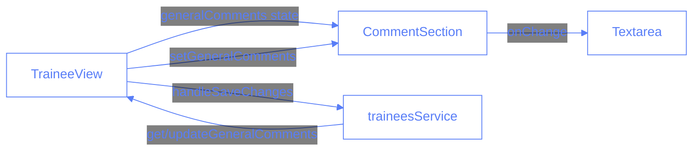
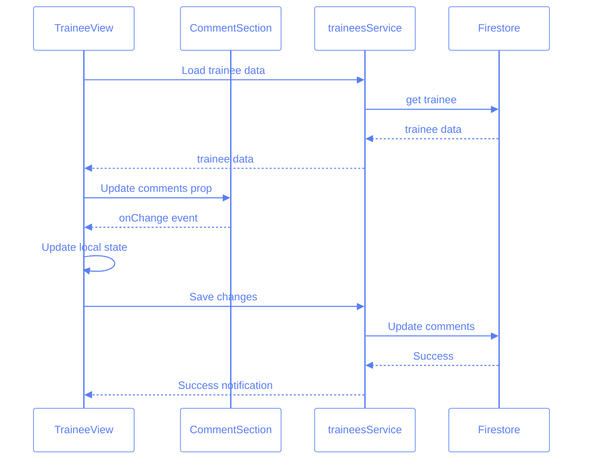

# Comments Component Documentation

## Overview

The Comments component is a reusable textarea component built with shadcn/ui, designed to handle comments throughout the application. It's primarily used for general comments in trainee profiles and session notes.

## Component Structure



## Implementation Details

### 1. Types Definition

```typescript
// @/types/comments.ts
export interface CommentSectionProps {
	/** The comments text content */
	comments: string;
	/** Callback function when comments change */
	onChange: (event: React.ChangeEvent<HTMLTextAreaElement>) => void;
	/** Whether the textarea is disabled */
	disabled?: boolean;
	/** Optional placeholder text */
	placeholder?: string;
	/** Optional CSS classes */
	className?: string;
	/** Optional number of rows */
	rows?: number;
}
```

### 2. Comments Component

```typescript
// @/components/session-card/Comments.tsx
import { Textarea } from "@/components/ui/textarea";
import { cn } from "@/lib/utils";
import { CommentSectionProps } from "@/types/comments";
import React from "react";

const CommentSection: React.FC<CommentSectionProps> = ({
	comments,
	onChange,
	disabled = false,
	placeholder = "Add comments...",
	className,
	rows = 3,
}) => {
	return (
		<Textarea
			value={comments}
			onChange={onChange}
			placeholder={placeholder}
			rows={rows}
			disabled={disabled}
			className={cn(
				"min-h-[80px] resize-none",
				"focus:ring-2 focus:ring-offset-2 focus:ring-primary",
				className
			)}
		/>
	);
};

export default CommentSection;
```

### 3. Integration in TraineeView

```typescript
// Relevant parts from TraineeView.tsx

// State management
const [generalComments, setGeneralComments] = useState("");

// Load trainee data including comments
const loadTraineeData = useCallback(async (traineeId: string) => {
	try {
		const traineeData = await traineesService.get(traineeId);
		Logger.debug("📝 Loaded trainee data:", {
			traineeId,
			generalComments: traineeData?.generalComments,
		});

		if (traineeData) {
			setGeneralComments(traineeData.generalComments || "");
		}
	} catch (error) {
		Logger.error("Failed to load trainee data:", error);
		toast({
			title: "Error",
			description: "Failed to load trainee data",
			variant: "destructive",
		});
	}
}, []);

// Save changes
const handleSaveChanges = async () => {
	try {
		if (currentTrainee?.id) {
			await traineesService.updateGeneralComments(
				currentTrainee.id,
				generalComments
			);
			Logger.debug("💾 General comments saved successfully");
			toast({
				title: "Success",
				description: "Changes saved successfully",
				variant: "success",
			});
		}
	} catch (error) {
		Logger.error("Failed to save changes:", error);
		toast({
			title: "Error",
			description: "Failed to save changes",
			variant: "destructive",
		});
	}
};

// Component usage
<CommentSection
	comments={generalComments}
	onChange={(e) => setGeneralComments(e.target.value)}
	placeholder="Add general comments about the trainee..."
	className="w-full text-base"
	rows={4}
/>;
```

## Data Flow



## Key Features

1. **Reusability**: The component is designed to be used across different parts of the application.
2. **Type Safety**: Full TypeScript support with proper interface definitions.
3. **Styling**: Uses shadcn/ui's Textarea component with customizable styling through className prop.
4. **Error Handling**: Comprehensive error handling with user feedback through toast notifications.
5. **Logging**: Debug logging for tracking data flow and error states.

## Usage Guidelines

1. **State Management**:

   - Comments state should be managed by the parent component
   - Changes are only persisted when explicitly saved

2. **Error Handling**:

   - All service calls should be wrapped in try-catch blocks
   - User feedback should be provided through toast notifications

3. **Styling**:

   - Use the className prop for custom styling
   - Base styles provide a consistent look with shadcn/ui components

4. **Performance**:
   - Comments are loaded only when needed (on trainee selection)
   - Changes are saved only when explicitly requested

## Common Issues and Solutions

1. **Issue**: Comments not loading after trainee selection
   **Solution**: Ensure the `loadTraineeData` function is called in the appropriate useEffect

2. **Issue**: Comments not saving
   **Solution**: Verify the `handleSaveChanges` function is properly connected to the save button

3. **Issue**: Styling inconsistencies
   **Solution**: Use the `cn` utility to properly merge className props
