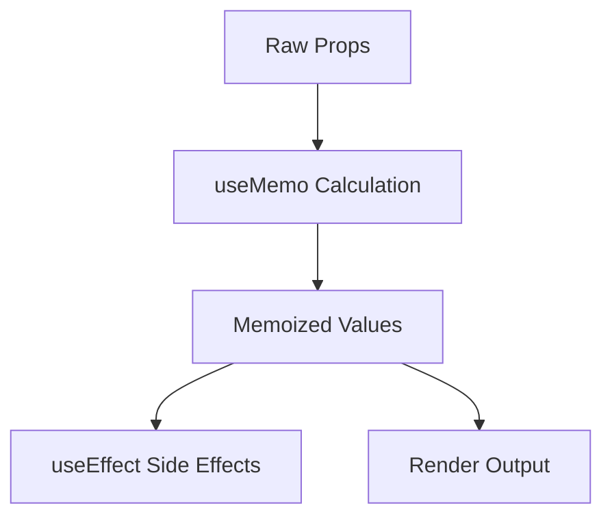

# Memoization Patterns: Trainee Availability Case Study

## What is Memoization?

Imagine a waiter at a busy restaurant who keeps getting asked "What's today's special?". Instead of running to the kitchen each time, they remember (memoize) the answer after asking the first time.

```typescript
// Without memoization (running to the kitchen every time)
function getSpecialDish() {
	return askChef(); // Expensive operation!
}

// With memoization (remembering the answer)
const todaysSpecial = useMemo(() => {
	return askChef(); // Only runs once!
}, []); // Empty array means "never ask again"
```

### Why is it Important?

1. **Performance**: Just like our waiter example, it prevents expensive recalculations
2. **Consistency**: Ensures we get the same result for the same inputs
3. **Battery Life**: Less CPU usage means better battery life on mobile devices

### Simple Example

```typescript
// Without Memoization
function ExpensiveList({ items }) {
	// ❌ Sorts and filters on EVERY render
	const sortedItems = items
		.sort((a, b) => b.price - a.price)
		.filter((item) => item.inStock);

	return (
		<div>
			{sortedItems.map((item) => (
				<Item {...item} />
			))}
		</div>
	);
}

// With Memoization
function EfficientList({ items }) {
	// ✅ Only sorts and filters when items change
	const sortedItems = useMemo(
		() =>
			items.sort((a, b) => b.price - a.price).filter((item) => item.inStock),
		[items]
	);

	return (
		<div>
			{sortedItems.map((item) => (
				<Item {...item} />
			))}
		</div>
	);
}
```

## The Problem

Our trainee availability system was re-calculating and logging available trainees on every render, even when typing comments or making unrelated changes. This caused:

1. Unnecessary calculations
2. Console spam
3. Potential performance issues

## The Solution Journey

### 1. Initial State (The Problem)

```typescript
const TraineeDropdown = memo(({ traineeOptions, sameHourPeople = [] }) => {
	// ❌ Calculated and logged on EVERY render
	const availableTrainees = traineeOptions.filter(
		(option) => !sameHourPeople.some((person) => person.id === option.id)
	);

	console.log(
		"non available trainees",
		traineeOptions
			.filter((option) =>
				sameHourPeople.some((person) => person.id === option.id)
			)
			.map((a) => `${a.firstName} ${a.lastName}`)
	);

	return <Select options={availableTrainees} />;
});
```

### 2. First Attempt (Partial Fix)

```typescript
const TraineeDropdown = memo(({ traineeOptions, sameHourPeople = [] }) => {
	// ✅ Calculations memoized
	// ❌ But still logging on every render
	const { availableTrainees, nonAvailableTrainees } = useMemo(() => {
		const nonAvailable = traineeOptions
			.filter((option) =>
				sameHourPeople.some((person) => person.id === option.id)
			)
			.map((a) => `${a.firstName} ${a.lastName}`);

		console.log("Trainee availability:", {
			// Still logs every render!
			available: available.map((a) => `${a.firstName} ${a.lastName}`),
			nonAvailable,
			total: traineeOptions.length,
		});

		return { availableTrainees: available, nonAvailableTrainees: nonAvailable };
	}, [traineeOptions, sameHourPeople]);

	return <Select options={availableTrainees} />;
});
```

### 3. Final Solution (Complete Fix)

```typescript
const TraineeDropdown = memo(({ traineeOptions, sameHourPeople = [] }) => {
	// ✅ Calculations memoized
	const { availableTrainees, nonAvailableTrainees } = useMemo(() => {
		const nonAvailable = traineeOptions
			.filter((option) =>
				sameHourPeople.some((person) => person.id === option.id)
			)
			.map((a) => `${a.firstName} ${a.lastName}`);

		const available = traineeOptions.filter(
			(option) => !sameHourPeople.some((person) => person.id === option.id)
		);

		return { availableTrainees: available, nonAvailableTrainees: nonAvailable };
	}, [traineeOptions, sameHourPeople]);

	// ✅ Logging only when numbers actually change
	useEffect(() => {
		console.log("Trainee availability:", {
			available: availableTrainees.map((a) => `${a.firstName} ${a.lastName}`),
			nonAvailable: nonAvailableTrainees,
			total: traineeOptions.length,
		});
	}, [
		availableTrainees.length,
		nonAvailableTrainees.length,
		traineeOptions.length,
	]);

	return <Select options={availableTrainees} />;
});
```

## Key Concepts

### 1. Separation of Concerns

```typescript
// Computation
const { availableTrainees, nonAvailableTrainees } = useMemo(() => {
	// Pure calculation logic
}, [dependencies]);

// Side Effects
useEffect(() => {
	// Logging and other side effects
}, [dependencies]);
```

### 2. Dependency Selection

```typescript
// ❌ Wrong: Using full arrays as dependencies
useEffect(() => {}, [availableTrainees, nonAvailableTrainees]);

// ✅ Right: Using only what matters (lengths)
useEffect(() => {}, [
	availableTrainees.length,
	nonAvailableTrainees.length,
	traineeOptions.length,
]);
```

### 3. Memoization Chain



## Best Practices

1. **Separate Calculations from Side Effects**

   ```typescript
   // ❌ Don't mix
   const result = useMemo(() => {
   	console.log("calculating..."); // Side effect in useMemo!
   	return someExpensiveCalculation();
   }, []);

   // ✅ Do separate
   const result = useMemo(() => someExpensiveCalculation(), []);

   useEffect(() => {
   	console.log("calculation changed:", result);
   }, [result]);
   ```

2. **Choose Dependencies Carefully**

   ```typescript
   // ❌ Too many dependencies
   useEffect(() => {}, [obj1, obj2, arr1, arr2]);

   // ✅ Only what's needed
   useEffect(() => {}, [obj1.id, arr1.length]);
   ```

3. **Use Primitive Values When Possible**

   ```typescript
   // ❌ Object/Array dependencies
   const [users, setUsers] = useState([]);
   useEffect(() => {}, [users]);

   // ✅ Primitive dependencies
   useEffect(() => {}, [users.length]);
   ```

## Common Pitfalls

1. **Creating New Arrays in Dependencies**

   ```typescript
   // ❌ Creates new array every render
   useEffect(() => {}, [traineeOptions.map((t) => t.id)]);

   // ✅ Use length or memoize the mapping
   const traineeIds = useMemo(
   	() => traineeOptions.map((t) => t.id),
   	[traineeOptions]
   );
   useEffect(() => {}, [traineeIds]);
   ```

2. **Unnecessary Memoization**

   ```typescript
   // ❌ Simple calculations don't need memoization
   const total = useMemo(() => a + b, [a, b]);

   // ✅ Complex calculations do
   const filtered = useMemo(() => expensiveFilter(largeArray), [largeArray]);
   ```

## Related Concepts

- [Session Management](./session-management.md)
- [Performance Optimizations](../technical/performance.md)
- [React Hooks Best Practices](../best-practices/hooks.md)
