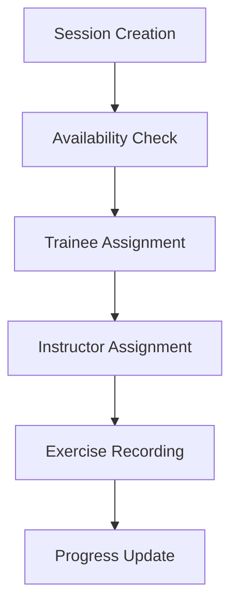

# Session Management

## Overview

The session management system is a core part of the Pilates Studio App, handling how training sessions are created, scheduled, and managed. It includes both the daily schedule view and individual trainee history.

## Key Components

### 1. Session Data Structure

```typescript
interface Session {
	id: string;
	timestamp: number;
	traineeId: string;
	instructorId: string;
	categories: Record<string, string[]>;
	comments: string;
	exercises: string[];
}
```

### 2. Session Organization

Sessions are organized in two main ways:

- **By Hour**: For daily scheduling (used in `SessionsContainer`)
- **By Trainee**: For trainee history and progress tracking (used in `TraineeView`)

### 3. Session States

A session can be in different states:

- **Empty**: Initial state when a slot is available
- **Scheduled**: Has assigned trainee and instructor
- **Completed**: Has exercises and categories recorded
- **Historical**: Past sessions used for progress tracking

## Core Features

### 1. Daily Schedule Management

```typescript
const dailyHourToSessions = {
	9: [
		/* morning sessions */
	],
	10: [
		/* mid-morning sessions */
	],
	// ... other hours
};
```

- Maximum 6 sessions per hour
- Real-time trainee availability checking
- Instructor assignment

### 2. Session Card System

Each session is represented by a card that:

- Shows trainee and instructor information
- Manages exercise categories
- Handles comments and progress notes
- Prevents scheduling conflicts

### 3. Trainee Progress Tracking

- Records exercises performed
- Maintains category progression
- Stores instructor comments
- Builds knowledge base of trainee capabilities

## Implementation Details

### 1. Session Creation

```typescript
const handleAddSession = () => {
	const newSession = {
		id: crypto.randomUUID(),
		timestamp: new Date(selectedDate).setHours(selectedHour),
		traineeId: "",
		instructorId: "",
		categories: {},
		comments: "",
		exercises: [],
	};
	// Add to session list
};
```

### 2. Availability Management

- Tracks occupied time slots
- Prevents double-booking
- Manages instructor schedules
- Handles session conflicts

### 3. Data Flow



## Best Practices

1. **Session Creation**

   - Always validate time slot availability
   - Check instructor availability
   - Verify trainee scheduling conflicts

2. **Data Management**

   - Keep sessions ordered by timestamp
   - Maintain consistent category structure
   - Preserve historical data for progress tracking

3. **UI Interactions**
   - Provide immediate feedback on scheduling
   - Show clear availability status
   - Enable easy session modification

## Common Use Cases

1. **Adding a New Session**

   ```typescript
   // 1. Check availability
   const isSlotAvailable = checkAvailability(hour);

   // 2. Create session if available
   if (isSlotAvailable) {
   	createNewSession(hour);
   }
   ```

2. **Modifying Existing Sessions**

   ```typescript
   // Update session details
   const updateSession = (sessionId, updates) => {
   	// Validate updates
   	// Apply changes
   	// Refresh view
   };
   ```

3. **Historical Analysis**
   ```typescript
   // Get trainee history
   const traineeHistory = sessions
   	.filter((session) => session.traineeId === traineeId)
   	.sort((a, b) => b.timestamp - a.timestamp);
   ```

## Related Concepts

- [Trainee Knowledge System](./trainee-knowledge.md)
- [Scheduling System](./scheduling.md)
- [Data Structures](../technical/data-structures.md)
