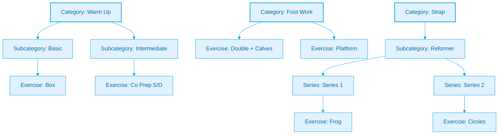

# Exercise Data Structure

## Overview

The Pilates Studio App uses a hierarchical structure to organize exercises, with three main levels:

1. Categories (required)
2. Subcategories (optional)
3. Series (optional)

## Categories

All exercises must belong to one of these categories:

- Warm Up
- Abdominal
- Spinal
- FBI (Full Body Integration)
- Strap
- Foot Work
- Arm
- Back
- Extra Leg

## Subcategories

Some categories have subcategories based on equipment or method:

- Reformer
- Cadillac
- W.C. (Wall Chair)
- Buso/S.C.
- Mat
- Basic
- Intermediate
- Advanced
- Variations

Note: Not all categories use subcategories. For example, 'Arm' and 'Back' exercises are organized directly under their categories.

## Series

Series are used primarily in certain subcategories (like Strap exercises) to group related exercises:

- Series 1, 2, 3, 4
- Basic
- Intermediate
- Advanced

## Data Structure

```typescript
// Exercise Interface
interface Exercise {
	id?: string;
	category: string; // Required: Main category
	subcategory?: string; // Optional: Equipment/method
	series?: string; // Optional: Series within subcategory
	exercise: string; // Required: Exercise name
}
```

## Example Structure



## Usage Guidelines

1. **Category Assignment**

   - Every exercise MUST have a category
   - Categories are predefined and cannot be modified without code changes

2. **Subcategories**

   - Only use subcategories where appropriate
   - Some categories (like Arm, Back) don't use subcategories

3. **Series**

   - Series are optional and mainly used in specific subcategories
   - Not all subcategories need series

4. **Exercise Names**

   - Should be clear and consistent
   - Use standard terminology from Pilates practice
