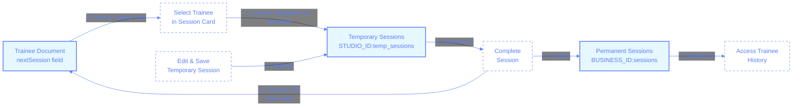

# Session Types and Relationships

## Overview

The Pilates Studio App manages three distinct types of session data, each serving a different purpose in the flow of training management:

1. **Temporary Sessions** - Planning sessions that appear on the schedule but haven't been completed
2. **Permanent Sessions** - Historical record of completed sessions
3. **Next Session Data** - Template stored with each trainee for their future sessions

This document explains the relationship between these session types and how data flows between them.

## Data Relationship Diagram

The following diagram illustrates how these three session types relate to each other and the flow of data between them:

## Data Flow Process

1. **Creating a Temporary Session**:

   - When an instructor selects a trainee for a session slot, a temporary session is created
   - The trainee's next session data is used as a template to pre-populate the temporary session
   - This temporary session is stored in the `STUDIO_ID:temp_sessions` collection

2. **Modifying a Temporary Session**:

   - Changes to a temporary session only affect that specific session
   - The trainee's next session data remains unchanged
   - Multiple temporary sessions can exist for the same trainee with different time slots

3. **Completing a Session**:

   - When a session is marked as completed:
     - A permanent record is created in the `BUSINESS_ID:sessions` collection
     - The trainee's next session data is updated with the current session's categories
     - The temporary session is removed from `STUDIO_ID:temp_sessions`

4. **Next Session Usage**:
   - Next session data serves as a template for future sessions
   - It's stored directly in the trainee document
   - It's updated only when a session is completed or manually edited

## Collection Structure

- **Temporary Sessions**: `${STUDIO_ID}:temp_sessions`

  - Studio-specific (visible only within that studio)
  - Intended for planning and scheduling
  - Contains datetime and room information

- **Permanent Sessions**: `${BUSINESS_ID}:sessions`

  - Business-wide historical record
  - Contains completed session data
  - Used for reporting and tracking progress

- **Next Session Data**: Field within trainee document in `${BUSINESS_ID}:trainees`
  - Business-wide trainee data
  - Contains only category and exercise information
  - Used as a template for future sessions

## Answers

1. Why are there three different types of session data?

   - [ ] A. Redundancy for data backup
   - [ ] B. To support different client platforms
   - [x] C. To serve different functional needs (planning, history, templates)
   - [ ] D. Legacy code requirements

2. What happens to a temporary session when it's completed?

   - [ ] A. It's kept for reference
   - [x] B. It's removed, and a permanent session is created
   - [ ] C. It's just marked as completed
   - [ ] D. It's archived in a different collection

3. When is a trainee's next session data updated?

   - [ ] A. Automatically every day
   - [ ] B. When viewing a trainee profile
   - [x] C. When a session is completed or manually edited
   - [ ] D. It's never automatically updated

4. Can multiple temporary sessions exist for the same trainee?
   - [x] A. Yes, for different time slots
   - [ ] B. No, only one per trainee
   - [ ] C. Only if they're in different studios
   - [ ] D. Only in test mode
