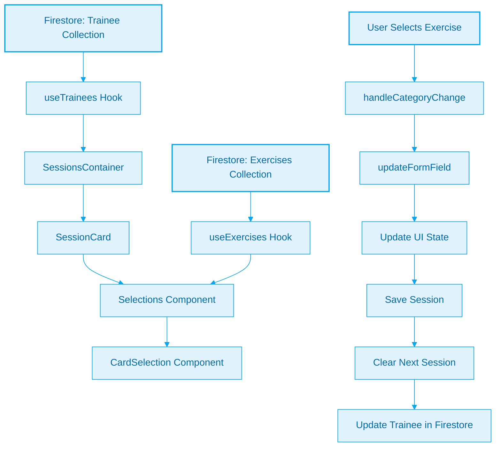
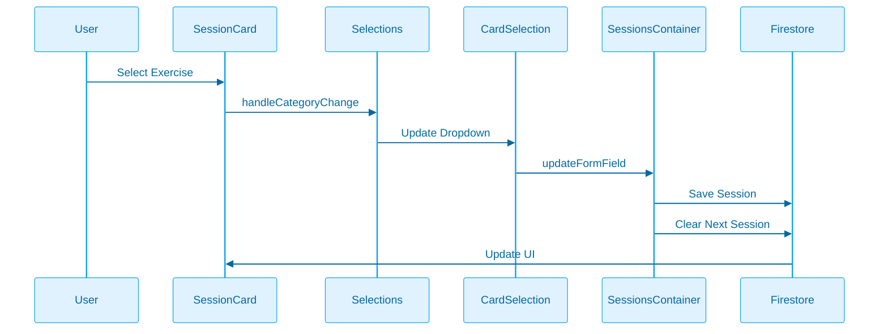
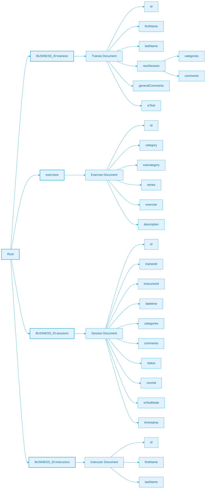

# Trainee Sessions Data Structure

## Overview

The Pilates Studio App maintains two types of session data for trainees:

1. Historical Sessions (completed sessions)
2. Next Session (template for upcoming sessions)

## Data Structures

### Trainee Interface

```typescript
interface Trainee {
	id: string;
	firstName: string;
	lastName: string;
	nextSession?: {
		categories: Categories;
		comments?: string;
	};
	generalComments?: string;
	isTest?: boolean;
}
```

### Categories Interface

```typescript
interface Categories {
	[category: string]: string; // category -> exercise mapping
}
```

### Session Interface

```typescript
interface Session {
	id: string;
	traineeId: string;
	instructor: Instructor;
	datetime: string;
	categories: Categories;
	comments: string;
	status: "completed" | "pending";
	roomId: string;
	isTestMode: boolean;
}
```

## Data Flow



## State Management Flow



## Real-time Updates

The application maintains real-time synchronization between:

1. Exercise selections in dropdowns
2. Session state in the UI
3. Trainee's next session template in Firestore

### Update Process

1. **Initial Load**

   - Trainee data is loaded through `useTrainees` hook
   - Exercise data is loaded through `useExercises` hook
   - Next session template is populated from trainee's data

2. **Exercise Selection**

   - User selects exercise in dropdown
   - Selection is immediately reflected in UI
   - Changes are tracked in temporary state

3. **Session Save**

   - Session is saved to Firestore
   - Trainee's next session is cleared
   - UI is updated to reflect changes

4. **Next Session Template**
   - When a trainee is selected for a new session
   - Their last session's exercises are loaded as defaults
   - Template is stored in `nextSession` field

## Collection Structure



## Usage Guidelines

1. **Next Session Template**

   - Used to pre-populate new sessions
   - Cleared after each session save
   - Should reflect the trainee's most recent exercise selections

2. **Categories Management**

   - Categories must match available exercises
   - Empty categories should be handled gracefully in UI
   - Exercise names must match exactly with exercise collection

3. **State Updates**

   - All changes should be reflected immediately in UI
   - Firestore updates should be atomic
   - Error handling should preserve data consistency

4. **Performance Considerations**
   - Use batch updates when possible
   - Implement proper loading states
   - Cache frequently accessed data
