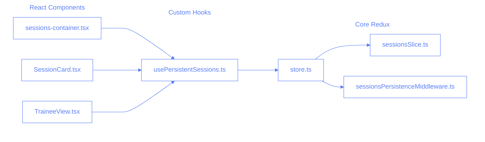
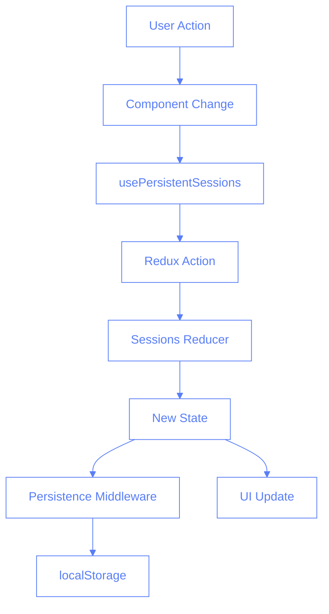
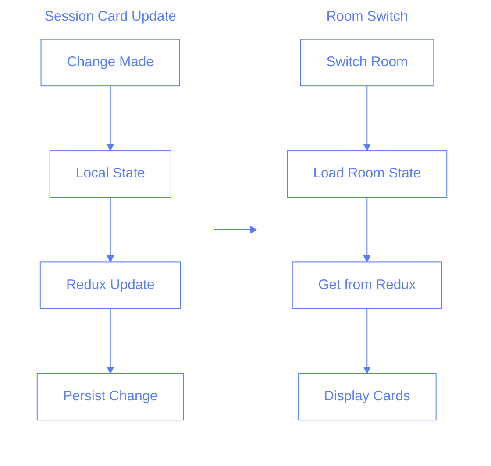
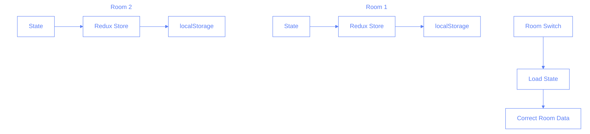

# Redux State Management

## Overview

This document outlines the Redux implementation in the Pilates Studio App, focusing on session state management, persistence, and the relationships between components.

## File Structure and Responsibilities



### Core Files

1. **store.ts**

   - Configures Redux store
   - Combines reducers
   - Sets up middleware
   - Handles initial state loading

2. **sessionsSlice.ts**

   - Defines session state structure
   - Implements reducers for session operations
   - Handles state updates
   - Maintains date->hour->room hierarchy

3. **sessionsPersistenceMiddleware.ts**
   - Manages state persistence to localStorage
   - Handles state recovery
   - Validates persisted data
   - Implements cleanup strategies

## State Structure

```typescript
interface SessionsState {
	sessions: {
		[date: string]: {
			[hour: string]: {
				[room: string]: {
					permanent: Session[];
					temporary: SessionForm[];
				};
			};
		};
	};
	metadata: {
		lastRefresh: {
			[date: string]: {
				[hour: string]: {
					[room: string]: number;
				};
			};
		};
	};
	ui: {
		selectedDate: string;
		selectedHour: string;
		selectedRoom: string;
	};
}
```

## Data Flow



## Session Card Changes Flow



## Room State Persistence



## Key Components

### 1. Redux Store Configuration

```typescript
const store = configureStore({
	reducer: {
		sessions: sessionsReducer,
	},
	middleware: (getDefaultMiddleware) =>
		getDefaultMiddleware().concat(sessionsPersistenceMiddleware),
	preloadedState: loadPersistedSessions(),
});
```

### 2. Session Updates

```typescript
const updateTemporarySession = (
	state,
	action: PayloadAction<{
		date: string;
		hour: string;
		room: string;
		session: SessionForm;
	}>
) => {
	const { date, hour, room, session } = action.payload;
	// Update session in the correct date->hour->room path
	if (!state.sessions[date]) state.sessions[date] = {};
	if (!state.sessions[date][hour]) state.sessions[date][hour] = {};
	if (!state.sessions[date][hour][room]) {
		state.sessions[date][hour][room] = {
			permanent: [],
			temporary: [],
		};
	}
	// ... update logic
};
```

### 3. Persistence Middleware

```typescript
const sessionsPersistenceMiddleware: Middleware =
	(store) => (next) => (action) => {
		const result = next(action);
		if (action.type.startsWith("sessions/")) {
			const state = store.getState().sessions;
			persistToLocalStorage(state);
		}
		return result;
	};
```

## State Recovery Process

1. **Initial Load**

   - Check localStorage for persisted state
   - Validate state structure
   - Load into Redux store

2. **Room Switch**

   - Update selected room in UI state
   - Access correct state path
   - Load room-specific sessions

3. **Session Updates**
   - Update local component state
   - Dispatch Redux action
   - Persist through middleware
   - Maintain in correct room

## Implementation Details

### Session Card State Management

```typescript
// In SessionCard.tsx
const [sessionForm, setSessionForm] = useState<SessionForm>(() => ({
	id: session?.id,
	tempId: session?.tempId || generateTempId(),
	// ... other fields
}));

// Sync with Redux
useEffect(() => {
	if (session?.instructor !== sessionForm.instructor) {
		setSessionForm((prev) => ({
			...prev,
			instructor: session.instructor,
		}));
	}
}, [session?.instructor]);
```

### Room State Management

```typescript
// In sessions-container.tsx
const handleRoomChange = (room: string) => {
	// Simply update room - Redux handles the rest
	setRoom(room);
};

// Get sessions for current room
const currentSessions = getCurrentSessions(
	selectedDate,
	selectedHour,
	selectedRoom
);
```

## Testing Considerations

1. **State Updates**

   ```typescript
   test("maintains room state", async () => {
   	// Switch to room 2
   	// Make changes
   	// Switch to room 1
   	// Switch back to room 2
   	// Verify changes persisted
   });
   ```

2. **Recovery Scenarios**
   ```typescript
   test("recovers from page refresh", async () => {
   	// Make changes
   	// Simulate refresh
   	// Verify state restored
   });
   ```

## Benefits of This Architecture

1. **Clean Separation of Concerns**

   - Components handle UI
   - Redux manages state
   - Middleware handles persistence

2. **Predictable State Updates**

   - Single source of truth
   - Clear update patterns
   - Easy to debug

3. **Efficient Room Switching**

   - No data copying needed
   - Instant state access
   - Maintains independence

4. **Robust Error Recovery**
   - State validation
   - Fallback mechanisms
   - Clean error handling

## Future Improvements

1. **Offline Support**

   - Implement service workers
   - Queue updates
   - Sync when online

2. **Performance Optimization**

   - Selective persistence
   - State compression
   - Cleanup strategies

3. **Enhanced Recovery**
   - Version control
   - Conflict resolution
   - Manual backups
