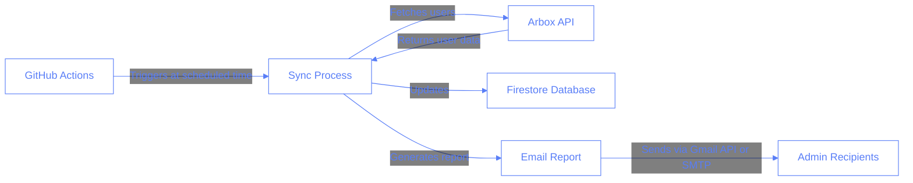
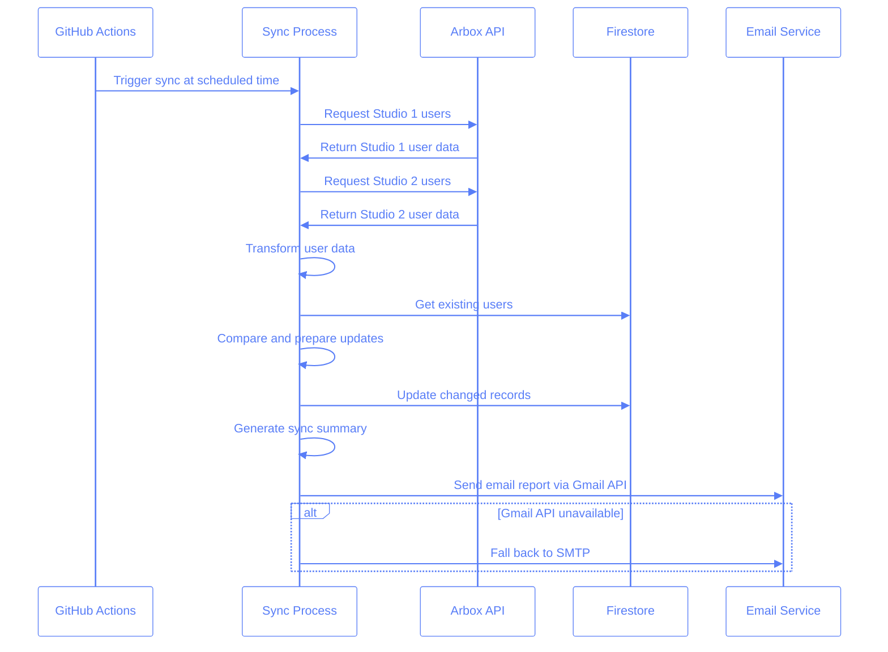

# Automated Arbox User Sync

This document outlines the automated Arbox user synchronization feature that runs daily to keep the Pilates studio's user database in sync with the Arbox system.

## Description

The Automated Arbox User Sync is a scheduled task that runs automatically during nighttime hours to synchronize user data between the Arbox API and our Firestore database. After completion, it sends an email summary of the results to designated recipients.

This automation eliminates the need for manual synchronization, ensuring that our database always contains the most up-to-date user information from both studio locations.

## Tech Description and Schemas

The automation is built using Python with LangChain for orchestration and scheduling. It leverages the existing `sync_arbox_users.py` script functionality but adds scheduling and email reporting capabilities.

### System Architecture



### Data Flow



## Implementation Details

The implementation consists of a Python script (`automated_sync_arbox.py`) that uses LangChain to create an agent for running the sync process and generating reports.

### Key Components

1. **Scheduler**: GitHub Actions workflow that runs at the configured time.
2. **Sync Process**: Imports and runs the existing `sync_arbox_users.py` script.
3. **Results Parser**: Extracts key metrics from the sync output.
4. **Email Generator**: Creates a formatted HTML email with the sync results.
5. **Email Sender**: Sends the report to configured recipients using either:
   - Gmail API with OAuth 2.0 authentication (recommended)
   - SMTP with App Password (fallback)

### Environment Variables

The script requires the following environment variables:

#### For Local Development

These variables should be added to your `.env` file:

```
# Email Configuration - Gmail API method (recommended)
EMAIL_SENDER=your-email@gmail.com
EMAIL_RECIPIENTS=recipient1@example.com, recipient2@example.com

# Email Configuration - SMTP fallback method
EMAIL_PASSWORD=your-app-password  # Only needed for SMTP fallback
SMTP_SERVER=smtp.gmail.com        # Optional, default: smtp.gmail.com
SMTP_PORT=587                     # Optional, default: 587

# OpenAI API Key (for LangChain)
OPENAI_API_KEY=your-openai-api-key

# Plus all environment variables required by sync_arbox_users.py
ARBOX_API_KEY_1=your-studio1-api-key
ARBOX_API_KEY_2=your-studio2-api-key
PROJECT_ID=your-firebase-project-id
FIREBASE_SERVICE_ACCOUNT={"type":"service_account",...}
```

Note that `EMAIL_RECIPIENTS` can contain multiple email addresses separated by commas.

#### For GitHub Actions

These variables should be stored as GitHub Secrets:

```
# Required for both methods
EMAIL_SENDER
EMAIL_RECIPIENTS
ARBOX_API_KEY_1
ARBOX_API_KEY_2
PROJECT_ID
FIREBASE_SERVICE_ACCOUNT
OPENAI_API_KEY

# For Gmail API method (recommended)
GMAIL_CREDENTIALS  # Contents of client_secret.json
GMAIL_TOKEN        # Contents of gmail_token.pickle (base64 encoded)

# For SMTP fallback
EMAIL_PASSWORD     # App Password for Gmail
```

For detailed instructions on setting up email sending, see the [Email Configuration](../email-configuration.md) documentation.

### Dependencies

The script requires the following Python packages:

```
firebase-admin
requests
python-dotenv
google-cloud-secret-manager>=2.16.1
langchain>=0.1.0
langchain-openai>=0.0.2
openai>=1.3.0
langchain-community>=0.0.1

# Gmail API dependencies
google-api-python-client>=2.100.0
google-auth-httplib2>=0.1.0
google-auth-oauthlib>=1.1.0
```

## Running the Script

### Manual Execution

To run the script manually:

```bash
cd pilates-studio-app/scripts
python automated_sync_arbox.py
```

For immediate execution without waiting for the scheduled time:

```bash
cd pilates-studio-app/scripts
python automated_sync_arbox.py --run-once
```

### Deployment with GitHub Actions

Since the application is serverless, GitHub Actions is the ideal way to schedule and run the sync process:

1. Create a GitHub Actions workflow file at `.github/workflows/arbox-sync.yml`:

```yaml
name: Automated Arbox User Sync

on:
  schedule:
    # Run at 2 AM UTC every day
    - cron: "0 2 * * *"
  workflow_dispatch: # Allow manual triggering

jobs:
  sync:
    runs-on: ubuntu-latest

    steps:
      - name: Checkout repository
        uses: actions/checkout@v3

      - name: Set up Python
        uses: actions/setup-python@v4
        with:
          python-version: "3.9"

      - name: Install dependencies
        run: |
          python -m pip install --upgrade pip
          pip install -r scripts/requirements.txt

      - name: Set up Gmail API credentials
        env:
          GMAIL_CREDENTIALS: ${{ secrets.GMAIL_CREDENTIALS }}
        run: |
          if [ ! -z "$GMAIL_CREDENTIALS" ]; then
            echo "$GMAIL_CREDENTIALS" > scripts/client_secret.json
            echo "Gmail API credentials configured"
          else
            echo "No Gmail API credentials provided, will use SMTP fallback"
          fi

      - name: Set up Gmail API token (if available)
        env:
          GMAIL_TOKEN: ${{ secrets.GMAIL_TOKEN }}
        run: |
          if [ ! -z "$GMAIL_TOKEN" ]; then
            echo "$GMAIL_TOKEN" > scripts/gmail_token.pickle
            echo "Gmail API token configured"
          fi

      - name: Run Arbox sync
        env:
          EMAIL_SENDER: ${{ secrets.EMAIL_SENDER }}
          EMAIL_PASSWORD: ${{ secrets.EMAIL_PASSWORD }}
          EMAIL_RECIPIENTS: ${{ secrets.EMAIL_RECIPIENTS }}
          ARBOX_API_KEY_1: ${{ secrets.ARBOX_API_KEY_1 }}
          ARBOX_API_KEY_2: ${{ secrets.ARBOX_API_KEY_2 }}
          PROJECT_ID: ${{ secrets.PROJECT_ID }}
          FIREBASE_SERVICE_ACCOUNT: ${{ secrets.FIREBASE_SERVICE_ACCOUNT }}
          OPENAI_API_KEY: ${{ secrets.OPENAI_API_KEY }}
        run: |
          cd scripts
          python automated_sync_arbox.py --run-once
```

2. Add the `--run-once` flag to the script to make it run immediately without waiting for a specific time:

```python
# In automated_sync_arbox.py
import argparse

# Add at the beginning of main():
parser = argparse.ArgumentParser(description='Automated Arbox User Sync')
parser.add_argument('--run-once', action='store_true', help='Run sync once immediately and exit')
args = parser.parse_args()

if args.run_once:
    # Skip waiting and run immediately
    logger.info("⏰ Running sync immediately (--run-once flag)")
    success, output, error_message = run_sync_script()
    results = parse_sync_results(output)
    subject, html_content = generate_email_content(success, results, output, error_message)
    send_email(subject, html_content)
    logger.info("✅ Sync process completed")
    sys.exit(0)
```

3. Store all sensitive information as GitHub Secrets in your repository settings.

### Alternative: Cloud Functions or Cloud Run Jobs

For a fully serverless approach, you could also consider:

1. **Google Cloud Scheduler + Cloud Functions**: Set up a Cloud Scheduler job to trigger a Cloud Function that runs the sync script.

2. **AWS EventBridge + Lambda**: Use AWS EventBridge to schedule an AWS Lambda function that runs the sync script.

These options provide true serverless execution without maintaining any infrastructure.

## Testing

The automated sync script includes comprehensive error handling and logging to ensure reliability. All operations are logged to both the console and a log file (`automated_sync_arbox.log`).

### Testing Strategy

1. **Unit Tests**: Test individual components (email generation, results parsing).
2. **Integration Tests**: Test the full sync process with a test database.
3. **Email Tests**: Verify email formatting and delivery.

### Email Testing

To test the email functionality specifically:

1. **Gmail API Test**:

   ```bash
   python gmail_api_sender.py --test
   ```

2. **Full Process Test**:
   ```bash
   python automated_sync_arbox.py --run-once
   ```
   This runs the entire sync process once, including sending the email report, which is the most comprehensive test.

### Monitoring

When running in GitHub Actions:

1. View workflow run logs in the GitHub Actions tab
2. Set up GitHub Actions notifications for failed workflows
3. Consider adding status reporting to a Slack channel or other monitoring system

## Multiple Choice Questions

1. What is the primary purpose of the Automated Arbox User Sync?

   - [ ] A. To create new users in Arbox
   - [ ] B. To delete inactive users from Firestore
   - [ ] C. To synchronize user data between Arbox and Firestore
   - [ ] D. To generate reports on user activity

2. How is the automated sync process scheduled in the serverless architecture?

   - [ ] A. Using a cron job on a dedicated server
   - [ ] B. Using GitHub Actions scheduled workflows
   - [ ] C. Using Docker containers
   - [ ] D. Using manual triggers only

3. What happens after the sync process completes?

   - [ ] A. The application restarts
   - [ ] B. An email report is sent to configured recipients
   - [ ] C. Users are notified of changes
   - [ ] D. The database is backed up

4. Where should sensitive environment variables be stored for the GitHub Actions workflow?

   - [ ] A. In the workflow YAML file
   - [ ] B. In a .env file in the repository
   - [ ] C. In GitHub Secrets
   - [ ] D. In the script comments

5. What is the recommended method for sending email reports?
   - [ ] A. SMTP with regular password
   - [ ] B. SMTP with App Password
   - [ ] C. Gmail API with OAuth 2.0
   - [ ] D. SendGrid API

## Answers

1. C - The primary purpose is to synchronize user data between Arbox and Firestore, ensuring our database has the most up-to-date information.

2. B - The sync process is scheduled using GitHub Actions scheduled workflows, which is ideal for serverless architectures.

3. B - After completion, the script generates and sends an email report summarizing the results to configured recipients.

4. C - Sensitive information should be stored as GitHub Secrets to keep them secure and accessible to the workflow.

5. C - Gmail API with OAuth 2.0 is the recommended method for sending email reports as it's more secure and reliable than password-based authentication.
