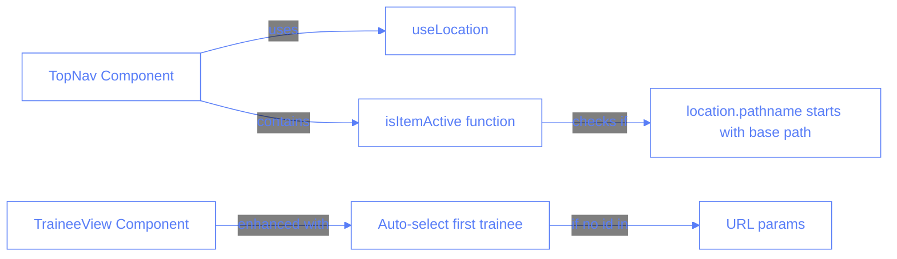

# Navigation Highlighting Bug Fix

## Description

This feature fixes a bug in the navigation bar where the Trainees link was not being properly highlighted when active. The issue was that the active state detection was comparing the exact URL path with query parameters, which didn't work correctly for routes with query parameters like `/trainee?id=1`.

## Tech Description and Schemas

The issue was in the navigation components where the active state detection was too strict, requiring an exact match between `location.pathname` and the link's `href` value. For paths with query parameters like `/trainee?id=1`, this comparison would fail because `location.pathname` only contains `/trainee` without the query portion.

## Implementation Details

The implementation involved the following changes:

1. **TopNav Component Enhancement**:

   - Created a helper function `isItemActive` to check if a navigation item is active
   - Modified the active state detection to use `startsWith` for paths like `/trainee`
   - Updated the "Trainees" navigation item to use `/trainee` as the base path without query parameters
   - Added a separate `pathMatch` property for paths that need special handling

2. **TraineeView Component Enhancement**:

   - Added logic to handle the case when no trainee ID is provided in the URL
   - Added functionality to automatically select the first available trainee
   - This ensures the component works correctly when navigating directly to `/trainee`

3. **Sidebar Component Removal**:
   - During the investigation, we found that the Sidebar component was defined but not used anywhere in the application
   - The Sidebar component was removed to clean up the codebase

## Testing

To test the navigation highlighting fix:

1. Navigate to the Sessions page (`/sessions`) and verify the Sessions link is highlighted
2. Navigate to the Trainees page (`/trainee?id=1`) and verify the Trainees link is highlighted
3. Navigate to the Dashboard page (`/dashboard`) and verify the Dashboard link is highlighted
4. Navigate directly to `/trainee` (without ID) and verify:
   - The first trainee is automatically selected
   - The URL is updated to include the ID of the first trainee
   - The Trainees link is properly highlighted

## Multiple Choice Questions and Answers

1. What was the root cause of the navigation highlighting bug?

   - [ ] A. CSS styling issue
   - [ ] B. React Router configuration error
   - [ ] C. Comparison between location.pathname and href including query parameters
   - [ ] D. Missing active class in the navigation components

2. How does the fix handle detecting the active state for the Trainees link?

   - [ ] A. It looks at the full URL including query parameters
   - [ ] B. It checks if location.pathname is exactly equal to the link path
   - [ ] C. It checks if location.pathname starts with the base path
   - [ ] D. It uses a custom React Router hook

3. What happens when a user navigates directly to `/trainee` without an ID?

   - [ ] A. The page shows an error
   - [ ] B. The user is redirected to the Sessions page
   - [ ] C. No trainee is selected
   - [ ] D. The first trainee is automatically selected

4. Why was a separate `pathMatch` property added to the navigation items in TopNav?

   - [ ] A. For internationalization support
   - [ ] B. To support different highlighting rules for different navigation items
   - [ ] C. To improve performance
   - [ ] D. It's required by React Router

5. What action was taken with the Sidebar component during this fix?

   - [ ] A. It was updated to match the TopNav component
   - [ ] B. It was completely removed as it wasn't being used
   - [ ] C. It was modified to use a different styling approach
   - [ ] D. It was integrated into the Layout component

## Answers

1. C - The bug was caused by comparing the exact URL path with query parameters, which doesn't work for routes like `/trainee?id=1` because `location.pathname` only contains `/trainee`.

2. C - The fix checks if `location.pathname` starts with the base path (`/trainee`) rather than requiring an exact match.

3. D - When a user navigates directly to `/trainee` without an ID, the first trainee is automatically selected and the URL is updated to include the ID.

4. B - The separate `pathMatch` property was added to support different highlighting rules for different navigation items, especially those with query parameters.

5. B - The Sidebar component was completely removed from the codebase as it wasn't being used anywhere in the application.
