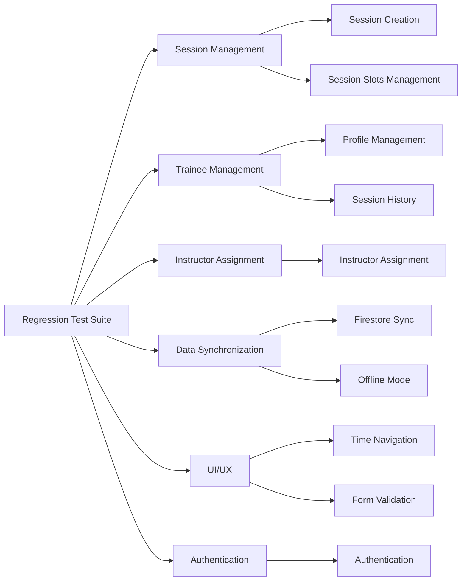

# Regression Test Suite

## Description

This document outlines the critical regression tests for the Pilates Studio application. These tests should be run after any significant feature additions or changes to ensure that core functionality remains intact. The regression suite consists of the 10 most important tests that cover key application functionality.

## Tech Description and Schema

The regression tests are implemented using Playwright, which allows for end-to-end testing of the application in a real browser environment. Tests are designed to interact with the application just as a user would, validating both UI components and data flow.

%%{init: {'theme': 'base', 'themeVariables': {
'primaryColor': '#ffffff',
'primaryTextColor': '#597ef7',
'primaryBorderColor': '#597ef7',
'lineColor': '#597ef7',
'textColor': '#597ef7',
'mainBkg': 'transparent',
'nodeBorder': '#597ef7',
'clusterBkg': 'transparent',
'labelTextColor': '#597ef7',
'titleColor': '#597ef7',
'clusterBorder': '#fff',
'edgeLabelBackground': 'transparent'
}}}%%



## Top 10 Critical Tests

### 1. Session Creation and Scheduling

**Purpose:** Verify that sessions can be properly created, scheduled and saved.

**Test Steps:**

1. Log in as an admin user
2. Navigate to the sessions page
3. Select a time slot
4. Create a new session by selecting a trainee
5. Assign an instructor
6. Add exercise categories
7. Save the session
8. Refresh the page
9. Verify the session persists with all details intact

**Expected Outcomes:**

- Session is created with correct trainee and instructor
- All session details (date, time, room, studio) are correctly saved
- After refresh, session is still visible with the correct information

**Test File:** `tests/session-creation.spec.ts`

### 2. Session Slots Management

**Purpose:** Verify that the UI consistently maintains 6 session slots and handles refreshes correctly.

**Test Steps:**

1. Log in as an admin user
2. Navigate to the sessions page for a specific time/date
3. Count initial session cards
4. Select a trainee for an empty slot
5. Click "Refresh Sessions" button
6. Count session cards again

**Expected Outcomes:**

- Initially displays 6 session slots (mix of filled and empty)
- After selecting a trainee and refreshing, still displays 6 slots total
- Trainee selection is preserved across the refresh

**Test File:** `tests/duplicate-session-prevention.spec.ts` (already implemented)

### 3. Trainee Profile Creation and Editing

**Purpose:** Verify that trainee profiles can be created, viewed, and edited.

**Test Steps:**

1. Log in as an admin user
2. Navigate to the trainees page
3. Create a new trainee with complete profile information
4. Save the trainee profile
5. Navigate away and return to the trainee's profile
6. Edit several fields in the trainee profile
7. Save changes
8. Refresh the page

**Expected Outcomes:**

- New trainee profile is created with all details
- Edited information persists after saving and refreshing
- Trainee appears in dropdown selectors when creating sessions

**Test File:** `tests/trainee-profile-management.spec.ts`

### 4. Trainee Session History Tracking

**Purpose:** Verify that trainee session history is properly tracked and displayed.

**Test Steps:**

1. Log in as an admin user
2. Create multiple sessions for a specific trainee on different dates
3. Navigate to the trainee's profile page
4. Check the session history section

**Expected Outcomes:**

- All created sessions appear in the trainee's history
- Session details (date, time, exercises, instructor) are correctly displayed
- Sessions are ordered chronologically
- Exercise categories and progress are accurately tracked across sessions

**Test File:** `tests/trainee-session-history.spec.ts`

### 5. Instructor Assignment and Availability

**Purpose:** Verify that instructors can be properly assigned to sessions and availability is managed.

**Test Steps:**

1. Log in as an admin user
2. Navigate to the sessions page
3. Create a new session with a trainee
4. Assign an instructor to the session
5. Try to create another session at the same time with the same instructor

**Expected Outcomes:**

- Instructor is properly assigned to the first session
- UI provides appropriate feedback when attempting to double-book an instructor
- System prevents or flags instructor double-booking

**Test File:** `tests/instructor-assignment.spec.ts`

### 6. Firestore Data Synchronization

**Purpose:** Verify that data is properly synchronized between the application and Firestore.

**Test Steps:**

1. Log in as an admin user
2. Create a new session
3. Use the Firebase Emulator UI to verify the session was saved to Firestore
4. Modify the session data directly in Firestore
5. Refresh the application
6. Verify the changes appear in the UI

**Expected Outcomes:**

- New sessions are saved to Firestore with correct data
- Changes made in Firestore appear in the application after refresh
- Data structure in Firestore matches the expected schema

**Test File:** `tests/firestore-sync.spec.ts`

### 7. Offline Mode and Recovery

**Purpose:** Verify that the application can handle offline operations and recovery.

**Test Steps:**

1. Log in as an admin user
2. Use browser devtools to simulate offline mode
3. Create a new session while offline
4. Verify the UI indicates pending changes
5. Restore network connection
6. Verify pending changes are synced to Firestore

**Expected Outcomes:**

- Application shows appropriate UI indicators when offline
- Changes made offline are queued for synchronization
- Once back online, changes are properly synced to Firestore

**Test File:** `tests/offline-recovery.spec.ts`

### 8. Time and Date Navigation

**Purpose:** Verify that users can navigate between different dates and time slots.

**Test Steps:**

1. Log in as an admin user
2. Navigate to the sessions page
3. Change the selected date
4. Navigate between different time slots
5. Verify sessions for each time slot are correctly displayed

**Expected Outcomes:**

- Date picker correctly changes the view to selected date
- Time slot navigation shows the correct sessions for each time
- UI elements adapt appropriately to different screen sizes
- Session counts are consistent across navigation changes

**Test File:** `tests/time-navigation.spec.ts`

### 9. Form Validation and Error Handling

**Purpose:** Verify that forms properly validate input and display appropriate error messages.

**Test Steps:**

1. Log in as an admin user
2. Attempt to create profiles/sessions with invalid data
3. Test boundary conditions (e.g., scheduling outside operational hours)
4. Verify error messages for each validation failure

**Expected Outcomes:**

- Forms prevent submission with invalid or missing required data
- Appropriate error messages are displayed for each validation failure
- Boundary conditions are properly handled
- Toast notifications appear with correct error messages

**Test File:** `tests/form-validation.spec.ts`

### 10. Authentication and Authorization

**Purpose:** Verify that authentication works and access control is properly enforced.

**Test Steps:**

1. Attempt login with valid credentials
2. Attempt login with invalid credentials
3. Verify redirects for unauthenticated users
4. Test access control for different user roles
5. Verify logout functionality

**Expected Outcomes:**

- Valid credentials allow access to the application
- Invalid credentials show appropriate error messages
- Unauthenticated users are redirected to login
- Different user roles have appropriate access levels
- Logout successfully terminates the session

**Test File:** `tests/authentication.spec.ts`

## Running the Regression Suite

To run the entire regression test suite:

```bash
npx playwright test
```

To run a specific test:

```bash
npx playwright test tests/duplicate-session-prevention.spec.ts
```

To run tests with a visible browser (for debugging):

```bash
npx playwright test --headed
```

## Test Development Guidelines

When developing new tests:

1. **Isolation:** Each test should be independent and not rely on the state from other tests
2. **Setup/Teardown:** Use proper setup and teardown functions to initialize and clean up test data
3. **Mocking:** Use Firebase emulators instead of production databases
4. **Assertions:** Include specific, meaningful assertions that clearly indicate what is being tested
5. **Debugging:** Add screenshots at key points to aid in debugging test failures
6. **Logging:** Include detailed console logging to understand test flow and potential failures

## Integration with CI/CD

The regression test suite is integrated with the CI/CD pipeline using GitHub Actions. Tests automatically run:

1. After each push to the main branch
2. When a pull request is created or updated
3. Before deployment to production

Failed tests will block deployment, ensuring that only validated code reaches production.

## Answers

1. Why is it important to include session slots management in the regression suite?

   - [ ] A. Because it's the simplest test to implement
   - [ ] B. It only matters for the admin user experience
   - [x] C. It's a core UI behavior that could easily break with other changes
   - [ ] D. It's not important, it should be removed from the suite

2. When should the regression test suite be run?

   - [ ] A. Only when major versions are released
   - [x] B. After any significant feature addition or code change
   - [ ] C. Once a month during maintenance windows
   - [ ] D. Only when bugs are reported by users

3. What is the main purpose of the offline mode test?

   - [x] A. To verify the application is resilient to network interruptions
   - [ ] B. To test that the application works without an internet connection indefinitely
   - [ ] C. To reduce server load during testing
   - [ ] D. It's only relevant for mobile applications

4. Why test Firestore synchronization specifically?
   - [ ] A. Because Firestore is slow and needs optimization
   - [x] B. To ensure data consistency between the client app and the database
   - [ ] C. It's only important for multi-user scenarios
   - [ ] D. To measure database performance

## Answer Explanations

1. C - Session slots management is a core UI behavior that must be maintained. Changes to session handling, Redux state, or component rendering could easily break this behavior, making it an essential regression test.

2. B - Regression tests should be run after any significant code changes to ensure existing functionality continues to work correctly. This prevents new features from breaking established behaviors.

3. A - The offline mode test verifies that the application can handle network interruptions gracefully, preserving user changes and resuming synchronization when connectivity is restored. This is critical for real-world usage reliability.

4. B - Testing Firestore synchronization ensures that data flows correctly between the client and database in both directions, maintaining data integrity across the application.
