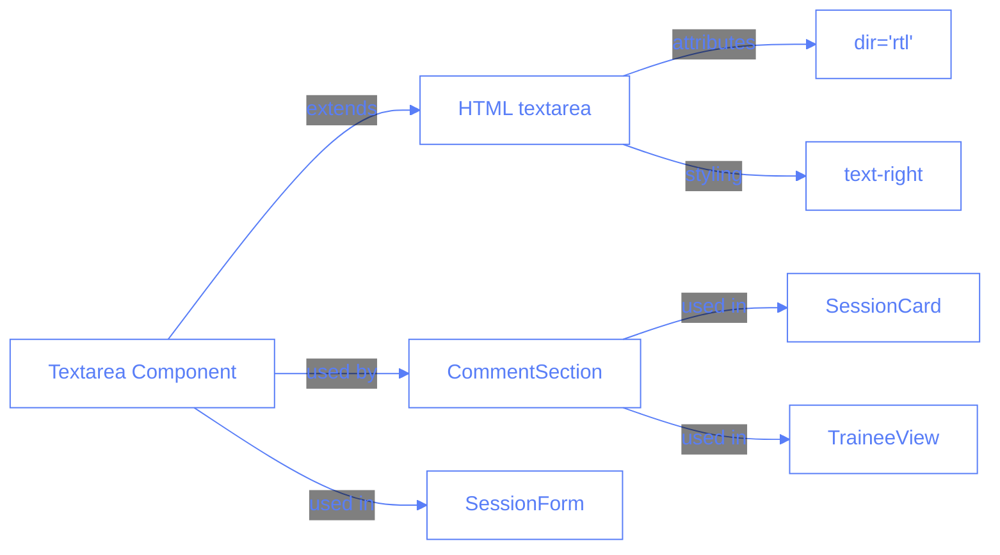

# RTL Text Support for Comments

## Description

This feature implements right-to-left (RTL) text direction for all comment text areas in the application. This enhancement is particularly important for supporting languages that are written from right to left, such as Hebrew, Arabic, and Persian, ensuring a better user experience for users who prefer to input comments in these languages.

## Tech Description and Schemas

The implementation leverages the shadcn/ui Textarea component which serves as the base for all text areas in the application. By modifying this component, we ensure consistent RTL support throughout the application without requiring changes to individual implementations.

## Implementation Details

The implementation involved two main changes:

1. **Base Textarea Component Modification**:

   - Added the `dir="rtl"` HTML attribute to the textarea element
   - Added the `text-right` CSS class to ensure proper text alignment
   - This ensures that all text entered in any textarea will flow from right to left

2. **CommentSection Component Enhancement**:
   - Fixed className formatting to properly incorporate the height classes
   - Ensured proper RTL support through the base Textarea component
   - Updated documentation to indicate RTL support

These changes work together to provide a consistent RTL experience across all comment fields in the application.

## Testing

To test the RTL text support feature:

1. Navigate to any page with comment fields (e.g., TraineeView, Session details)
2. Enter text in a language that reads from right to left (e.g., Hebrew, Arabic)
3. Verify that the text flows correctly from right to left
4. Test with mixed content (both RTL and LTR text) to ensure proper text rendering
5. Check placeholder text alignment to ensure it aligns with RTL direction

## Multiple Choice Questions and Answers

1. Why was the RTL support implemented at the base Textarea component level?

   - [ ] A. It was easier to implement
   - [ ] B. It provides better performance
   - [ ] C. It ensures consistent behavior across all text areas
   - [ ] D. It was required by the browser

2. What HTML attribute is primarily responsible for enabling RTL text direction?

   - [ ] A. text-align="right"
   - [ ] B. dir="rtl"
   - [ ] C. lang="rtl"
   - [ ] D. rtl="true"

3. In which components would users now experience RTL text direction?

   - [ ] A. Only in the TraineeView component
   - [ ] B. Only in components that explicitly enable it
   - [ ] C. All components that use the CommentSection component
   - [ ] D. All text areas throughout the application

4. What additional CSS class was added to enhance RTL text support?

   - [ ] A. text-right
   - [ ] B. rtl-text
   - [ ] C. align-right
   - [ ] D. direction-rtl

5. What happens when a user types mixed content (both LTR and RTL text) in a comment area?
   - [ ] A. All text displays as LTR
   - [ ] B. All text displays as RTL
   - [ ] C. The browser automatically handles bidirectional text based on the content
   - [ ] D. The application throws an error

## Answers

1. C - Implementing RTL support at the base component level ensures all text areas throughout the application have consistent behavior without requiring changes to each individual implementation.

2. B - The `dir="rtl"` HTML attribute is the standard way to specify right-to-left text direction for an element.

3. D - Since the change was made to the base Textarea component, RTL text direction is now supported in all text areas throughout the application.

4. A - The `text-right` CSS class was added to ensure proper text alignment for RTL content.

5. C - Modern browsers handle bidirectional text automatically based on the content and the `dir` attribute of the containing element.
