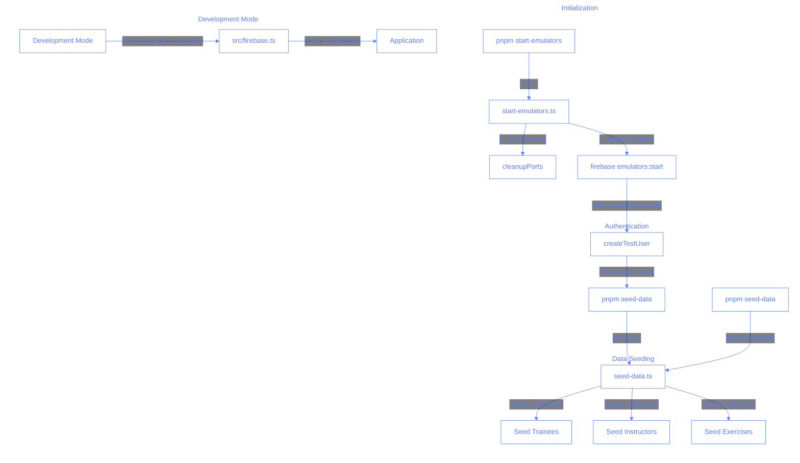

# Seeding Process

This document outlines the seeding process for the Pilates Studio App.

## Flow Diagram

## Process Description

1. **Automatic Seeding (Development)**

   - Triggered by: `pnpm start-emulators`
   - Order:
     1. Cleans up existing emulator processes
     2. Starts Firebase emulators
     3. Creates test user
     4. Runs seed-data script

2. **Manual Seeding**

   - Triggered by: `pnpm seed-data`
   - Directly runs the seeding script
   - Useful for resetting data or adding new sample data

3. **Development Mode Connection**
   - When the app starts in development mode
   - Automatically connects to emulators
   - Uses the seeded data

The seeding process is designed to be idempotent, meaning you can run it multiple times safely without creating duplicate data.
