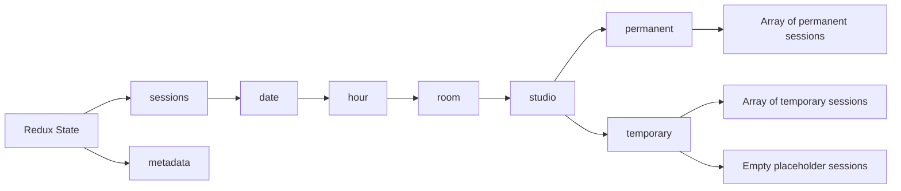

# Session Slots Management

## Description

The Pilates Studio application maintains a consistent number of session slots (6 slots) in the session scheduling interface for each hour/room/studio combination. This feature ensures a predictable and uniform UI experience when navigating between different time slots and when refreshing session data.

## Tech Description and Schema

The session slots management system works by combining permanent sessions loaded from the database with temporary sessions, and then filling any remaining slots with empty placeholder sessions to maintain a total of 6 slots at all times.

### Session State Structure

%%{init: {'theme': 'base', 'themeVariables': {
'primaryColor': '#ffffff',
'primaryTextColor': '#597ef7',
'primaryBorderColor': '#597ef7',
'lineColor': '#597ef7',
'textColor': '#597ef7',
'mainBkg': 'transparent',
'nodeBorder': '#597ef7',
'clusterBkg': 'transparent',
'labelTextColor': '#597ef7',
'titleColor': '#597ef7',
'clusterBorder': '#fff',
'edgeLabelBackground': 'transparent'
}}}%%



### Session Types

1. **Permanent Sessions**: Loaded from the database and represent committed sessions
2. **Temporary Sessions**: Created by user interactions but not yet committed to the database
3. **Empty Placeholder Sessions**: Auto-generated empty slots to maintain a total of 6 slots

## Implementation Details

The session slot management logic is primarily implemented in the `refreshTemporarySessions` action in the `sessionsSlice.ts` file. This action is responsible for:

1. Merging sessions from Firestore with local session state
2. Preventing duplicate sessions for the same trainee
3. Ensuring that exactly 6 total session slots are available after a refresh operation

Key code snippet from `sessionsSlice.ts`:

```typescript
// Fill empty slots if needed (ensure we have 6 total sessions)
const currentSessionCount =
	state.sessions[date][hour][room][studio].temporary.length;
const emptySessionsNeeded = Math.max(0, 6 - currentSessionCount);

if (emptySessionsNeeded > 0) {
	console.log(
		`➕ Redux: Adding ${emptySessionsNeeded} empty sessions to maintain 6 slots`
	);

	const emptySessions = Array.from({ length: emptySessionsNeeded }).map(
		(_, i) => ({
			tempId: `empty-${date}-${hour}-${room}-${studio}-${Date.now()}-${i}`,
			datetime: `${date} ${hour}`,
			traineeId: undefined,
			studioId: studio,
			instructor: null,
			instructorId: undefined,
			categories: {},
			comments: "",
			status: "pending",
		})
	);

	state.sessions[date][hour][room][studio].temporary.push(...emptySessions);
}
```

This logic ensures that after any refresh operation, the system will always display exactly 6 session cards, with empty slots filling in any gaps.

## Common Scenarios

1. **Initial Load**: The system loads any existing sessions from Firestore and fills the remaining slots with empty cards to reach a total of 6.
2. **Selecting a Trainee**: When a trainee is selected for an empty slot, that slot becomes a trainee-assigned session, but the total remains 6.
3. **Refreshing Sessions**: When the "Refresh Sessions" button is clicked, the system:
   - Fetches the latest session data from Firestore
   - Merges it with local changes to avoid losing unsaved work
   - Ensures the total session count remains at 6

## What Might Look Like a Bug (But Isn't)

When a user selects a trainee for an empty session and then clicks "Refresh Sessions", they might observe:

- Initially: 1 session with trainee and 5 empty sessions (total: 6)
- After refresh: Still 6 total sessions (1 with trainee and 5 empty)

This is by design to provide a consistent user interface. The system is not duplicating sessions; it's maintaining a total of 6 slots at all times.

## Testing

The session slots management behavior is verified in the `duplicate-session-prevention.spec.ts` test, which ensures that after selecting a trainee and refreshing sessions, the system maintains exactly 6 session cards.

## Answers

1. Why does the system always maintain 6 session slots?

   - [ ] A. It's a bug in the session state management
   - [ ] B. To accommodate a maximum of 6 trainees per hour
   - [x] C. To provide a consistent and predictable UI experience
   - [ ] D. To reduce database load

2. What happens when a user selects a trainee and clicks "Refresh Sessions"?

   - [ ] A. All session data is lost and reloaded
   - [x] B. The system preserves the trainee selection while ensuring the total remains 6 sessions
   - [ ] C. The system creates duplicates of the selected session
   - [ ] D. Nothing, refresh only works for empty sessions

3. How are empty slots implemented?

   - [ ] A. They are stored in the database
   - [ ] B. They are created only when needed and discarded immediately
   - [x] C. They are generated dynamically in the Redux state to fill gaps up to 6 slots
   - [ ] D. They are created by a separate background process

4. What happens if there are already 6 sessions with trainees assigned?
   - [x] A. No empty slots are generated as the total is already 6
   - [ ] B. The system will still add empty slots, resulting in more than 6
   - [ ] C. The system will remove the oldest sessions to maintain only 6
   - [ ] D. The system will show an error message

## Answer Explanations

1. C - Providing a consistent UI experience ensures that users always see the same number of slots, making the interface predictable and easier to use.
2. B - The refresh functionality preserves local changes while syncing with the database and maintaining the consistent UI with 6 slots.
3. C - Empty slots are generated on-the-fly in the Redux state, not persisted to the database, to maintain the UI consistency.
4. A - The system will only generate empty slots when needed to reach a total of 6, not exceeding that number.
