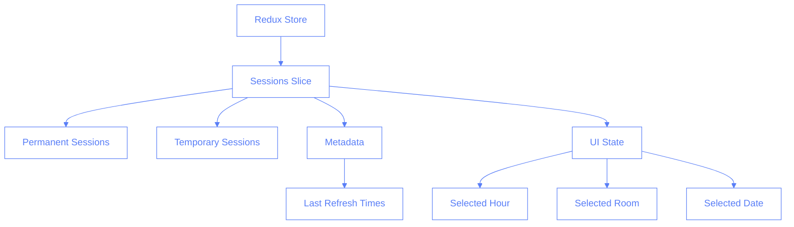
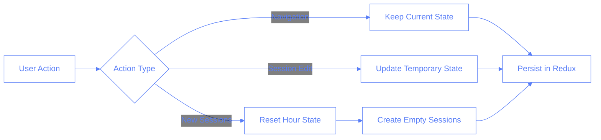
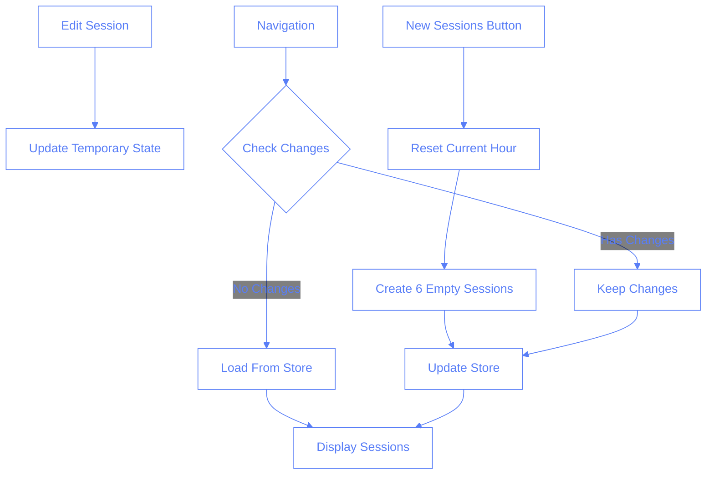
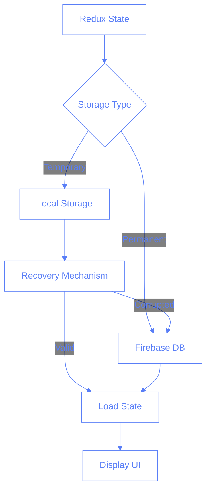
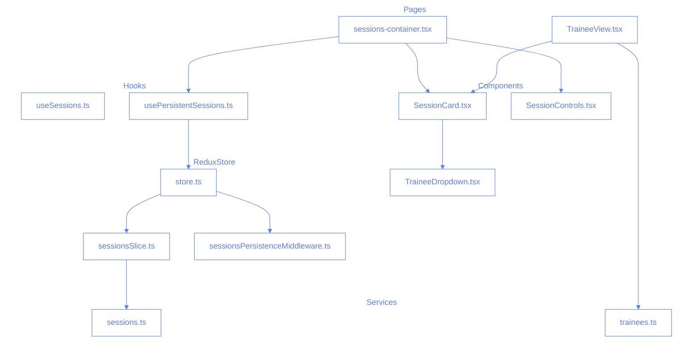
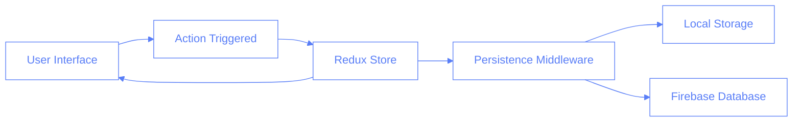

# Session State Persistence

## Overview

This document outlines the architecture and implementation of session state persistence in the Pilates Studio App. The goal is to maintain session state across navigation, room changes, and page refreshes, with explicit state reset only occurring when the user clicks the "New Sessions" button.

## Problem Statement

Previously, session states were reset or reloaded in various scenarios:

- When switching rooms
- When navigating to different pages
- When changing hours
- When refreshing the page

This led to a poor user experience as users lost their work in progress. The new implementation ensures that sessions persist until explicitly reset.

## Technical Architecture

### Redux Store Structure



### Session Management Flow



### Data Flow for Session Changes



### State Persistence Strategy



## Implementation Details

### State Structure

```typescript
interface SessionsState {
	sessions: {
		[date: string]: {
			[hour: string]: {
				[room: string]: {
					permanent: Session[];
					temporary: SessionForm[];
				};
			};
		};
	};
	metadata: {
		lastRefresh: {
			[date: string]: {
				[hour: string]: {
					[room: string]: number; // timestamp
				};
			};
		};
	};
}
```

### Key Components

1. **Redux Store**

   - Centralized state management
   - Maintains both temporary and permanent sessions
   - Handles UI state (selected hour, room, date)

2. **Local Storage**

   - Persists temporary sessions and UI state
   - Provides recovery mechanism for page refreshes
   - Manages state cleanup for old sessions

3. **Database Integration**
   - Stores permanent sessions
   - Serves as backup for corrupted local state
   - Handles synchronization of saved sessions

## Usage Guidelines

### State Persistence Rules

1. Sessions persist across:

   - Room changes
   - Page navigation
   - Hour changes
   - Page refreshes

2. Sessions reset only when:
   - User clicks "New Sessions" button
   - State is corrupted and requires recovery
   - Manual cleanup of old sessions occurs

### Error Recovery

- Automatic recovery from corrupted state
- Fallback to database if local storage fails
- Periodic cleanup of old sessions

## Performance Considerations

### Memory Management

- Selective persistence of changed sessions
- Chunked storage for large datasets
- Periodic cleanup of old data

### State Cleanup Strategy

```typescript
const SEVENTY_TWO_HOURS = 72 * 60 * 60 * 1000;
const cleanupOldSessions = (
	sessions,
	cutoffDate = Date.now() - SEVENTY_TWO_HOURS
) => {
	// Remove sessions older than 72 hours
	return Object.entries(sessions).reduce((acc, [key, value]) => {
		const sessionDate = new Date(key.split("_")[0]).getTime();
		if (sessionDate > cutoffDate) {
			acc[key] = value;
		}
		return acc;
	}, {});
};
```

This ensures that:

- Temporary sessions older than 72 hours are automatically cleaned up
- Reduces localStorage usage and improves performance
- Maintains a reasonable window for users to recover their work
- Permanent sessions in the database are not affected by this cleanup

## Testing Strategy

### Unit Tests

- Redux reducer tests
- State persistence logic
- Recovery mechanisms

### Integration Tests

- Navigation scenarios
- State recovery flows
- Data synchronization

### E2E Tests

- Full user workflows
- Cross-browser storage handling
- Error recovery scenarios

## Future Improvements

1. **Offline Support**

   - Implement service workers
   - Handle offline state changes
   - Sync when connection restores

2. **Performance Optimizations**

   - Implement virtual scrolling for large datasets
   - Optimize storage chunks
   - Add compression for stored data

3. **Enhanced Recovery**
   - Add manual state backup/restore
   - Implement version control for states
   - Add conflict resolution

## File Relationships and Problem Solving

### File Tree Structure



### Component Relationships



## Understanding Middleware

### What is Middleware?

Middleware acts as a layer between different parts of your application, intercepting and potentially modifying actions before they reach their destination. Think of it as a security checkpoint at an airport:

1. You (the action) want to go somewhere (the reducer)
2. The security checkpoint (middleware) checks your bags (data)
3. It can:
   - Let you pass through unchanged
   - Add something to your bags (enhance the action)
   - Take something out (filter)
   - Keep a record of who passed through (logging)
   - Stop you completely (block the action)

### Why Middleware in This Project?

In our Pilates Studio app, middleware serves several crucial purposes:

1. **State Persistence**

   - Automatically saves session state to localStorage
   - Prevents data loss on page refreshes
   - Maintains UI state across navigation

2. **Performance Optimization**

   - Batches save operations
   - Prevents unnecessary database calls
   - Manages state cleanup

3. **Error Recovery**
   - Provides fallback mechanisms
   - Handles corrupted state
   - Manages synchronization

### Key Syntax Breakdown

```typescript
// Middleware Definition
const sessionsPersistenceMiddleware: Middleware<{}, RootState> =
	(store) => (next) => (action) => {
		const result = next(action);
		// ... middleware logic
		return result;
	};

// Curried Function Explanation:
// (store) => // Gets the Redux store
//   (next) => // Gets the next middleware/reducer
//     (action) => // Gets the dispatched action
```

Important patterns:

1. **Action Type Checking**:

```typescript
if (action.type.startsWith("sessions/")) {
	// Handle session-related actions
}
```

2. **State Access**:

```typescript
const state = store.getState().sessions;
```

3. **Storage Operations**:

```typescript
localStorage.setItem(
	STORAGE_KEY,
	JSON.stringify({
		sessions: state.sessions,
		metadata: state.metadata,
		ui: state.ui,
		lastSaved: Date.now(),
	})
);
```

## Comprehension Check

1. What is the primary purpose of the SessionCard component?
   a) Display user information
   b) Handle session data and UI
   c) Manage database connections
   d) Process payments

2. In the Redux store structure, where are temporary sessions stored?
   a) Local storage only
   b) Database only
   c) Both Redux store and local storage
   d) Memory cache

3. What triggers a session state reset?
   a) Page refresh
   b) Navigation
   c) Clicking "New Sessions" button
   d) Room change

4. How does the middleware handle corrupted state?
   a) Ignores it
   b) Throws an error
   c) Attempts recovery from database
   d) Creates new empty state

5. What is the purpose of the `tempId` in session objects?
   a) Database primary key
   b) Temporary identifier for unsaved sessions
   c) Cache key
   d) User reference

6. How are session categories stored?
   a) Array of strings
   b) Single string
   c) Record<Category, string>
   d) JSON blob

7. What happens when a session is saved?
   a) Only updates Redux
   b) Only updates database
   c) Updates both Redux and database
   d) Updates local storage only

8. How does the app handle offline functionality?
   a) Doesn't work offline
   b) Uses service workers
   c) Stores in localStorage
   d) Queues operations

9. What is the cleanup strategy for old sessions?
   a) Manual deletion
   b) 24-hour expiry
   c) 72-hour expiry
   d) Never expires

10. How are instructor assignments handled?
    a) Fixed assignment
    b) Random assignment
    c) User selection with validation
    d) Automatic scheduling

11. What pattern is used for handling form state?
    a) Controlled components
    b) Uncontrolled components
    c) Mixed approach
    d) External form library

12. How does the middleware chain work?
    a) Single middleware only
    b) Sequential processing
    c) Parallel processing
    d) Random order

13. What happens to in-progress sessions during navigation?
    a) Lost immediately
    b) Saved to database
    c) Preserved in Redux store
    d) Cached in memory

14. How are session conflicts handled?
    a) First come first served
    b) User notification and prevention
    c) Automatic resolution
    d) No conflict handling

15. What is the relationship between SessionCard and TraineeView?
    a) Parent-child
    b) Siblings
    c) Independent components
    d) Circular dependency

## Answers

1. b
2. c
3. c
4. c
5. b
6. c
7. c
8. c
9. c
10. c
11. a
12. b
13. c
14. b
15. c
