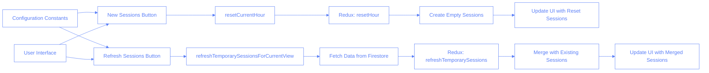

# Sessions Controls Features

## Overview

The Sessions Controls component provides several key features for managing session data in the Pilates Studio Application. This document focuses on two primary session management buttons: "New Sessions" and "Refresh Sessions".

## Functionality

### New Sessions Button

The "New Sessions" button completely resets the current view, clearing all existing sessions and creating new empty session cards. This is useful when starting fresh scheduling for a specific hour/room/studio combination.

**Key behaviors:**

- Creates exactly the configured number of empty session cards (default: 6)
- Removes any existing session data for the current view (including trainee selections)
- Resets the Redux store data for the current hour/room/studio
- Generates new unique temporary IDs for each session

**When to use:**

- At the beginning of a scheduling period
- When needing to completely redo scheduling for a specific hour
- When wanting to clear all existing trainee assignments

### Refresh Sessions Button

The "Refresh Sessions" button fetches the latest data from the Firestore database and updates the current view while preserving any existing non-empty sessions. This is useful for refreshing the view with the latest changes from other users or devices.

**Key behaviors:**

- Maintains the configured number of session cards (default: 6)
- Preserves any non-empty sessions (sessions with assigned trainees)
- Updates the sessions with the latest data from the database
- Does not generate new temporary IDs for existing sessions

**When to use:**

- When collaborating with other instructors who might have made changes
- After making edits to check if they were properly saved
- If the local view appears out of sync with the database

## Implementation Details

The implementation involves two separate Redux actions and associated UI handlers:

### Configuration Constants

The application uses a configurable constant to determine the number of session cards:

```typescript
// In sessionsSlice.ts
// Configuration constants
const DEFAULT_SESSION_CARDS_COUNT = 6; // Number of session cards to display/generate
```

### New Sessions Implementation

```typescript
// In SessionControls.tsx
<Button
	variant="outline"
	onClick={() => {
		console.log("🔄 New Sessions button clicked");
		onResetHour();
	}}
	className="text-white z-10 bg-slate-600 border-slate-400 m-2 hover:bg-red-600/20"
>
	New Sessions
</Button>
```

This triggers the `resetCurrentHour` function which dispatches the `resetHour` Redux action:

```typescript
// In sessionsSlice.ts
resetHour: (
	state,
	action: PayloadAction<{
		date: string;
		hour: string;
		room: string;
		studio: string;
	}>
) => {
	const { date, hour, room, studio } = action.payload;

	// ... ensure structure exists ...

	// Create new empty sessions (using the configuration constant)
	const emptySessions: SessionForm[] = new Array(DEFAULT_SESSION_CARDS_COUNT)
		.fill(null)
		.map((_, index) => ({
			tempId: `empty-${date}-${hour}-${room}-${studio}-${index}`,
			datetime: `${date} ${hour}`,
			traineeId: undefined,
			studioId: studio,
			instructor: null,
			instructorId: undefined,
			categories: {},
			comments: "",
			status: "pending",
		}));

	// Update the state with empty sessions
	state.sessions[date][hour][room][studio].temporary = emptySessions;
};
```

### Refresh Sessions Implementation

```typescript
// In SessionControls.tsx
<Button
	variant="outline"
	onClick={() => {
		console.log("🔄 Refresh Sessions button clicked");
		onRefresh();
	}}
	className="text-white z-10 bg-slate-600 border-slate-400 m-2 hover:bg-blue-600/20"
>
	Refresh Sessions
</Button>
```

This triggers the `refreshTemporarySessionsForCurrentView` function which fetches data from Firestore and dispatches the `refreshTemporarySessions` Redux action:

```typescript
// In usePersistentSessions.ts
const refreshTemporarySessionsForCurrentView = useCallback(async () => {
  // ... fetch data from firestore ...

  // Dispatch the action to refresh the Redux state
  dispatch(
    refreshTemporarySessions({
      date: sessions.ui.selectedDate,
      hour: sessions.ui.selectedHour,
      room: sessions.ui.selectedRoom,
      studio: sessions.ui.selectedStudio,
      sessions: tempSessions,
    })
  );

  // ... return session count ...
}, [...]);
```

And in the Redux action:

```typescript
// Fill empty slots if needed (ensure we have the configured number of total sessions)
const currentSessionCount =
	state.sessions[date][hour][room][studio].temporary.length;
const emptySessionsNeeded = Math.max(
	0,
	DEFAULT_SESSION_CARDS_COUNT - currentSessionCount
);

if (emptySessionsNeeded > 0) {
	console.log(
		`➕ Redux: Adding ${emptySessionsNeeded} empty sessions to maintain ${DEFAULT_SESSION_CARDS_COUNT} slots`
	);

	// Create empty sessions...
}
```

## Technical Schema

The following diagram illustrates the flow and differences between the New Sessions and Refresh Sessions features:



## Usage Guidelines

### When to Use New Sessions:

1. At the beginning of a scheduling day
2. When wanting to completely restart scheduling for an hour
3. When multiple sessions have incorrect data and it's faster to reset than fix individually

### When to Use Refresh Sessions:

1. After making changes to verify they were saved
2. When collaborating with others who might have made changes
3. If you suspect the local view is out of sync with the database
4. To get the latest data without losing your current session selections

## Configuration Options

The number of session cards can be configured by modifying the `DEFAULT_SESSION_CARDS_COUNT` constant in `src/store/sessionsSlice.ts`. This value affects both the "New Sessions" and "Refresh Sessions" functionality, ensuring a consistent number of cards throughout the application.

## Multiple Choice Questions

1. What is the main difference between the New Sessions and Refresh Sessions buttons?

   - [ ] A. They are identical and interchangeable
   - [ ] B. New Sessions creates more session cards than Refresh Sessions
   - [ ] C. New Sessions clears existing sessions and creates empty ones, while Refresh Sessions preserves non-empty sessions
   - [ ] D. Refresh Sessions works offline while New Sessions requires an internet connection

2. How many session cards are created by default with the New Sessions button?

   - [ ] A. 4
   - [ ] B. 5
   - [ ] C. 6
   - [ ] D. It varies based on the room size

3. How can the number of session cards be changed?

   - [ ] A. It cannot be changed as it's hardcoded
   - [ ] B. By modifying the DEFAULT_SESSION_CARDS_COUNT constant in sessionsSlice.ts
   - [ ] C. Through the user interface settings panel
   - [ ] D. By editing the HTML directly

4. What happens to existing sessions with assigned trainees when you click New Sessions?

   - [ ] A. They are preserved
   - [ ] B. They are cleared and replaced with empty sessions
   - [ ] C. They are archived for future reference
   - [ ] D. They are moved to a different time slot

5. In what scenarios should you use the New Sessions button?
   - [ ] A. When you just want to see the latest changes from other users
   - [ ] B. When you want to completely restart scheduling for an hour
   - [ ] C. When you want to preserve your existing trainee assignments
   - [ ] D. When you're finished scheduling for the day

## Answers

1. C - New Sessions clears existing sessions and creates empty ones, while Refresh Sessions preserves non-empty sessions
2. C - 6
3. B - By modifying the DEFAULT_SESSION_CARDS_COUNT constant in sessionsSlice.ts
4. B - They are cleared and replaced with empty sessions
5. B - When you want to completely restart scheduling for an hour
