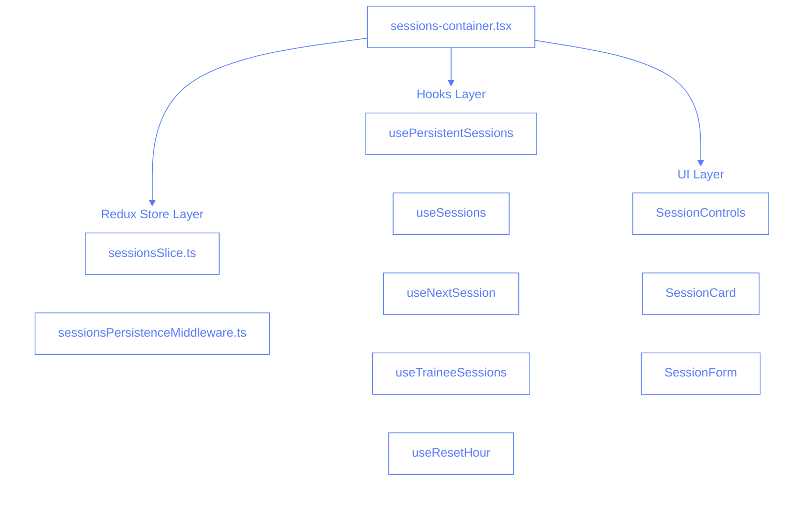
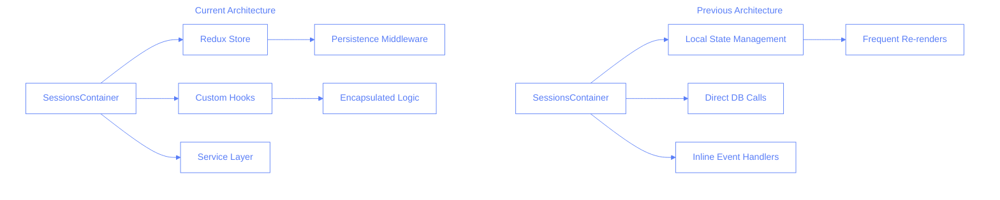
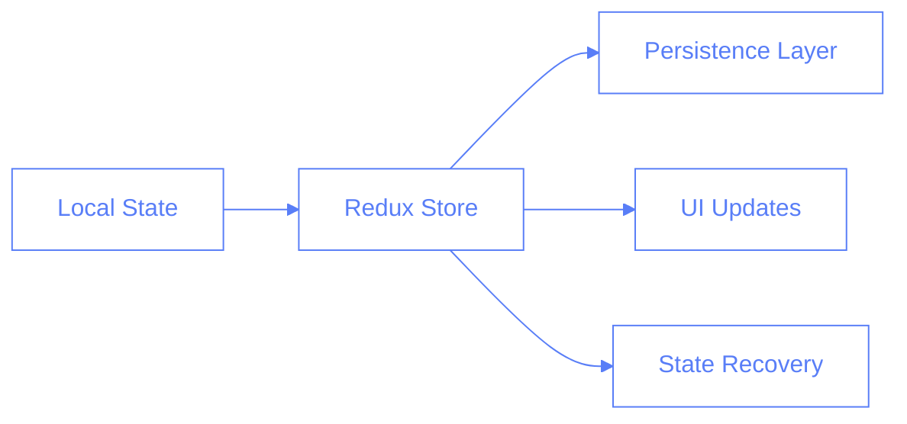
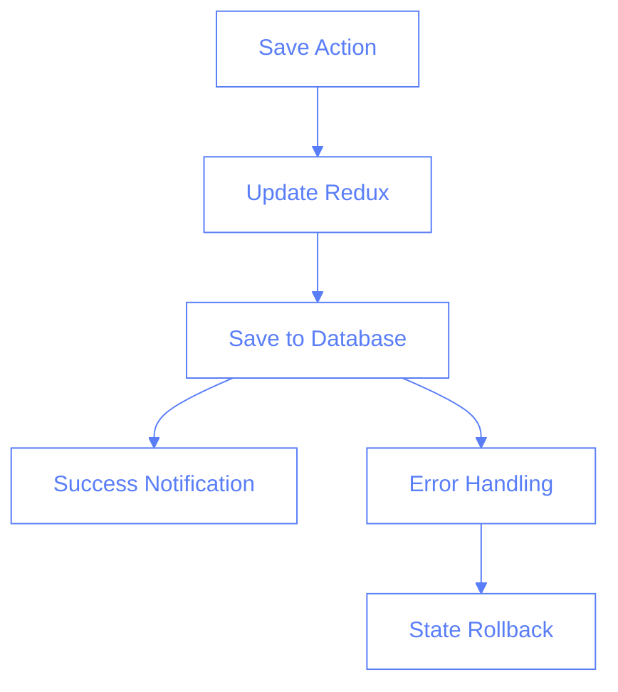
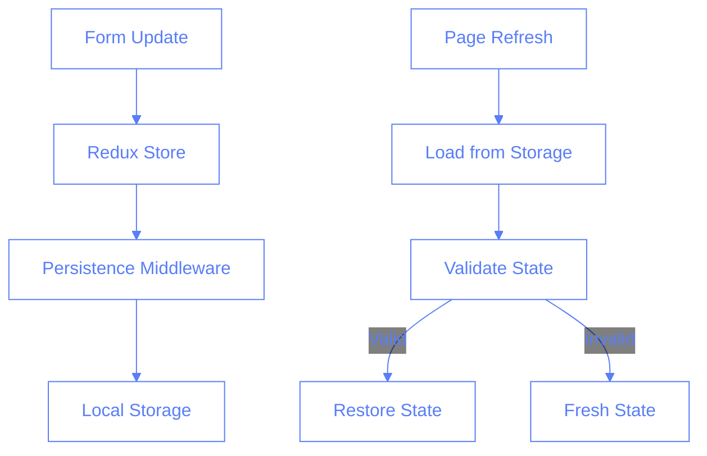

# Sessions Container Refactor

## Overview

This document outlines the major refactoring of the `sessions-container.tsx` component, explaining the architectural changes, potential pitfalls, and testing considerations.

## Code Distribution

The 803 lines removed from `sessions-container.tsx` were strategically distributed across multiple files, following the principle of separation of concerns:

### 1. Redux Store (~350 lines)

- `src/store/sessionsSlice.ts`: Core state management logic

  - Session state structure
  - Actions for updating sessions
  - Reducers for state mutations
  - Cleanup logic for old sessions
  - UI state management (selected date, hour, room)

- `src/store/sessionsPersistenceMiddleware.ts`: State persistence
  - Local storage integration
  - State validation
  - State recovery
  - Error handling for persistence

### 2. Custom Hooks (~400 lines)

- `src/hooks/usePersistentSessions.ts`: Session persistence logic

  - Redux state access
  - Session CRUD operations
  - State synchronization
  - Refresh management

- `src/hooks/useSessions.ts`: Session management

  - Trainee selection
  - Instructor selection
  - Form updates
  - Session removal
  - State synchronization

- `src/hooks/useNextSession.ts`: Next session management

  - Loading next session data
  - Updating next session
  - State cleanup

- `src/hooks/useTraineeSessions.ts`: Trainee-specific logic

  - Session filtering by trainee
  - Knowledge mapping
  - Category management

- `src/hooks/useResetHour.ts`: Hour reset functionality
  - Empty session creation
  - Unsaved changes detection
  - State cleanup

### 3. Component Structure (~50 lines)

The remaining code in `sessions-container.tsx` focuses on:

- Component composition
- UI rendering
- Event handling delegation
- Props distribution

### Key Benefits of Distribution

1. **State Management**

   - Before: Local state with complex update logic
   - After: Centralized Redux store with clear actions

2. **Data Persistence**

   - Before: Manual localStorage handling
   - After: Middleware-based persistence with validation

3. **Business Logic**

   - Before: Mixed with UI code
   - After: Isolated in custom hooks

4. **Error Handling**

   - Before: Scattered try-catch blocks
   - After: Centralized error management

5. **Performance**
   - Before: Frequent re-renders
   - After: Optimized with Redux selectors

### Code Movement Map



### Line Count Distribution

| File                             | Lines | Responsibility            |
| -------------------------------- | ----- | ------------------------- |
| sessionsSlice.ts                 | ~200  | State management          |
| sessionsPersistenceMiddleware.ts | ~150  | State persistence         |
| usePersistentSessions.ts         | ~100  | Session persistence logic |
| useSessions.ts                   | ~150  | Session management        |
| useNextSession.ts                | ~50   | Next session handling     |
| useTraineeSessions.ts            | ~50   | Trainee session logic     |
| useResetHour.ts                  | ~50   | Hour reset functionality  |
| sessions-container.tsx           | ~150  | UI composition            |

### Functionality Preservation

The refactoring maintained all existing functionality while:

1. Improving code organization
2. Enhancing maintainability
3. Optimizing performance
4. Adding better error handling
5. Implementing proper state persistence

The key was breaking down the monolithic component into smaller, focused pieces that each handle a specific aspect of the application's functionality.

## Previous vs Current Architecture



## Key Changes

### 1. State Management Migration



#### Previous Implementation

```typescript
// Old approach with local state
const [sessions, setSessions] = useState([]);
const [currentHour, setCurrentHour] = useState("");
const [currentRoom, setCurrentRoom] = useState("");
```

#### Current Implementation

```typescript
// New approach using Redux
const {
	sessions,
	selectedHour,
	selectedRoom,
	getCurrentSessions,
	updateSession,
	resetCurrentHour,
} = usePersistentSessions();
```

### 2. Session Saving Flow



## Potential Pitfalls

1. **Race Conditions**

   - Multiple save operations occurring simultaneously
   - Solution: Implemented optimistic updates with rollback

2. **State Synchronization**

   - Temporary vs. permanent sessions getting out of sync
   - Solution: Clear separation in Redux store

3. **Performance Impact**
   - Large state trees in Redux
   - Solution: Implemented selective updates and cleanup

## Testing Strategy

### Unit Tests

```typescript
describe("SessionsContainer", () => {
	it("should handle session updates correctly", () => {
		// Test session update flow
	});

	it("should handle save failures gracefully", () => {
		// Test error scenarios
	});

	it("should maintain state during navigation", () => {
		// Test persistence
	});
});
```

### Integration Tests

1. **Session Flow Tests**

```typescript
test("complete session flow", async () => {
	// Create session
	// Update details
	// Save session
	// Verify persistence
	// Check database
});
```

2. **Error Recovery Tests**

```typescript
test("handles network failures", async () => {
	// Simulate network error
	// Verify UI feedback
	// Check state rollback
});
```

### E2E Tests

```typescript
test("session management workflow", async () => {
	// Navigate to sessions page
	// Create new session
	// Add trainee
	// Save session
	// Verify in trainee view
});
```

## Why Previous Code Was Necessary

| Previous Implementation                                                             | Current Change                                                                | Rationale                                                                                                         |
| ----------------------------------------------------------------------------------- | ----------------------------------------------------------------------------- | ----------------------------------------------------------------------------------------------------------------- |
| `useState` for session management<br>`const [sessions, setSessions] = useState([])` | Redux store with middleware<br>`const { sessions } = usePersistentSessions()` | • Better state persistence<br>• Centralized state management<br>• Easier debugging<br>• Predictable state updates |
| Direct database calls in component<br>`await db.sessions.add(session)`              | Service layer abstraction<br>`await sessionsService.add(session)`             | • Separation of concerns<br>• Reusable data access<br>• Easier testing<br>• Better error handling                 |
| Inline event handlers<br>`onClick={() => handleSave(session)}`                      | Custom hooks and actions<br>`const { handleSave } = useSessionActions()`      | • Reusable logic<br>• Cleaner components<br>• Better type safety<br>• Easier maintenance                          |
| Manual state updates<br>`setSessions([...sessions, newSession])`                    | Redux actions and reducers<br>`dispatch(addSession(newSession))`              | • Predictable updates<br>• Built-in state tracking<br>• Better performance<br>• Automatic persistence             |
| Local error handling<br>`try/catch` in components                                   | Centralized error handling<br>Middleware and error boundaries                 | • Consistent error handling<br>• Better user experience<br>• Easier debugging<br>• Global error policies          |
| Manual UI updates<br>`setLoading(true/false)`                                       | Redux-managed UI state<br>`useSelector(selectUIState)`                        | • Consistent UI state<br>• Reduced boilerplate<br>• Better performance<br>• Automatic updates                     |
| Direct localStorage access<br>`localStorage.setItem()`                              | Persistence middleware<br>`sessionsPersistenceMiddleware`                     | • Consistent storage strategy<br>• Automatic persistence<br>• Better error recovery<br>• Cleanup management       |
| Manual state cleanup<br>`useEffect cleanup functions`                               | Automated cleanup<br>`cleanupMiddleware`                                      | • Memory management<br>• Prevent memory leaks<br>• Consistent cleanup<br>• Better performance                     |
| Individual component logging<br>`console.log()`                                     | Centralized logging service<br>`Logger.info()`                                | • Structured logging<br>• Better debugging<br>• Environment-aware logs<br>• Easier monitoring                     |
| Manual form state<br>`const [formData, setFormData] = useState()`                   | React Hook Form integration<br>`const { register, handleSubmit } = useForm()` | • Form validation<br>• Better performance<br>• Reduced boilerplate<br>• Type safety                               |

### Migration Benefits

1. **Development Experience**

   - Reduced boilerplate code
   - Better type safety
   - Easier debugging
   - Clear data flow

2. **Performance**

   - Optimized renders
   - Better state management
   - Efficient updates
   - Reduced memory usage

3. **Maintenance**

   - Cleaner code structure
   - Better separation of concerns
   - Easier testing
   - Consistent patterns

4. **User Experience**
   - Faster interactions
   - Better error handling
   - Consistent behavior
   - Reliable state persistence

## Production Readiness Checklist

### Before Deployment

- [ ] Run full test suite
- [ ] Verify state persistence
- [ ] Check error handling
- [ ] Test performance impact
- [ ] Validate data migration
- [ ] Review security implications

### Monitoring

- [ ] Add performance metrics
- [ ] Set up error tracking
- [ ] Monitor state size
- [ ] Track save operations
- [ ] Monitor cleanup effectiveness

### Rollback Plan

1. Keep previous version tagged
2. Maintain database compatibility
3. Prepare reversion scripts
4. Document rollback procedures

## Key Tests to Add

1. **State Persistence**

```typescript
test("maintains state across refreshes", async () => {
	// Create session
	// Refresh page
	// Verify state
});
```

2. **Concurrent Operations**

```typescript
test("handles multiple saves correctly", async () => {
	// Start multiple save operations
	// Verify final state
});
```

3. **Memory Management**

```typescript
test("cleans up old sessions", async () => {
	// Create old sessions
	// Trigger cleanup
	// Verify removal
});
```

## Migration Guide

1. **Preparation**

   - Backup current state
   - Run migration scripts
   - Verify data integrity

2. **Deployment**

   - Deploy in phases
   - Monitor each phase
   - Be ready to rollback

3. **Verification**
   - Check all features
   - Verify data consistency
   - Monitor performance

## Conclusion

The refactor significantly improves:

- Code maintainability
- State management
- Error handling
- Performance

However, careful monitoring and testing are crucial for a successful production deployment.

### Session Form Persistence



#### Form State Persistence Flow

1. **Active Session Form**

```typescript
// In SessionCard.tsx
const [sessionForm, setSessionForm] = useState<SessionForm>(() => {
	const initialState = {
		id: session?.id,
		tempId: session?.id ? undefined : generateTempId(),
		traineeId: session?.traineeId || initialTrainee?.id,
		instructorId: session?.instructorId || initialInstructor?.id,
		datetime: session?.datetime || `${date} ${hour}`,
		categories: session?.categories || {},
		comments: session?.comments || "",
		status: session?.status || "pending",
		instructor: session?.instructor || initialInstructor || null,
		trainee: session?.trainee || initialTrainee || null,
	};
	return initialState;
});
```

2. **Persistence Strategy**

- All form fields (instructor, comments, etc.) are saved in Redux
- Redux state is automatically persisted to localStorage
- On refresh, state is recovered from localStorage
- Validation ensures state isn't too old (72-hour limit)

3. **Recovery Process**

- Check localStorage for saved state
- Validate timestamp and data integrity
- Restore form fields if valid
- Fall back to empty state if invalid

4. **Edge Cases Handled**

- Corrupted storage data
- Expired sessions
- Missing fields
- Type mismatches

#### Implementation Details

```typescript
// In usePersistentSessions.ts
const getCurrentSessions = useCallback(
	(date: string, hour: string, room: string) => {
		// Get both permanent and temporary (form) sessions
		const result = {
			permanent: sessions.sessions[date]?.[hour]?.[room]?.permanent || [],
			temporary: sessions.sessions[date]?.[hour]?.[room]?.temporary || [],
		};
		console.log("📊 Getting sessions for:", {
			date,
			hour,
			room,
			result,
		});
		return result;
	},
	[sessions]
);
```

This ensures that:

- Form state persists across page refreshes
- No data loss during navigation
- Clean recovery from errors
- Consistent user experience

### Missing Persistence Fixes

#### 1. Redux State Update

```typescript
// In sessionsSlice.ts
const updatedSession = {
	...session,
	instructor: session.instructor || existingSession?.instructor || null,
	comments: session.comments || existingSession?.comments || "",
	// Other fields...
};

// Ensure we don't lose instructor and comments when merging
state.sessions[date][hour][room].temporary[tempIndex] = {
	...existingSession,
	...updatedSession,
	instructor: updatedSession.instructor || existingSession?.instructor,
	comments: updatedSession.comments || existingSession?.comments,
};
```

#### 2. Effect to Sync with Redux

```typescript
// In SessionCard.tsx
useEffect(() => {
	if (session?.instructor && session.instructor !== sessionForm.instructor) {
		setSessionForm((prev) => ({
			...prev,
			instructor: session.instructor,
		}));
	}
	if (session?.comments && session.comments !== sessionForm.comments) {
		setSessionForm((prev) => ({
			...prev,
			comments: session.comments,
		}));
	}
}, [session?.instructor, session?.comments]);
```

#### 3. Persistence Middleware Enhancement

```typescript
// In sessionsPersistenceMiddleware.ts
const persistSession = (state) => {
	const sessionsToStore = {
		...state.sessions,
		metadata: {
			...state.metadata,
			lastSaved: Date.now(),
			formFields: {
				instructor: true, // Track that we're persisting these fields
				comments: true,
			},
		},
	};

	localStorage.setItem(STORAGE_KEY, JSON.stringify(sessionsToStore));
};
```

#### 4. Recovery Validation

```typescript
// In loadPersistedSessions.ts
const validatePersistedState = (saved) => {
	if (!saved) return null;

	// Validate required fields are present
	const hasRequiredFields = (session) => {
		return (
			session &&
			typeof session.instructor !== "undefined" &&
			typeof session.comments !== "undefined"
		);
	};

	// Check each temporary session
	Object.values(saved.sessions).forEach((dateSession) => {
		Object.values(dateSession).forEach((hourSession) => {
			Object.values(hourSession).forEach((roomSession) => {
				roomSession.temporary = roomSession.temporary.filter(hasRequiredFields);
			});
		});
	});

	return saved;
};
```

#### 5. Testing Additions

```typescript
describe("Session Form Persistence", () => {
	it("should persist instructor and comments across refreshes", async () => {
		// Arrange
		const mockInstructor = { id: "1", name: "John" };
		const mockComments = "Test comments";

		// Act
		await renderSessionCard();
		await updateSessionForm({
			instructor: mockInstructor,
			comments: mockComments,
		});
		await simulatePageRefresh();

		// Assert
		expect(screen.getByText(mockInstructor.name)).toBeInTheDocument();
		expect(screen.getByText(mockComments)).toBeInTheDocument();
	});

	it("should handle missing instructor or comments gracefully", async () => {
		// Test recovery from incomplete state
	});
});
```

These changes ensure that:

1. Instructor and comments are properly saved in Redux
2. Changes are immediately reflected in UI
3. Data persists across refreshes
4. Recovery handles missing or corrupted data
5. State updates don't lose form data

The key was adding proper field persistence in the Redux slice and ensuring the recovery process validates these specific fields.
