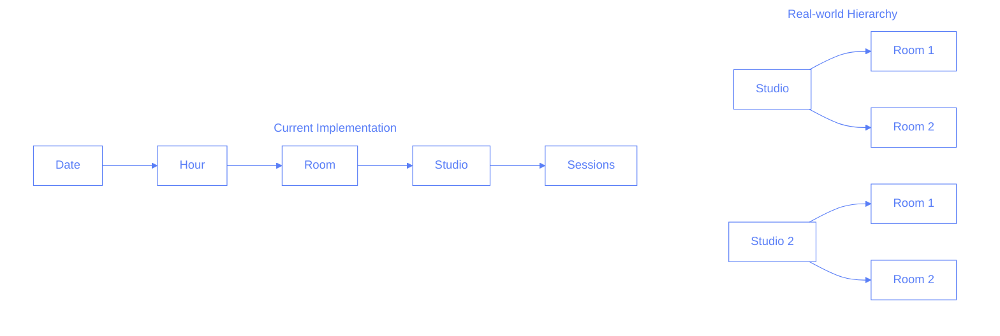
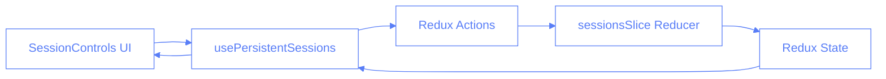
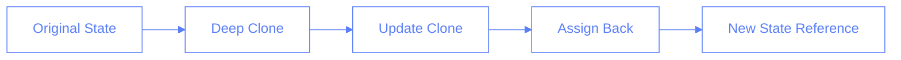
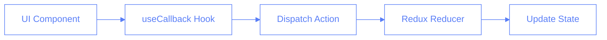

# Studio State Management in Pilates Studio App

## Overview

This document outlines the lessons learned and best practices for managing studio state in our application, particularly focusing on the challenges we encountered and their solutions.

## Data Hierarchy Considerations

### Real-world vs. Implementation Structure



### Implementation Considerations

1. **Current Structure** (`[date][hour][room][studio]`):

   - Optimized for time-based queries
   - Easy to get all sessions for a specific time slot
   - Requires additional logic to group by studio

2. **Alternative Structure** (`[date][hour][studio][room]`):
   - More aligned with real-world relationships
   - Better for studio-based queries
   - Would require changes to existing selectors and reducers

### Impact on Views

```typescript
// Current Implementation
const sessions = state.sessions[date][hour][room][studio];

// Alternative Implementation
const sessions = state.sessions[date][hour][studio][room];
```

The current implementation still works because:

1. Each studio-room combination is unique
2. The UI allows filtering by both studio and room
3. Data integrity is maintained through proper initialization

### Quiz: Data Hierarchy

1. In the real world, what is the correct hierarchy?
   a) Room contains Studios
   b) Studios contain Rooms
   c) They are independent
   d) It depends on the implementation

Answer: b) Studios contain Rooms - This reflects the physical organization where a studio facility contains multiple rooms.

2. Why might we keep the current implementation despite it not matching real-world hierarchy?
   a) It's too difficult to change
   b) It's optimized for time-based queries
   c) It uses less memory
   d) TypeScript requires it

Answer: b) It's optimized for time-based queries - Our app primarily displays and manages sessions by time slots, making this structure more efficient for our main use case.

### Practical Example

```typescript
// Real-world structure example
interface Studio {
	id: string;
	name: string;
	rooms: {
		[roomId: string]: {
			sessions: SessionForm[];
		};
	};
}

// Current implementation
interface TimeSlot {
	[room: string]: {
		[studio: string]: {
			permanent: Session[];
			temporary: SessionForm[];
		};
	};
}
```

### Migration Considerations

If we wanted to align with real-world hierarchy, we would need to:

1. Update the state structure
2. Modify all selectors and reducers
3. Update UI components
4. Migrate existing data

The tradeoff between matching real-world hierarchy and maintaining current functionality led to keeping the current implementation because:

1. Time-based queries are more frequent
2. UI components are already optimized for current structure
3. Data integrity is maintained
4. Performance is good with current implementation

## Key Components and Data Flow



## State Structure

The Redux state for studios is nested within the session state:

```typescript
interface SessionsState {
	sessions: {
		[date: string]: {
			[hour: string]: {
				[room: string]: {
					[studio: string]: {
						permanent: Session[];
						temporary: SessionForm[];
					};
				};
			};
		};
	};
	ui: {
		selectedStudio: string;
		// ... other UI state
	};
}
```

### Quiz: State Structure

1. What is the correct nesting order for sessions in the state?
   a) date > studio > hour > room
   b) studio > date > room > hour
   c) date > hour > room > studio
   d) room > studio > date > hour

Answer: c) date > hour > room > studio - This order optimizes for time-based queries, which is our primary access pattern.

2. Where is the selected studio stored in the state?
   a) In the sessions object
   b) In the ui object
   c) In the metadata object
   d) In a separate studios object

Answer: b) In the ui object - UI-related state is kept separate from data state for better state management and clearer separation of concerns.

## Lessons Learned

### 1. Proper State Initialization

One of the key issues we encountered was improper state initialization when creating new sessions. The solution involved ensuring the complete state structure exists before operations:

```typescript
// Wrong ❌
state.sessions[date][hour][room][studio].temporary = [];

// Right ✅
if (!state.sessions[date]) state.sessions[date] = {};
if (!state.sessions[date][hour]) state.sessions[date][hour] = {};
if (!state.sessions[date][hour][room]) state.sessions[date][hour][room] = {};
if (!state.sessions[date][hour][room][studio]) {
	state.sessions[date][hour][room][studio] = {
		permanent: [],
		temporary: [],
	};
}
```



```mermaid
%%{init: {'theme': 'base', 'themeVariables': {
'primaryColor': '#ffffff',
'primaryTextColor': '#597ef7',
'primaryBorderColor': '#597ef7',
'lineColor': '#597ef7',
'textColor': '#597ef7',
'mainBkg': 'transparent',
'nodeBorder': '#597ef7',
'clusterBkg': 'transparent',
'labelTextColor': '#597ef7',
'titleColor': '#597ef7',
'clusterBorder': '#fff',
'edgeLabelBackground': 'transparent'
}}}%%
graph LR
    Check1[Check date] --> Create1[Create date object]
    Create1 --> Check2[Check hour]
    Check2 --> Create2[Create hour object]
    Create2 --> Check3[Check room]
    Check3 --> Create3[Create room object]
    Create3 --> Check4[Check studio]
    Check4 --> Create4[Create studio object]
```

### Quiz: State Initialization

1. Why do we need to check each level of the state structure?
   a) To improve performance
   b) To prevent type errors when accessing nested properties
   c) To save memory
   d) To make the code more readable

Answer: b) To prevent type errors when accessing nested properties - This ensures the state structure is consistent and prevents undefined errors when accessing or updating nested properties.

### State Initialization Deep Dive

While TypeScript's optional chaining (`?.`) can help prevent runtime errors when accessing nested properties, it doesn't solve the fundamental issue of state structure initialization. Here's why:

```typescript
// Using optional chaining (NOT sufficient)
const sessions = state.sessions?.[date]?.[hour]?.[room]?.[studio]?.temporary;
// Problem: sessions will be undefined, but we need an empty array!

// Proper initialization (Required)
if (!state.sessions[date]) state.sessions[date] = {};
// Ensures we have a valid object to work with, not just null-safety
```

Optional chaining is for safe property access, but proper initialization:

1. Ensures correct data structure for operations (empty arrays vs undefined)
2. Maintains consistent state shape
3. Prevents undefined errors in reducers and components
4. Makes TypeScript type inference more accurate

### 2. Immutable Updates

When updating the state, we learned to use immutable updates to prevent type coercion issues:

```typescript
// Wrong ❌
state.sessions[date][hour][room][studio] = {
	permanent: [],
	temporary: emptySessions,
};

// Right ✅
const newState = {
	...state.sessions,
	[date]: {
		...state.sessions[date],
		[hour]: {
			...state.sessions[date]?.[hour],
			[room]: {
				...state.sessions[date]?.[hour]?.[room],
				[studio]: {
					permanent: [],
					temporary: emptySessions,
				},
			},
		},
	},
};
state.sessions = newState;
```



### Quiz: Immutable Updates

1. Why do we use the spread operator (...) when updating state?
   a) To copy all properties without mutation
   b) To merge objects
   c) To remove undefined values
   d) To improve performance

Answer: a) To copy all properties without mutation - The spread operator creates a new object with all properties from the original object, ensuring no mutation.

2. What's the benefit of creating a new state object instead of mutating the existing one?
   a) It's faster
   b) It prevents bugs from unexpected state changes
   c) It uses less memory
   d) It's required by TypeScript

Answer: b) It prevents bugs from unexpected state changes - Creating a new state object ensures that the original state is not mutated, preventing bugs from unintended state changes.

### Immutable Updates Explained

Immutable updates are crucial in Redux for several reasons:

```typescript
// Mutating state directly (WRONG)
state.sessions[date][hour][room][studio].temporary.push(newSession);
// Problems:
// 1. Redux change detection fails (same reference)
// 2. Components don't re-render
// 3. Time-travel debugging breaks
// 4. State becomes unpredictable

// Immutable update (CORRECT)
const newState = {
	...state.sessions,
	[date]: {
		...state.sessions[date],
		[hour]: {
			...state.sessions[date]?.[hour],
			[room]: {
				...state.sessions[date]?.[hour]?.[room],
				[studio]: {
					permanent: [],
					temporary: [...existingSessions, newSession],
				},
			},
		},
	},
};
```

Why Immutability Matters:

1. **Change Detection**: Redux uses reference equality to detect changes
2. **Predictable Updates**: Each action creates a new state snapshot
3. **Debugging**: Enables time-travel debugging by preserving state history
4. **React Performance**: Allows efficient re-rendering through reference checks

### 3. Action Handling

Proper action handling in the Redux slice is crucial:

```typescript
// Action definition
setSelectedStudio: (state, action: PayloadAction<string>) => {
	state.ui.selectedStudio = action.payload;
};

// Hook implementation
const setStudio = useCallback(
	(studio: string) => {
		dispatch(setSelectedStudio(studio));
	},
	[dispatch]
);
```



### Quiz: Action Handling

1. Why do we use useCallback for action dispatchers?
   a) To prevent unnecessary re-renders
   b) To make the code more readable
   c) To handle errors
   d) To improve type safety

Answer: a) To prevent unnecessary re-renders - useCallback memoizes the function reference, preventing recreation on each render which helps optimize performance by avoiding unnecessary re-renders of child components.

2. What's the purpose of PayloadAction type?
   a) To validate the action payload
   b) To provide type safety for the action payload
   c) To optimize the action dispatch
   d) To format the payload data

Answer: b) To provide type safety for the action payload - PayloadAction is a TypeScript type that ensures action creators receive the correct data type at compile time, preventing runtime type errors.

## Best Practices Summary

1. **Complete State Structure**: Always ensure the complete state structure exists before performing operations.
2. **Immutable Updates**: Use immutable update patterns to prevent type coercion issues.
3. **Type Safety**: Leverage TypeScript's type system for action payloads and state structure.
4. **Action Exports**: Export all actions from the slice and import them explicitly where needed.
5. **Proper Initialization**: Initialize all levels of nested state before use.

### Quiz: Best Practices

1. Which of these is NOT a best practice for studio state management?
   a) Using immutable updates
   b) Direct state mutation
   c) Complete state structure initialization
   d) Type-safe action payloads

Answer: b) Direct state mutation - Mutating state directly violates Redux principles, breaks change detection, and can lead to unpredictable behavior and debugging difficulties.

2. What should you do before accessing deeply nested state properties?
   a) Use optional chaining
   b) Initialize the complete path
   c) Use try/catch blocks
   d) Add type assertions

Answer: b) Initialize the complete path - Proper initialization ensures the state structure exists and is consistent, preventing undefined errors and maintaining predictable state shape.

## Conclusion

Proper studio state management requires careful attention to state structure, immutable updates, and type safety. Following these patterns helps prevent common issues and makes the code more maintainable.

---

### Redux Core Concepts and File Structure

```mermaid
%%{init: {'theme': 'base', 'themeVariables': {
'primaryColor': '#ffffff',
'primaryTextColor': '#597ef7',
'primaryBorderColor': '#597ef7',
'lineColor': '#597ef7',
'textColor': '#597ef7',
'mainBkg': 'transparent',
'nodeBorder': '#597ef7',
'clusterBkg': 'transparent',
'labelTextColor': '#597ef7',
'titleColor': '#597ef7',
'clusterBorder': '#fff',
'edgeLabelBackground': 'transparent'
}}}%%
graph TB
    subgraph "File Structure"
    UI[sessions-container.tsx]
    Hook[usePersistentSessions.ts]
    Slice[sessionsSlice.ts]
    Types[session.ts]
    end

    UI --> Hook
    Hook --> Slice
    Slice --> Types

    subgraph "Redux Flow"
    Action[Action Dispatch] --> Reducer[Reducer Function]
    Reducer --> Store[Redux Store]
    Store --> Select[Selector]
    Select --> Component[UI Component]
    end
```



Key Redux Concepts:

1. **Reducer**: A pure function that takes current state + action and returns new state

   ```typescript
   // In sessionsSlice.ts
   setSelectedStudio: (state, action: PayloadAction<string>) => {
   	state.ui.selectedStudio = action.payload;
   };
   ```

2. **Dispatch**: Method to send actions to the Redux store

   ```typescript
   // In usePersistentSessions.ts
   const dispatch = useDispatch();
   const setStudio = useCallback(
   	(studio: string) => {
   		dispatch(setSelectedStudio(studio));
   	},
   	[dispatch]
   );
   ```

3. **Store**: Central state container
   ```typescript
   // Access in components
   const selectedStudio = useSelector(
   	(state) => state.sessions.ui.selectedStudio
   );
   ```

Studio Selection Flow:

1. User clicks studio in UI (`sessions-container.tsx`)
2. Component calls `setStudio` from hook
3. Hook dispatches `setSelectedStudio` action
4. Reducer updates state
5. UI components re-render with new studio
