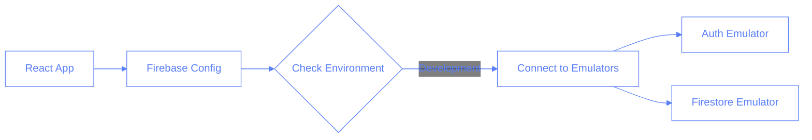
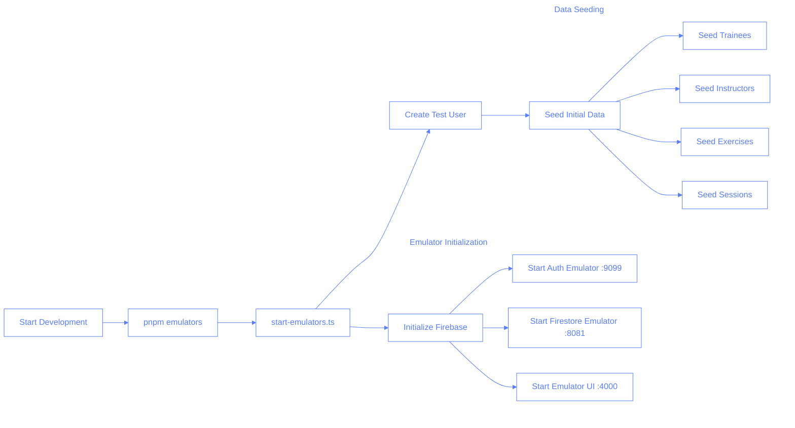
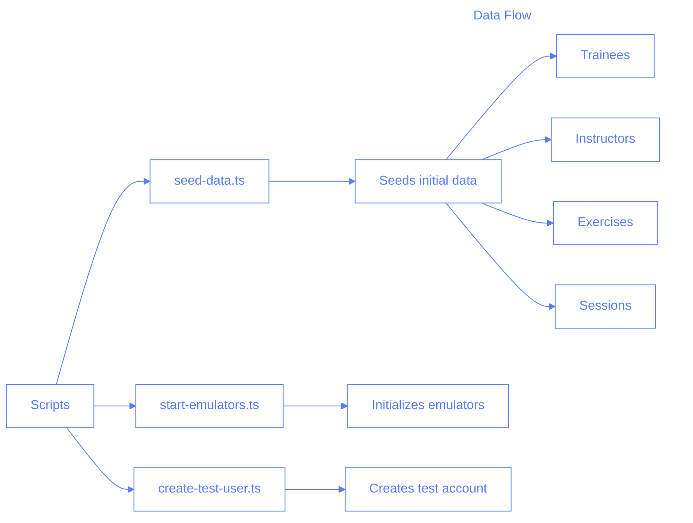
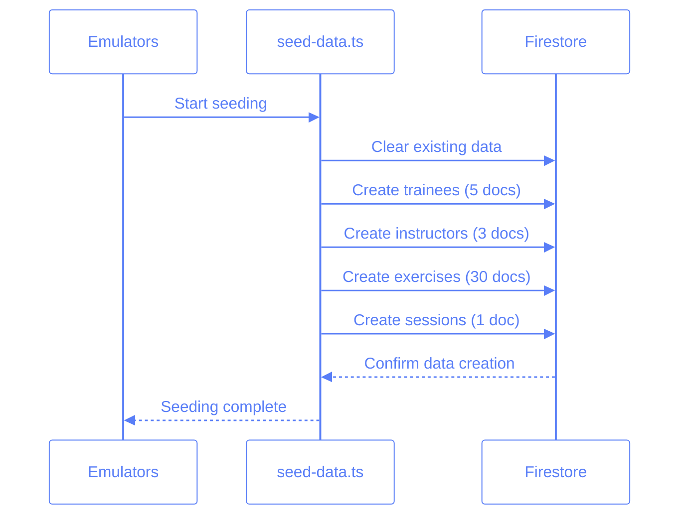
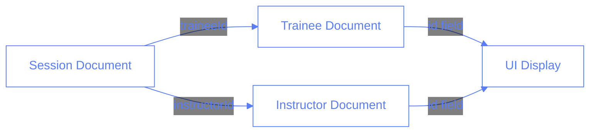

# Firebase Emulators & Data Flow

This document outlines how Firebase emulators are used in development and how the setup differs from production.

## Dev Flow



## Development Environment Flow



## Production Environment Flow

```mermaid
%%{init: {'theme': 'base', 'themeVariables': {
    'primaryColor': '#ffffff',
    'primaryTextColor': '#597ef7',
    'primaryBorderColor': '#597ef7',
    'lineColor': '#597ef7',
    'textColor': '#597ef7',
    'mainBkg': 'transparent',
    'nodeBorder': '#597ef7',
    'clusterBkg': 'transparent',
    'labelTextColor': '#597ef7',
    'titleColor': '#597ef7',
    'clusterBorder': '#fff',
    'edgeLabelBackground': 'transparent'
}}}%%

graph LR
    A[Start Production] --> B[Firebase Production Services]

    subgraph "Firebase Services"
        B --> C[Authentication]
        B --> D[Firestore Database]
    end

    subgraph "Data Structure"
        E[Business Collection] --> F[Trainees Collection]
        E --> G[Instructors Collection]
        E --> H[Sessions Collection]
        I[Global Exercises] --> J[Shared Across Businesses]
    end

    subgraph "Application Flow"
        K[React App] --> L[Firebase Config]
        L --> M[Production Endpoints]
        M --> N[Auth Service]
        M --> O[Firestore Service]
    end
```

## Key Differences

### Development (Emulators)

- Uses local emulators for Auth and Firestore
- Data is seeded automatically on startup
- Test user is created automatically
- Data is ephemeral (cleared on restart)
- Business prefix is hardcoded to "1:"
- All operations are allowed (no security rules)

### Production

- Uses real Firebase services
- Data persists
- Real authentication required
- Security rules enforced
- Business-specific collections
- Proper data isolation between businesses

## Scripts Overview



## Data Seeding Process



## Document ID Handling in Emulator Data

When seeding data into the Firebase emulator, proper handling of document IDs is crucial for maintaining data integrity and visibility. Here's why and how:

### Document ID Pattern

```typescript
// ✅ Correct way - Keep ID in document data
const docData = {
	id: "trainee123",
	firstName: "John",
	lastName: "Doe",
};
await setDoc(docRef, docData);

// ❌ Incorrect way - Stripping ID

// This uses object destructuring to extract the 'id' property from docData
// and collects all remaining properties into a new 'data' object.
// The spread operator (...) creates a new object without the 'id' field.
// This is problematic because:
// 1. It removes the ID from the document data
// 2. Breaks data relationships and referential integrity
// 3. Makes debugging harder in the Emulator UI
const { id, ...data } = docData; // Don't do this!
await setDoc(docRef, data);
```

### Why ID Preservation Matters

1. **Reference Integrity**: Documents often reference each other (e.g., sessions referencing trainee IDs)
2. **UI Visibility**: The Emulator UI relies on proper document structure
3. **Consistency**: Matches production data structure where IDs are part of the document

### Impact on Data Relationships



### Best Practices for Seeding

1. **Always Include IDs**: Keep document IDs in both the reference and the data
2. **Verify After Writing**: Use verification steps to confirm data presence
3. **Use Business Prefixes**: Maintain proper collection prefixing (e.g., `${BUSINESS_ID}:trainees`)
4. **Match Production Schema**: Follow the same data structure as production

### Common Issues and Solutions

| Issue                  | Impact                   | Solution                     |
| ---------------------- | ------------------------ | ---------------------------- |
| Missing IDs            | Data relationships break | Keep IDs in document data    |
| Wrong Collection Names | Data not visible         | Use proper business prefixes |
| Incomplete Data        | UI rendering issues      | Follow complete schema       |
| Reference Mismatches   | Broken relationships     | Verify references exist      |

## Exercise Data Structure

```mermaid
%%{init: {'theme': 'base', 'themeVariables': {
    'primaryColor': '#ffffff',
    'primaryTextColor': '#597ef7',
    'primaryBorderColor': '#597ef7',
    'lineColor': '#597ef7',
    'textColor': '#597ef7',
    'mainBkg': 'transparent',
    'nodeBorder': '#597ef7',
    'clusterBkg': 'transparent',
    'labelTextColor': '#597ef7',
    'titleColor': '#597ef7',
    'clusterBorder': '#fff',
    'edgeLabelBackground': 'transparent'
}}}%%
graph LR
    A[exercises.json] --> B[Exercises Collection]
    B --> C[Category Structure]

    subgraph "Categories"
        C --> D[Warm Up]
        C --> E[Foot Work]
        C --> F[Abdominal]
        C --> G[Strap]
        C --> H[Spinal]
        C --> I[Stretch]
        C --> J[FBI]
        C --> K[Arm]
        C --> L[Extra Leg]
        C --> M[Back]
    end

    subgraph "Exercise Properties"
        N[Exercise] --> O[category]
        N --> P[subcategory]
        N --> Q[series]
        N --> R[exercise name]
    end
```
