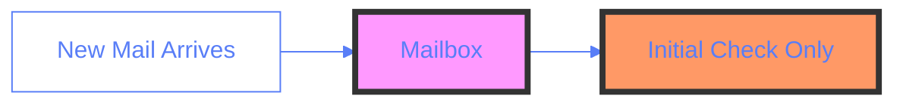
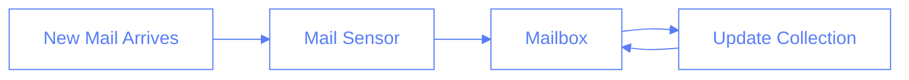
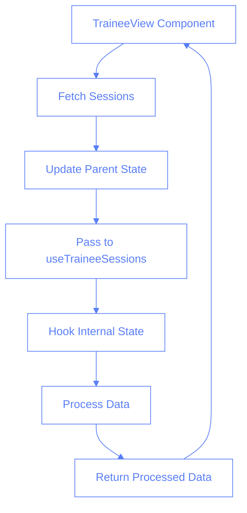
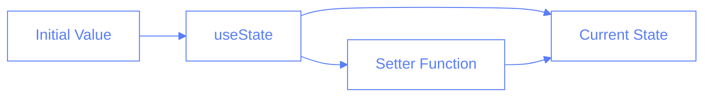
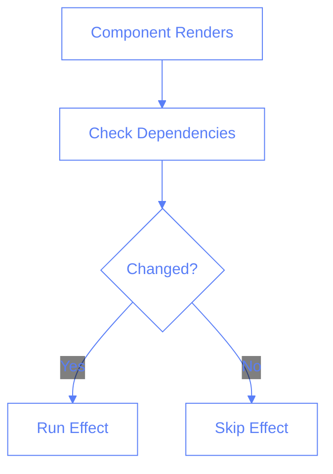
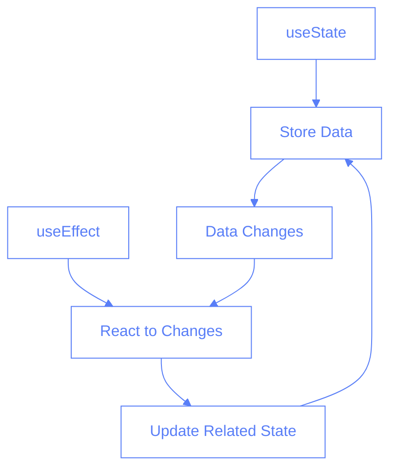
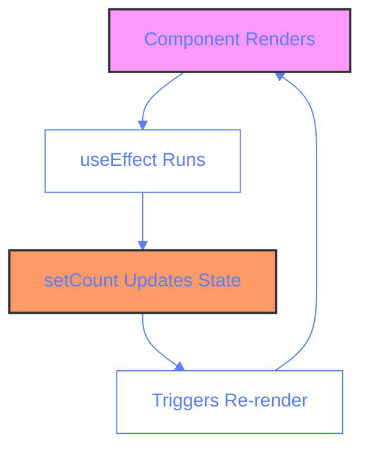

# Hooks and State Management: Lessons from TraineeView

## Overview

This document outlines key lessons learned from debugging state management issues in the TraineeView component and useTraineeSessions hook. We'll explore best practices for state synchronization between parent and child components, proper hook usage, and effective debugging strategies.

## The Mailbox Analogy 📬

Imagine you have a smart mailbox (our hook) that's supposed to sort letters (sessions) for different people (trainees).

### The Problem

Initially, our code was like having a mailbox that:

1. Only checked for mail once when installed (`useState` without `useEffect`)
2. Didn't update when new mail arrived



### The Solution

We fixed it by:

1. Adding a mail sensor (`useEffect`)
2. Updating our mail collection when new mail arrives



## Code Examples

### Problem Code

```typescript
// 🚫 Before - Problem code
const useMailbox = (newMail) => {
	// Only sets initial mail, ignores updates!
	const [mail] = useState(newMail);
	// ... process mail ...
};
```

### Fixed Code

```typescript
// ✅ After - Fixed code
const useMailbox = (newMail) => {
	// Can update mail with setMail
	const [mail, setMail] = useState(newMail);

	// Checks for new mail and updates
	useEffect(() => {
		setMail(newMail);
	}, [newMail]);
	// ... process mail ...
};
```

## Parent-Child State Flow



### Actual Implementation

```typescript
// Parent Component (TraineeView)
const TraineeView = () => {
	const [sessions, setSessions] = useState([]);

	useEffect(() => {
		const fetchSessions = async () => {
			const data = await sessionsService.getAll();
			setSessions(data);
		};
		fetchSessions();
	}, []);

	return <UseTraineeSessions sessions={sessions} />;
};

// Hook (useTraineeSessions)
const useTraineeSessions = (initialSessions) => {
	const [sessions, setSessions] = useState(initialSessions);

	useEffect(() => {
		setSessions(initialSessions);
	}, [initialSessions]);

	return processedSessions;
};
```

## Best Practices

### 1. State Management

```typescript
// ✅ Do: Include setter function
const [state, setState] = useState(initial);

// ❌ Don't: Omit setter if state might update
const [state] = useState(initial);
```

### 2. Props Synchronization

```typescript
// ✅ Do: Sync with prop changes
useEffect(() => {
	setState(newProp);
}, [newProp]);

// ❌ Don't: Ignore prop updates
const [state] = useState(newProp);
```

### 3. Debugging

```typescript
// ✅ Do: Use structured logging
Logger.debug("📥 State update:", {
	new: newValue,
	current: currentValue,
});

// ❌ Don't: Use basic console.log
console.log("updated", newValue);
```

## Comprehension Check

### Section 1: State Management Basics

1. What is the main issue with the following code?

```typescript
const useMyHook = (initialData) => {
	const [data] = useState(initialData);
};
```

a) Missing type definition
b) Missing dependency array
c) Missing setter function ✅
d) Incorrect hook name

2. When should you use useEffect for state updates?
   a) Never
   b) Only for API calls
   c) When state needs to sync with prop changes ✅
   d) Only for initial render

### Section 2: Parent-Child Communication

3. In our example, why did the TraineeView need to pass sessions to useTraineeSessions?
   a) To improve performance
   b) To maintain single source of truth ✅
   c) To avoid using useState
   d) To prevent re-renders

4. What ensures the hook's internal state stays in sync with parent data?
   a) useState only
   b) useCallback
   c) useMemo
   d) useEffect with proper dependencies ✅

### Section 3: Debugging

5. Which logging approach is recommended for debugging state updates?
   a) console.log
   b) console.warn
   c) Structured logging with context ✅
   d) No logging needed

## Key Takeaways

1. Always include state setters when state might update
2. Use useEffect to sync with prop changes
3. Maintain clear parent-child data flow
4. Implement structured logging for debugging
5. Break down complex state operations into clear steps

## Related Documentation

- [Component State Management](./component-state-lessons.md)
- [Session Status Management](./session-status-management.md)
- [Firebase Emulators](./firebase-emulators.md)

## Understanding React Hooks: Back to Basics

### What is useState? 🎯

useState is like a memory box for your component. It remembers data between renders and can update the UI when that data changes.

```typescript
// Simple useState Example
const Counter = () => {
	// count: current value
	// setCount: function to update value
	const [count, setCount] = useState(0);

	return (
		<button onClick={() => setCount(count + 1)}>Clicked {count} times</button>
	);
};
```



### What is useEffect? 🔄

useEffect is like a watcher that runs code in response to changes. Think of it as "side effects" that need to happen when data changes.

```typescript
// Simple useEffect Example
const Greeting = () => {
	const [name, setName] = useState("");

	useEffect(() => {
		// Runs when name changes
		console.log(`Hello, ${name}!`);
	}, [name]); // dependency array

	return <input value={name} onChange={(e) => setName(e.target.value)} />;
};
```



### Working Together: Common Patterns 🤝

Here are common scenarios where useState and useEffect work together:

1. **Data Fetching**

```typescript
const UserProfile = () => {
	const [user, setUser] = useState(null);
	const [loading, setLoading] = useState(true);

	useEffect(() => {
		const fetchUser = async () => {
			setLoading(true);
			const data = await api.getUser();
			setUser(data);
			setLoading(false);
		};
		fetchUser();
	}, []); // Empty array = run once on mount

	if (loading) return <div>Loading...</div>;
	return <div>{user?.name}</div>;
};
```

2. **Synchronized States**

```typescript
const FormWithPreview = () => {
	const [text, setText] = useState("");
	const [wordCount, setWordCount] = useState(0);

	useEffect(() => {
		// Update word count when text changes
		setWordCount(text.trim().split(/\s+/).length);
	}, [text]);

	return (
		<div>
			<textarea value={text} onChange={(e) => setText(e.target.value)} />
			<div>Words: {wordCount}</div>
		</div>
	);
};
```

3. **Prop Changes Response**

```typescript
const DataDisplay = ({ sourceData }) => {
	const [processedData, setProcessedData] = useState([]);

	useEffect(() => {
		// Process data when source changes
		const processed = sourceData.map((item) => ({
			...item,
			displayValue: item.value.toUpperCase(),
		}));
		setProcessedData(processed);
	}, [sourceData]);

	return (
		<div>
			{processedData.map((item) => (
				<div key={item.id}>{item.displayValue}</div>
			))}
		</div>
	);
};
```

### When to Use Together? 🤔

Use useState and useEffect together when:

1. **Data Dependencies**: One state depends on another
2. **External Sync**: Need to sync with external data/API
3. **Derived State**: Computing values based on state changes
4. **Side Effects**: Performing operations when state changes



### Quick Quiz: Hooks Basics

1. When using useState, what do we get back?
   a) Just the current value
   b) Just the setter function
   c) An array with current value and setter function ✅
   d) A single object with value and setter

2. What happens if we omit the dependency array in useEffect?
   a) Effect never runs
   b) Effect runs only once
   c) Effect runs on every render ✅
   d) Effect runs only on mount

3. In the following code, what's wrong?

```typescript
const [count, setCount] = useState(0);
useEffect(() => {
	setCount(count + 1);
});
```

a) Missing dependency array
b) Will cause infinite loop ✅
c) useState is used incorrectly
d) Effect should be async

4. When should you NOT use useEffect?
   a) For API calls
   b) For syncing states
   c) For direct state updates from props
   d) For calculations during render ✅

5. What's the best practice for handling multiple related states?
   a) Multiple useState calls
   b) Combine into a single object with useState ✅
   c) Use global state
   d) Always use useReducer

### Deep Dive: Understanding the Infinite Loop Problem 🔄

Let's examine why this code creates an infinite loop:

```typescript
const [count, setCount] = useState(0);
useEffect(() => {
	setCount(count + 1); // Danger! Infinite loop!
});
```

#### Why It Happens:



The infinite loop occurs because:

1. Component renders initially (count = 0)
2. useEffect runs after render
3. setCount(count + 1) updates state to 1
4. State update triggers a new render
5. useEffect runs again after new render
6. Process repeats endlessly! 🔄

#### How to Fix It:

1. **Add Dependency Array**

```typescript
// ✅ Runs only once on mount
useEffect(() => {
	setCount(count + 1);
}, []); // Empty dependency array
```

2. **Add Condition**

```typescript
// ✅ Runs with a condition
useEffect(() => {
	if (count < 5) {
		// Will stop at 5
		setCount(count + 1);
	}
}, [count]);
```

3. **Use Functional Update**

```typescript
// ✅ Use when you need the previous value
useEffect(() => {
	setCount((prev) => prev + 1);
}, []); // Safe with empty array
```

#### Common Scenarios That Cause Loops:

1. **State Updates in useEffect**

```typescript
// 🚫 Will loop
useEffect(() => {
	setData(newValue);
}); // Missing dependency array

// ✅ Won't loop
useEffect(() => {
	setData(newValue);
}, [dependencyThatChangesRarely]); // Clear dependency
```

2. **Prop Changes**

```typescript
// 🚫 Will loop if prop changes
useEffect(() => {
	setPropCopy(prop);
}); // Missing dependency array

// ✅ Won't loop
useEffect(() => {
	setPropCopy(prop);
}, [prop]); // Only runs when prop changes
```

3. **API Calls**

```typescript
// 🚫 Will loop
useEffect(() => {
	fetchData().then(setData);
}); // Missing dependency array

// ✅ Won't loop
useEffect(() => {
	fetchData().then(setData);
}, []); // Runs once on mount
```

#### Quick Quiz: Infinite Loops

1. Which of these will cause an infinite loop?

```typescript
// A
useEffect(() => {
	setCount(count + 1);
}, [count]);

// B
useEffect(() => {
	setCount((prev) => prev + 1);
}, []);

// C
useEffect(() => {
	setCount(count + 1);
});

// D
useEffect(() => {
	if (count < 5) setCount(count + 1);
}, [count]);
```

a) Only A
b) Only C ✅
c) A and C
d) All of them

2. Why doesn't the functional update cause an infinite loop?

```typescript
useEffect(() => {
	setCount((prev) => prev + 1);
}, []);
```

a) It's just special syntax
b) The empty dependency array prevents re-runs ✅
c) Functional updates don't trigger re-renders
d) It actually does cause a loop

Remember: When using useEffect with state updates, always ask yourself:

1. What triggers this effect to run?
2. Will the effect's action trigger another run?
3. What dependencies should control the effect?
