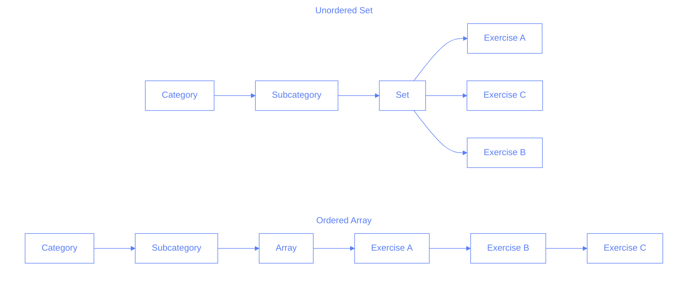
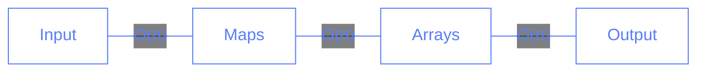
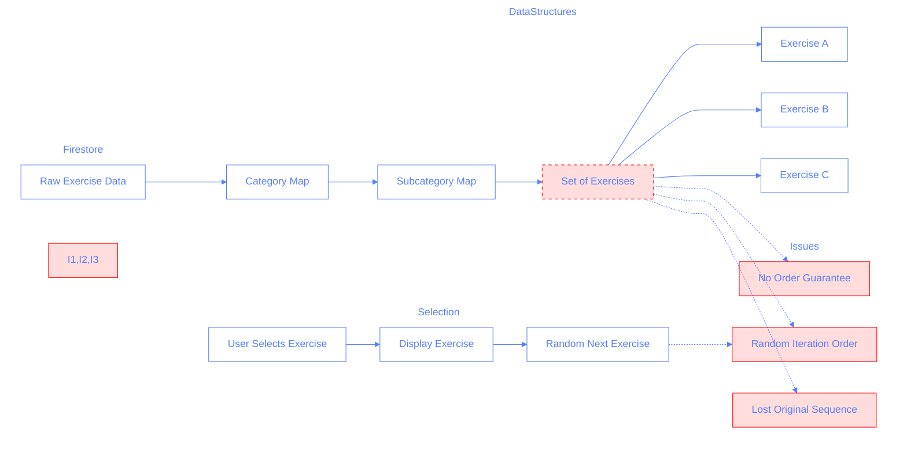
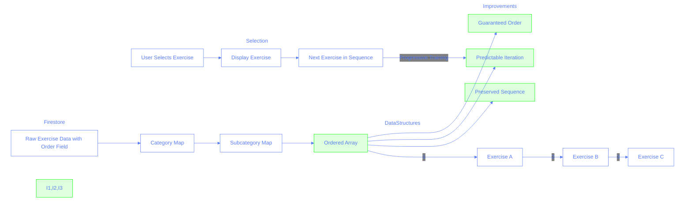

# Data Structures, Data Layers, and Firestore: Lessons Learned

## Overview

This document outlines key lessons learned while fixing a bug related to exercise ordering and data normalization in our Pilates Studio App. The case study demonstrates important concepts in data structures, Firebase integration, and TypeScript best practices.

## The Bug

The trainee knowledge feature wasn't displaying correctly due to mismatches in data structure and case sensitivity between our Firebase data and application code.

### Initial State

- Exercises existed in Firestore with mixed case fields (`Category` vs `category`)
- Data structures weren't preserving order information
- Knowledge tracking system wasn't matching exercises correctly

### Root Causes

1. Case sensitivity mismatches between Firestore and application
2. Using `Set` instead of ordered arrays for exercise lists
3. Lack of data normalization when fetching from Firestore

## The Solution

### 1. Data Normalization Layer

```typescript
// Helper function to normalize exercise data from Firestore
const normalizeExerciseData = (data: any): Exercise => {
	return {
		id: data.id,
		category: data.category || data.Category || "",
		subcategory: data.subcategory || data.Subcategory || "",
		series: data.series || data.Series || "",
		exercise: data.exercise || data.Exercise || "",
		order: data.order || data.Order || 0,
	};
};
```

#### Data Flow


#### Knowledge Check

1. Why do we need data normalization?
   - [ ] A. To make the data smaller
   - [ ] B. To improve performance
   - [ ] C. To handle inconsistent field names from Firestore
   - [ ] D. To compress the data

### 2. Data Structure Evolution

#### Before vs After



#### Implementation Details

```typescript
// Before: Unordered Set - Random access
categorized: Map<string, Map<string, Set<string>>>;
// Example: exercises.get("Back")?.get("Basic")?.has("Exercise B")

// After: Ordered Array - Maintains sequence
categorized: Map<string, Map<string, string[]>>;
// Example: exercises.get("Back")?.get("Basic")?.[1] // "Exercise B"
```

#### Library Analogy

Think of it like organizing books in a library:

- **Before**: Books were just placed on shelves (Set = no order)
- **After**: Books are arranged by category AND numbered within each category (Array = ordered)

```typescript
// Before: Unordered Set
categorized: Map<string, Map<string, Set<string>>>;

// After: Ordered Array
categorized: Map<string, Map<string, string[]>>;
```

#### Knowledge Check

2. What's the main difference between Set and Array in this context?
   - [ ] A. Sets are faster
   - [ ] B. Arrays use less memory
   - [ ] C. Arrays maintain insertion order
   - [ ] D. Sets are easier to use

### 3. Two-Step Processing

```typescript
// Step 1: Group exercises
const groupedExercises = new Map<string, Map<string, Exercise[]>>();
exercises.forEach((exercise) => {
	// Grouping logic
});

// Step 2: Sort and finalize
groupedExercises.forEach((subcategoryMap, category) => {
	subcategoryMap.forEach((exercises, subcategory) => {
		const sortedExercises = exercises
			.sort((a, b) => (a.order || 0) - (b.order || 0))
			.map((e) => e.exercise);
	});
});
```

#### Processing Flow


#### Knowledge Check

3. Why use a two-step processing approach?
   - [ ] A. It's faster
   - [ ] B. It's clearer and more maintainable
   - [ ] C. It uses less memory
   - [ ] D. It's required by TypeScript

## Best Practices & Lessons Learned

### 1. Data Structure Selection

- Choose data structures based on requirements (order vs lookup speed)
- Consider the trade-offs between different structures
- Document why certain structures were chosen

### 2. Type Safety

```typescript
// Clear interface definitions
interface ExercisesData {
	raw: Exercise[];
	categorized: Map<string, Map<string, string[]>>;
}
```

### 3. Error Handling

```typescript
try {
	const querySnapshot = await getDocs(collection(db, COLLECTION_NAME));
	// Processing
} catch (error) {
	Logger.error("Error fetching exercises:", error);
	throw error;
}
```

### 4. Data Normalization

- Always normalize data at the service layer
- Handle inconsistent field names
- Document expected data formats

#### Knowledge Check

4. Where should data normalization happen?
   - [ ] A. In the UI components
   - [ ] B. In the service layer
   - [ ] C. In the database
   - [ ] D. In the state management

## Performance Considerations

### Time Complexity Analysis


Let's break down the time complexity of each operation:

1. **Set Operations**: O(1)

   - Adding elements
   - Checking existence
   - Removing elements

2. **Data Normalization**: O(n)

   - Processing each exercise once
   - Field name standardization
   - Type conversion

3. **Grouping**: O(n)

   - Iterating through all exercises
   - Creating category maps
   - Building subcategory structure

4. **Sorting**: O(n log n)

   - Sorting exercises within each subcategory
   - Using JavaScript's built-in sort

5. **Final Structure Creation**: O(n)
   - Converting to final format
   - Building return object

### Space Complexity



### Memory Usage Breakdown

1. **Input Data**: O(n)

   - Original exercise data
   - Raw Firestore documents

2. **Temporary Maps**: O(n)

   - Category grouping
   - Subcategory organization

3. **Sorted Arrays**: O(n)

   - Ordered exercise lists
   - Final structure preparation

4. **Total Space**: O(n)
   - Linear scaling with input size
   - Constant factor overhead

### Trade-offs

1. **Arrays vs Sets**

   - Arrays

     - Lookup: O(n)
     - Insertion: O(1) at end, O(n) at arbitrary position
     - Memory: Linear
     - Advantage: Maintains order

   - Sets
     - Lookup: O(1)
     - Insertion: O(1)
     - Memory: Linear with overhead
     - Advantage: Fast lookups

2. **Two-Step Processing**

   - Memory Impact

     - Additional O(n) space for temporary structures
     - Temporary maps and arrays during processing

   - Benefits
     - Clearer code organization
     - Easier to maintain and debug
     - Better separation of concerns

3. **Performance vs Maintainability**
   - Total time complexity: O(n log n)
   - Space complexity: O(n)
   - Trade-off: Slightly higher memory usage for better code organization

#### Knowledge Check

5. What's the overall time complexity of our exercise processing pipeline?

   - [ ] A. O(1)
   - [ ] B. O(n)
   - [ ] C. O(n log n)
   - [ ] D. O(n²)

6. Which operation is the performance bottleneck in our pipeline?

   - [ ] A. Set operations
   - [ ] B. Data normalization
   - [ ] C. Sorting
   - [ ] D. Final structure creation

7. Why did we accept the additional memory overhead?
   - [ ] A. It improves lookup speed
   - [ ] B. It makes the code more maintainable
   - [ ] C. It was necessary to implement exercise ordering
   - [ ] D. It reduces database calls

## Hard Questions

8. If we needed to support both fast lookups AND maintain order, which data structure combination would be most appropriate?

   - [ ] A. Just an Array (simple but slower lookups)
   - [ ] B. Just a Set (fast lookups but no order)
   - [ ] C. Both Map and Array (Map for lookups, Array for order)
   - [ ] D. Multiple Sets (still no order capability)

9. What would be the impact on memory if we maintained both Set and Array structures?

   - [ ] A. O(1) additional space
   - [ ] B. O(2n) = O(n) but with double the constant factor
   - [ ] C. O(n²) due to duplicated data
   - [ ] D. No additional memory impact

10. In our two-step processing approach, why do we sort AFTER grouping instead of before?

    - [ ] A. It's just a design choice with no performance impact
    - [ ] B. Sorting before grouping would be faster
    - [ ] C. Sorting within subcategories reduces the size of each sort operation
    - [ ] D. The order doesn't matter for correctness

11. If Firestore suddenly started guaranteeing field name consistency (always lowercase), how would you modify the system?

    - [ ] A. Remove all normalization logic immediately
    - [ ] B. Keep everything as is for backward compatibility
    - [ ] C. Gradually deprecate normalization while monitoring errors
    - [ ] D. Create a new parallel data structure

12. What's the worst-case performance scenario for our current implementation?
    - [ ] A. When all exercises are in the same category
    - [ ] B. When there are no exercises
    - [ ] C. When exercises are already sorted
    - [ ] D. When each exercise is in its own category

## Answers

1. C - Inconsistent field names require normalization
2. C - Arrays maintain insertion order, Sets don't
3. B - Two-step processing improves code clarity
4. B - Service layer is responsible for data normalization
5. C - Sorting has O(n log n) complexity
6. C - Sorting is the bottleneck
7. C - Sets don't maintain order, so we needed Arrays despite the overhead to implement proper exercise sequencing
8. C - Using a Map for O(1) lookups while maintaining an Array for ordered operations provides the best of both worlds, though it requires additional memory
9. B - We'd store each exercise twice in different structures, doubling memory usage but maintaining O(n) complexity
10. C - Sorting smaller subcategory groups is more efficient than sorting the entire dataset, as sorting is O(n log n)
11. C - Gradual deprecation with monitoring ensures we catch any edge cases and maintain system stability
12. D - Maximum fragmentation forces more sort operations and map creations, increasing overhead. Let's break down why:

Option A (All exercises in same category):

- Grouping: O(n) - single pass through n exercises
- Sorting: O(n log n) - one sort operation on all n exercises
- Total: O(n log n) with a single sort operation
- Memory: O(n) with single category map

Option D (Each exercise in own category):

- Grouping: O(n) - still one pass but creating n different maps
- Sorting: O(n \* 1 log 1) = O(n) - n separate sorts of size 1
- Map Creation: O(n) - creating n different category maps
- Total: O(n) but with n separate allocations and higher constant factor
- Memory: O(n) but with n different map objects

While Option D has better algorithmic complexity O(n) vs O(n log n), it's actually worse in practice due to:

1. Memory fragmentation from n separate allocations
2. Cache inefficiency from scattered data
3. JavaScript engine overhead from many small objects
4. Map creation overhead for each category

## Original Implementation Flow (Pre-Fix)



### Flow Explanation:

1. Data starts in Firestore (unordered)
2. Loaded into nested Maps (still maintaining structure)
3. Exercises stored in Sets at leaf nodes:
   - ❌ No guaranteed order
   - ❌ Random iteration sequence
   - ❌ Original exercise order lost
4. When selecting exercises:
   - ❌ Next exercise is unpredictable
   - ❌ Cannot maintain training progression
   - ❌ No way to enforce exercise sequence

The dashed lines and red highlights show where ordering information is lost and where it impacts the user experience.

## Corrected Implementation Flow (Post-Fix)



### Flow Explanation:

1. Data starts in Firestore with explicit order field
2. Loaded into nested Maps (maintaining structure)
3. Exercises stored in ordered Arrays at leaf nodes:
   - ✅ Guaranteed order based on `order` field
   - ✅ Consistent iteration sequence
   - ✅ Original exercise order preserved
4. When selecting exercises:
   - ✅ Next exercise is predictable
   - ✅ Can maintain proper training progression
   - ✅ Exercise sequence enforced by array order

The green highlights show the improvements and where ordering information is now properly maintained throughout the flow. Numbered connections between exercises demonstrate the explicit ordering.
