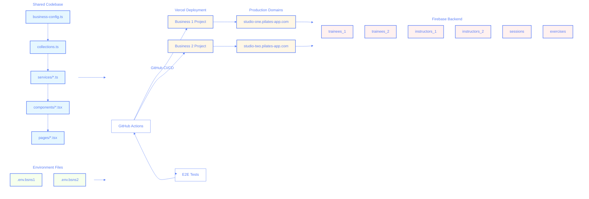

# Multi-Business Setup

This document describes how the application is set up to handle multiple businesses using the same codebase.

## Architecture Overview



## Collection Structure

- `trainees_1` and `trainees_2`: Business-specific trainee collections
- `instructors_1` and `instructors_2`: Business-specific instructor collections
- `sessions`: Shared sessions collection
- `exercises`: Shared exercises collection

## Environment Configuration

Each business has its own environment configuration file:

- `.env.bsns1` for Business 1
- `.env.bsns2` for Business 2

The key environment variables are:

- `VITE_BUSINESS_ID`: Identifies the business ("1" or "2")
- `VITE_APP_NAME`: Business-specific app name
- `VITE_APP_DOMAIN`: Business-specific domain

## Deployment

The application is deployed using GitHub Actions and Vercel:

1. Two separate Vercel projects are maintained
2. GitHub Actions workflow deploys to both projects on main branch updates
3. Each deployment uses business-specific environment variables

## Local Development

To run the app locally for a specific business:

```bash
# For Business 1
cp .env.bsns1 .env
npm run dev

# For Business 2
cp .env.bsns2 .env
npm run dev
```

## Security Considerations

1. Each business's data is isolated in separate collections
2. Sessions collection is shared but filtered by business ID
3. Environment variables are securely stored in Vercel

## Testing

When running tests:

1. Use the emulator with both business configurations
2. Test data isolation between businesses
3. Verify shared collection access patterns
