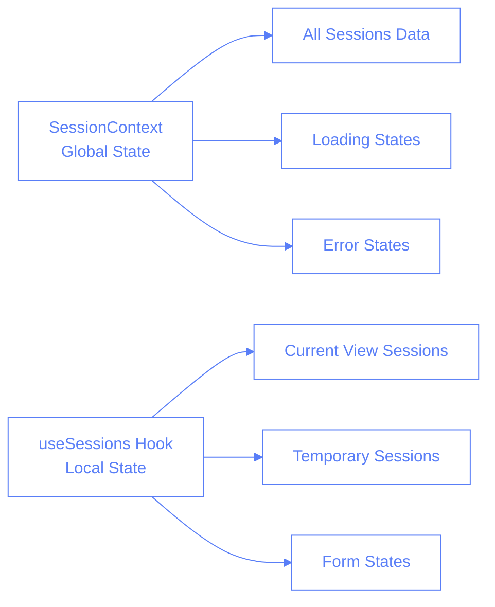
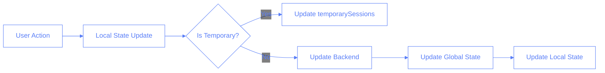
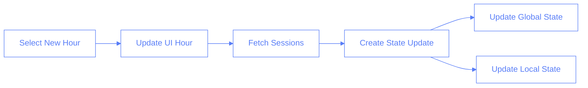
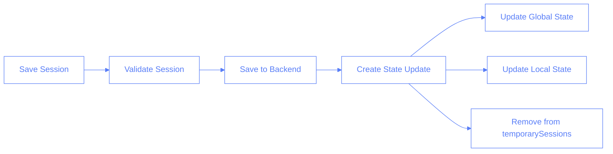

# Session State Management

## Overview

This document outlines the dual state management system used in the Pilates Studio App for handling session data, explaining why we need both global and local state management, and how they interact.

## State Management Architecture

### State Systems



### Data Flow - Session Updates



## State Structure

### Global State (SessionContext)

```typescript
interface SessionContextState {
  // Organized by date and hour
  dailyHourToSessions: {
    [date: string]: {
      [hour: string]: Session[];
    };
  };
  isLoading: boolean;
  error: Error | null;
}
```

### Local State (useSessions)

```typescript
interface UseSessionsState {
  sessions: Session[]; // Current view sessions
  temporarySessions: SessionForm[]; // Unsaved sessions
  dailyHourToSessions: Record<string, Record<string, Session[]>>;
  isLoading: boolean;
  error: Error | null;
}
```

## Key Operations

### Hour Change



### Session Save



## Why Two Systems?

1. **Performance Optimization**

   - Local state provides immediate access to current view data
   - Reduces unnecessary re-renders
   - Handles temporary states efficiently

2. **State Isolation**

   - Local state manages view-specific data
   - Global state maintains source of truth
   - Prevents state conflicts between views

3. **User Experience**
   - Immediate feedback for user actions
   - Smooth transitions between views
   - Efficient handling of temporary states

## Best Practices

1. **State Updates**

   ```typescript
   // Create update once, apply to both states
   const newState = createStateUpdate(data);
   setGlobalState(newState);
   setLocalState(newState);
   ```

2. **State Synchronization**

   ```typescript
   // Always update both states together
   const handleStateChange = (newData) => {
     const update = {
       [selectedDate]: {
         [selectedHour]: newData,
       },
     };

     setState(update); // Global
     setLocalState(update); // Local
   };
   ```

3. **Temporary State Management**
   ```typescript
   // Only use local state for temporary data
   const addTemporarySession = (session) => {
     setTemporarySessions((prev) => [...prev, session]);
     // Don't update global state yet
   };
   ```
