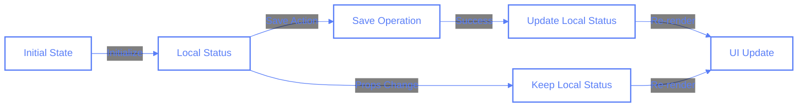

# Session Status Management: Lessons from a Race Condition Bug

## Overview

This document outlines a significant bug fix related to session status management in the Pilates Studio App, specifically focusing on race conditions in state updates and the importance of local state management.

## Problem Description

The application was experiencing inconsistent behavior where a session's completion status wasn't being properly reflected in the UI, particularly after saving. This manifested in two main ways:

1. The save button's enabled state wasn't updating correctly after status changes
2. Status updates were being overridden due to prop synchronization in useEffect

## Root Cause Analysis

The issue stemmed from multiple factors:

1. **Race Conditions**: Status updates were happening in multiple places:

   - Local state updates after save operations
   - Props synchronization in useEffect
   - Initial state setting

2. **State Management Confusion**: There was no clear "source of truth" for the session status:

   ```typescript
   // Before: Multiple sources of truth
   const [sessionForm, setSessionForm] = useState({
     status: session?.status || 'pending', // from props
   });

   useEffect(() => {
     // Also updating from props here
     if (session?.status !== sessionForm.status) {
       setSessionForm((prev) => ({ ...prev, status: session.status }));
     }
   }, [session?.status]);
   ```

## Solution

We implemented several key changes:

1. **Local State Ownership**:

   ```typescript
   // After: Single source of truth
   const [sessionForm, setSessionForm] = useState({
     status: session?.status || SESSION_STATUS.PENDING,
   });
   ```

2. **Removed Status Synchronization**:

   ```typescript
   useEffect(() => {
     // Only update when session ID changes
     if (prev.id === session?.id) return prev;
     // Status is not synced from props anymore
   }, [session?.id]);
   ```

3. **Immediate Local Updates**:

   ```typescript
   const handleSave = async () => {
     await onSaveSession(sessionForm);
     setSessionForm((prev) => ({
       ...prev,
       status: SESSION_STATUS.COMPLETED,
     }));
   };
   ```

4. **Constants for Status Values**:
   ```typescript
   const SESSION_STATUS = {
     PENDING: 'pending',
     COMPLETED: 'completed',
     CANCELLED: 'cancelled',
   } as const;
   ```

## Best Practices

### 1. State Management

- Clearly define ownership of state (local vs. props)
- Avoid multiple sources of truth
- Be explicit about state update timing
- Use local state for UI-specific state that doesn't need to be shared

### 2. Constants and Type Safety

- Use constant objects for string literals
- Leverage TypeScript's `as const` for type safety
- Centralize common constants
- Avoid hardcoding values

### 3. Debugging and Logging

- Implement comprehensive logging at key state changes
- Use consistent logging patterns:
  ```typescript
  const LOG_ICONS = {
    INIT: '🎬',
    UPDATE: '📝',
    SAVE: '💾',
    SUCCESS: '✨',
    COMPLETE: '✅',
    ERROR: '❌',
    BLOCKED: '🚫',
  } as const;
  ```
- Log both before and after state updates
- Include relevant context in logs (IDs, previous/new values)

### 4. Effect Management

- Be specific about effect dependencies
- Consider what triggers effects and why
- Avoid unnecessary prop synchronization
- Document effect purposes with comments

## Implementation Guide

When implementing similar features:

1. **State Initialization**:

   ```typescript
   const [state, setState] = useState(() => ({
     // Use initialization function for complex initial state
     status: initialValue || DEFAULT_STATUS,
   }));
   ```

2. **Status Updates**:

   ```typescript
   const updateStatus = (
     newStatus: (typeof SESSION_STATUS)[keyof typeof SESSION_STATUS]
   ) => {
     setState((prev) => ({
       ...prev,
       status: newStatus,
     }));
   };
   ```

3. **Props Handling**:
   ```typescript
   // Only sync necessary props, avoid status sync
   useEffect(() => {
     if (id !== prevId) {
       // Update other props but maintain local status
     }
   }, [id]);
   ```

## Testing Considerations

1. Test status transitions:

   - Initial state
   - After save
   - After prop changes
   - Edge cases (double saves, rapid updates)

2. Test race conditions:
   - Multiple rapid saves
   - Prop changes during save
   - Network delays

## Mermaid Diagram



## Related Documents

- [Firebase Emulators Setup](../firebase-emulators.md)
- [Core Concepts: State Management](../core-concepts/state-management.md)
