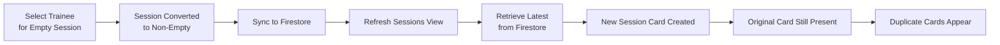
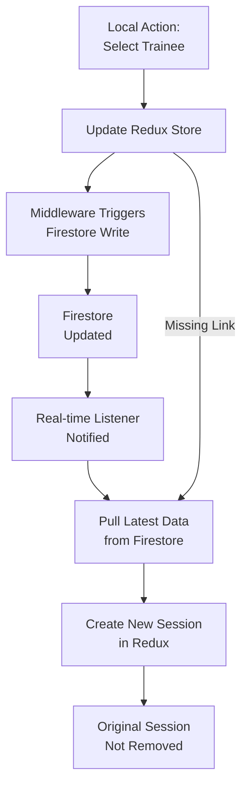
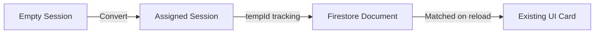

# Duplicate Sessions Bug: Analysis and Fix

This document outlines a critical bug in the Pilates Studio application where duplicate session cards appeared when a user selected a trainee in an empty session and then refreshed the view.

## Problem Description

%%{init: {'theme': 'base', 'themeVariables': {
'primaryColor': '#ffffff',
'primaryTextColor': '#597ef7',
'primaryBorderColor': '#597ef7',
'lineColor': '#597ef7',
'textColor': '#597ef7',
'mainBkg': 'transparent',
'nodeBorder': '#597ef7',
'clusterBkg': 'transparent',
'labelTextColor': '#597ef7',
'titleColor': '#597ef7',
'clusterBorder': '#fff',
'edgeLabelBackground': 'transparent'
}}}%%



When users selected a trainee in an empty session slot, the application would correctly convert the session from an "empty" session to a regular session with trainee data. However, upon refreshing the view, the application would:

1. Pull the session data from Firestore
2. Create a new session card for the fetched data
3. Fail to recognize that this session data corresponded to an existing session card
4. Result in two cards for the same session: the original one and a duplicate

This issue stemmed from several interconnected factors:

- Lack of session correlation between Redux state and Firestore
- Missing mechanism to deduplicate sessions based on common attributes
- Inadequate session identity tracking during bidirectional syncing

## Root Cause Analysis

The root of the problem was in the bidirectional synchronization between the Redux store and Firestore. The application used a real-time listener to update the UI when changes occurred in Firestore, but wasn't properly tracking which updates came from local edits vs. remote changes.



Three critical issues were identified:

1. **No Session Correlation**: When a user selected a trainee for an empty session, the ID of the session changed from an "empty-XX" format to either a randomly generated ID or a converted ID. However, the application wasn't tracking that these were the same logical session.

2. **Redundant Fetches**: The application performed redundant fetches from Firestore after updates, causing it to re-read data it had just written, creating a loop.

3. **Timestamp Tracking**: There was no mechanism to identify when an update from Firestore was simply echoing back a change that was just made locally.

## Solution Implementation

We implemented a multi-faceted solution to address all aspects of the problem:

### 1. Enhanced Session Correlation



- Added proper session correlation by maintaining consistent IDs between empty sessions and their converted counterparts
- Implemented a tracking mechanism to map converted session IDs back to their original empty session IDs

### 2. Deduplication Logic

We added logic in the Redux state management and real-time listener to prevent duplicate session creation:

```typescript
// Added to sessions-container.tsx
const updatedSessions = new Set<string>();
const localUpdateTimestamps = new Map<string, number>();

// Skip processing if we just updated this session locally
if (localUpdateTimestamps.has(docId)) {
	const lastUpdateTime = localUpdateTimestamps.get(docId) || 0;
	const timeSinceUpdate = now - lastUpdateTime;

	// If updated recently (within 5 seconds), skip processing
	if (timeSinceUpdate < 5000) {
		console.log(`⏭️ Skipping update, changed locally ${timeSinceUpdate}ms ago`);
		return;
	}
}
```

### 3. Redux Middleware Optimization

We enhanced the Redux middleware to prevent syncing sessions that were just updated locally:

```typescript
// Added to sessionsFirebaseMiddleware.ts
// Track which sessions were synced by this client
recentlySyncedSessions: new Set<string>(),

// Skip syncing for sessions that were recently synced
if (this.recentlySyncedSessions.has(tempId)) {
  console.log(`⏭️ Skipping sync for ${tempId} - recently synced by this client`);
  return false;
}
```

### 4. Initialization Improvements

Fixed the initialization process to ensure empty sessions are properly created on component mount:

```typescript
// Added to sessions-container.tsx
useEffect(() => {
	// Debug logging on component mount to check state
	console.log("🔄 SessionsContainer mounted with state:", {
		selectedDate,
		selectedHour,
		selectedRoom,
		selectedStudio,
	});

	// Set default values if undefined
	if (!selectedDate) {
		dispatch(setSelectedDate(getCurrentDate()));
	}

	if (!selectedHour) {
		dispatch(setSelectedHour(getCurrentHour()));
	}

	if (!selectedRoom) {
		dispatch(setSelectedRoom("1"));
	}

	if (!selectedStudio) {
		dispatch(setSelectedStudio("1"));
	}
}, []);
```

## Testing Strategy

The fix was tested with the following scenarios:

1. **Basic Trainee Selection**: Select a trainee in an empty session, refresh, verify no duplicates
2. **Rapid Selections**: Quickly select trainees in multiple sessions, verify no duplicates
3. **Multiple Refreshes**: Perform several refreshes in succession, verify no duplicates
4. **Hour Navigation**: Select trainee, change hour, return to original hour, verify no duplicates
5. **Browser Reload**: Select trainee, reload browser, verify no duplicates

A comprehensive Playwright test suite was created to validate these scenarios automatically.

## Benefits of the Fix

1. **Improved User Experience**: Users no longer see confusing duplicate session cards
2. **Reduced Server Load**: Fewer redundant Firestore operations
3. **Better Performance**: Elimination of unnecessary UI refreshes
4. **Data Integrity**: More consistent session state across Redux and Firestore

## Lessons Learned

1. **Track State Transformations**: When an entity can change form (like empty → assigned session), ensure proper identity tracking
2. **Bidirectional Sync Challenges**: Real-time sync requires careful handling of local vs. remote updates
3. **Debounce Mechanisms**: Time-based filtering is essential for preventing update loops
4. **Client-Side Deduplication**: Even with server-side uniqueness constraints, client-side deduplication is necessary

## Multiple Choice Questions

1. What was the primary cause of duplicate sessions in the application?

   - [ ] A. Session data wasn't being saved to Firestore properly
   - [ ] B. The Redux store was being reset on each refresh
   - [x] C. Lack of correlation between local session updates and Firestore events
   - [ ] D. Multiple users editing the same session simultaneously

2. How did the solution prevent duplicate session cards?

   - [ ] A. By disabling the refresh functionality completely
   - [x] B. By tracking recently updated sessions and skipping duplicate processing
   - [ ] C. By clearing all sessions before loading new ones
   - [ ] D. By storing sessions in localStorage instead of Firestore

3. Why was time-based filtering used in the solution?

   - [ ] A. To improve performance by batching updates
   - [ ] B. To allow session data to expire automatically
   - [x] C. To prevent processing echoed updates from Firestore that were just made locally
   - [ ] D. To schedule updates during off-peak hours

4. What component required fixes to solve the problem? (Select all that apply)

   - [x] A. The real-time Firestore listener in sessions-container.tsx
   - [x] B. The Redux middleware for Firebase synchronization
   - [x] C. The session initialization logic
   - [ ] D. The authentication system

5. What technique was used to correlate empty sessions with their non-empty counterparts?
   - [ ] A. Database foreign keys
   - [ ] B. Using the same ID for both
   - [x] C. Tracking the conversion with a consistent ID pattern and metadata
   - [ ] D. Storing a reference map in localStorage

## Answers

1. C - The application wasn't properly tracking which Firestore updates corresponded to local changes, causing it to create duplicate session cards when changes were echoed back from Firestore.

2. B - The solution implemented tracking mechanisms to identify recently updated sessions and skip processing for updates that were echoed back from Firestore.

3. C - Time-based filtering was used to recognize when a Firestore update was simply echoing back a change the client had just made, preventing processing of these duplicated events.

4. A, B, C - The solution required fixing the real-time listener, the Redux middleware, and the initialization logic to properly handle session correlation and prevent duplicates.

5. C - We implemented a consistent ID pattern and added metadata to track when empty sessions were converted to non-empty ones, allowing the system to recognize them as the same logical session.
