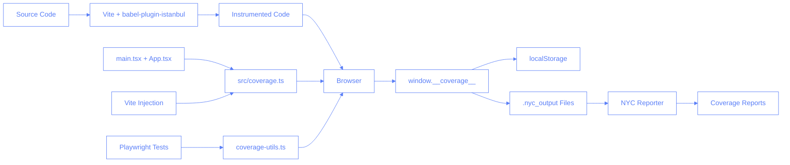

# Code Coverage for Pilates Studio App

This document describes the code coverage setup for the Pilates Studio App using Playwright and Istanbul.

## Overview

The code coverage setup enables measuring how much of our application code is executed during tests. This helps identify untested code paths and ensure critical flows are properly tested.

## Architecture

The code coverage solution works by:

1. Instrumenting the source code using babel-plugin-istanbul during development/test
2. Injecting coverage collection helpers into the browser
3. Collecting and saving coverage data during test runs
4. Generating reports with NYC



## Key Components

The coverage setup consists of several key files:

1. **Babel Configuration** (`.babelrc`): Configures babel-plugin-istanbul to instrument code
2. **NYC Configuration** (`.nycrc.json`): Configures reporting and thresholds
3. **Combined Coverage Module** (`src/coverage.ts`): Centralized module handling coverage initialization, verification, and data persistence
4. **Coverage Utilities** (`src/utils/coverage-utils.ts`): Server-side utilities for collecting coverage
5. **Coverage Verification** (`src/utils/coverage-verification.ts`): Utilities for verifying coverage instrumentation
6. **Coverage Fixtures** (`tests/fixtures/coverage.ts`): Playwright fixtures for integrating coverage
7. **Vite Configuration** (`vite.config.ts`): Configures Vite to use coverage instrumentation

## How the Coverage System Works

Coverage is implemented using a multi-layered approach:

1. **Instrumentation**: Code is instrumented by babel-plugin-istanbul when `COVERAGE=true`
2. **Initialization**: Coverage is initialized in two ways:
   - Via direct HTML injection from Vite (in the HTML head)
   - Via dynamic import in main.tsx and App.tsx
3. **Data Collection**: As the app runs, code execution is tracked in `window.__coverage__`
4. **Data Persistence**: Coverage data is:
   - Saved to localStorage periodically
   - Collected by Playwright and written to disk after tests
5. **Reporting**: NYC processes the collected data to generate reports

## How to Run Coverage Tests

To run tests with coverage:

```bash
pnpm run test:cov
```

This will:

1. Run specific test files with coverage enabled
2. Collect coverage data into `.nyc_output`
3. Generate HTML and lcov reports in the `coverage` directory
4. Open the coverage report in the browser (unless in CI)

## Interpreting Results

The coverage report shows:

- **Statements**: Percentage of statements executed
- **Branches**: Percentage of if/else branches executed
- **Functions**: Percentage of functions called
- **Lines**: Percentage of lines executed

## Troubleshooting

If coverage data is not being collected:

1. Verify `process.env.COVERAGE === 'true'` during test runs
2. Check browser console for coverage-related messages
3. Ensure the `.nyc_output` directory exists and is writable
4. Check that babel-plugin-istanbul is properly configured

## Implementation Details

### Coverage Collection Process

1. Vite applies babel-plugin-istanbul when `COVERAGE=true`
2. The `src/coverage.ts` module is:
   - Injected directly via HTML by the Vite plugin
   - Imported dynamically in main.tsx and App.tsx
3. As the app runs, code coverage data is stored in `window.__coverage__`
4. Coverage data is saved to localStorage periodically
5. The Playwright coverage fixtures inject additional coverage helpers via script
6. Coverage data is collected after each test and written to `.nyc_output`
7. NYC processes the coverage data to generate reports

### Architecture Improvements

The coverage system has been refactored to use a centralized approach:


### Adding Coverage to a New Test

To add coverage collection to a new test file:

```typescript
// Import the coverage test instead of the regular Playwright test
import { test, expect } from './fixtures/coverage';

test('my test', async ({ page, coverageCollector }) => {
  // Your test code here

  // You can manually collect coverage at any point if needed
  await coverageCollector(page);
});
```

## Multiple Choice Questions

1. What tool is used to instrument TypeScript code for coverage?

   - [ ] A. NYC
   - [ ] B. Playwright
   - [x] C. babel-plugin-istanbul
   - [ ] D. Jest

2. When is coverage data collected during tests?

   - [ ] A. Only at the start of tests
   - [ ] B. Only when manually triggered
   - [ ] C. Only at the end of tests
   - [x] D. Automatically at the end of tests and can be manually triggered

3. How is coverage data stored in the browser?

   - [x] A. In the window.**coverage** object
   - [ ] B. In localStorage only
   - [ ] C. In IndexedDB
   - [ ] D. In cookies

4. What environment variable enables coverage instrumentation?

   - [ ] A. NODE_ENV=coverage
   - [x] B. COVERAGE=true
   - [ ] C. ENABLE_COVERAGE=1
   - [ ] D. WITH_COVERAGE=yes

5. Which directory contains the raw coverage data?
   - [ ] A. /coverage
   - [x] B. /.nyc_output
   - [ ] C. /reports/coverage
   - [ ] D. /test-results

## Answers

1. C - babel-plugin-istanbul is used to instrument TypeScript code for coverage by adding tracking code during transpilation.
2. D - Coverage data is collected automatically at the end of each test, and can also be manually collected during a test using the coverageCollector fixture.
3. A - Coverage data is stored in the window.**coverage** object which is created by the Istanbul instrumentation.
4. B - The COVERAGE=true environment variable is used to enable coverage instrumentation in both Vite and Playwright.
5. B - Raw coverage data is stored in the .nyc_output directory, while processed reports go in the coverage directory.
