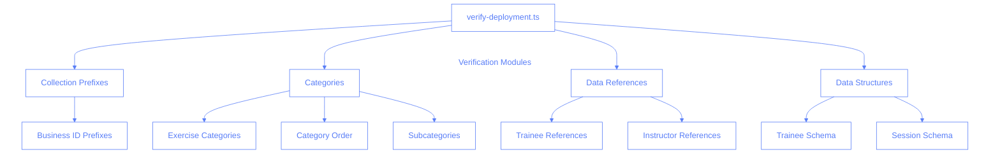
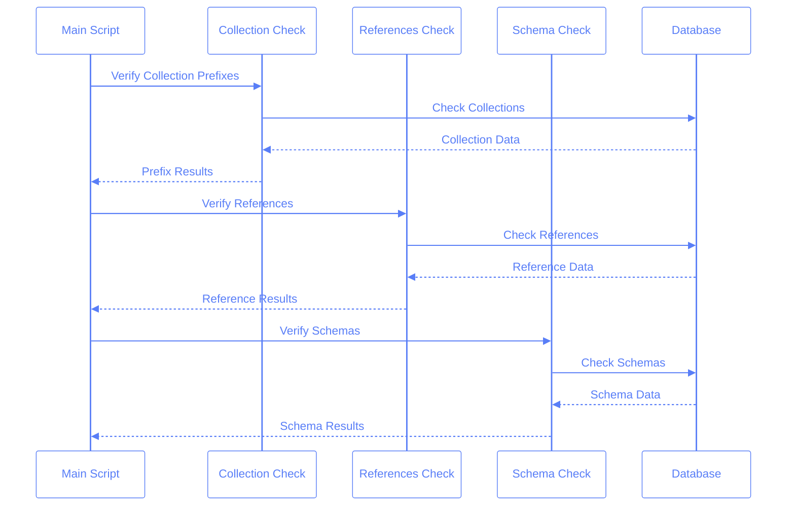

# Deployment Verification System

This document outlines our deployment verification system, which ensures data integrity and schema compliance before deployments.

## System Architecture



## Verification Process



## Module Structure

```
scripts/
├── verify-deployment.ts     # Main verification script
└── verify/
    ├── types.ts            # Shared types
    ├── firebase-config.ts  # Firebase initialization
    ├── collection-prefixes.ts
    ├── categories.ts
    ├── references.ts
    └── data-structures.ts
```

## Verification Types

### 1. Collection Prefixes

- Verifies business ID prefixes in collection names
- Ensures proper data isolation between businesses
- Example: `${BUSINESS_ID}:trainees`

### 2. Categories

- Validates exercise categories against predefined list
- Checks category order in exercises
- Verifies Warm Up subcategories
- Example categories: 'Warm Up', 'Foot Work', etc.

### 3. Data References

- Ensures trainee references exist
- Validates instructor references
- Prevents dangling references in sessions

### 4. Data Structures

- Validates trainee document schema
- Checks session document schema
- Verifies optional and required fields
- Type checks for all fields

## Running Verifications

```bash
pnpm run verify-deployment
```

### Success Output Example

```
🚀 Starting pre-deployment verification...

📋 Running Collection Prefixes verification...
✅ Collection Prefixes verification passed

📋 Running Categories verification...
✅ Categories verification passed

📋 Running Data References verification...
✅ Data References verification passed

📋 Running Data Structures verification...
✅ Data Structures verification passed

✅ All verifications passed! Safe to deploy.
```

### Error Output Example

```
❌ Categories verification failed:
  - Invalid category found: Side Work
  - Categories not in correct order: FBI, Arm

⚠️  Warnings:
  - Trainee 1234 nextSession missing optional comments field
```

## Best Practices

1. **Run Before Deployment**

   - Always run verification before deploying
   - Fix all errors before proceeding
   - Review warnings for potential issues

2. **Error Handling**

   - All verifications include detailed error messages
   - Warnings for non-critical issues
   - Clear distinction between errors and warnings

3. **Schema Validation**
   - Strict type checking for all fields
   - Required fields must be present
   - Optional fields must match expected types
