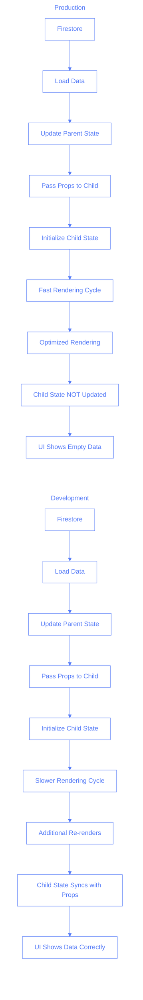
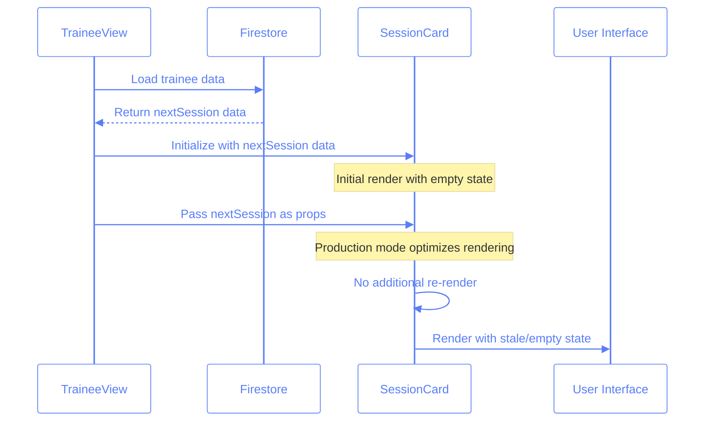

# Development vs. Production Environment Differences

This document explores the critical differences between development and production environments in React applications, using our recent bug fix as a practical case study. Understanding these differences is essential for developing robust applications that work consistently across all environments.

## Table of Contents

1. [Introduction](#introduction)
2. [Case Study: The Missing Next Session Categories](#case-study-the-missing-next-session-categories)
3. [Root Cause Analysis](#root-cause-analysis)
4. [Development vs. Production Behavior](#development-vs-production-behavior)
5. [React Component Lifecycle Differences](#react-component-lifecycle-differences)
6. [State Management and Prop Synchronization](#state-management-and-prop-synchronization)
7. [Best Practices for Environment-Agnostic Code](#best-practices-for-environment-agnostic-code)
8. [Debugging Environment-Specific Issues](#debugging-environment-specific-issues)
9. [Testing Strategies](#testing-strategies)
10. [Conclusion](#conclusion)

## Introduction

Modern web applications behave differently in development and production environments. While most functionality should be consistent across environments, subtle differences in rendering behavior, timing, and error handling can lead to bugs that only appear in one environment but not the other.

This document examines a real-world example where a feature worked perfectly in development but failed in production. We'll explore the root causes, solutions, and best practices for writing environment-agnostic code.

## Case Study: The Missing Next Session Categories

### The Problem

In our Pilates studio application, we encountered an issue with the "next session" feature on the trainee screen. Users could plan a session by adding categories, but after refreshing the page, the next session card would be empty in production, despite working perfectly in development.

### Observed Behavior

- **Development Environment**: Next session categories persisted after page refresh
- **Production Environment**: Next session categories disappeared after page refresh, even though data was correctly saved to and loaded from Firestore

### Data Flow

The expected data flow was:

1. User selects categories for the next session
2. Categories are saved to Firestore
3. On page refresh, categories are loaded from Firestore
4. Categories are displayed in the UI

In production, steps 1-3 worked correctly (confirmed by console logs), but step 4 failed.

## Root Cause Analysis

After thorough investigation, we discovered the root cause was a **timing issue in the React component lifecycle** that manifested differently in production versus development.

### The Technical Issue

The `SessionCard` component was maintaining its own internal state for categories, which wasn't properly synchronizing with the props passed down from the parent when they changed after initial render.

```javascript
// Inside SessionCard.tsx
const [sessionForm, setSessionForm] =
	useState <
	SessionForm >
	(() => {
		const initialState = {
			// ... other properties ...
			categories: session?.categories || {},
			comments: session?.comments || "",
			// ... other properties ...
		};

		return initialState;
	});

// Later in the render method
<Selections
	// ... other props ...
	categories={sessionForm.categories} // Using internal state, not props!
	// ... other props ...
/>;
```

The component was initializing its state from props but had no mechanism to update its internal state when props changed after the initial render. This created a disconnect between the props passed to the component and its internal state.

## Development vs. Production Behavior

Let's visualize the difference between development and production behavior:



### Key Differences:

1. **Rendering Speed**:

   - Development: Slower rendering allows more time for state updates
   - Production: Optimized for performance, faster rendering exposes race conditions

2. **Strict Mode**:

   - Development: React's StrictMode causes additional render cycles
   - Production: Fewer render cycles, more optimized

3. **Development Tools**:
   - Development: Additional checks and validations
   - Production: Stripped of development features for performance

## React Component Lifecycle Differences

The issue hinged on subtle differences in component lifecycle behavior between environments:

### Development Environment

```mermaid
%%{init: {'theme': 'base', 'themeVariables': {
'primaryColor': '#ffffff',
'primaryTextColor': '#597ef7',
'primaryBorderColor': '#597ef7',
'lineColor': '#597ef7',
'textColor': '#597ef7',
'mainBkg': 'transparent',
'nodeBorder': '#597ef7',
'clusterBkg': 'transparent',
'labelTextColor': '#597ef7',
'titleColor': '#597ef7',
'clusterBorder': '#fff',
'edgeLabelBackground': 'transparent'
}}}%%
sequenceDiagram
    participant App as TraineeView
    participant Database as Firestore
    participant Card as SessionCard
    participant UI as User Interface

    App->>Database: Load trainee data
    Database-->>App: Return nextSession data
    App->>Card: Initialize with nextSession data
    Note over Card: Initial render with empty state
    App->>Card: Pass nextSession as props
    Note over Card: Dev mode causes extra renders
    Card->>Card: Re-render cycle
    Card->>Card: Slow enough for state to update
    Card->>UI: Render with correct data
```



### Production Environment



## State Management and Prop Synchronization

The solution was to add explicit synchronization between the component's internal state and its props:

```javascript
// Add a new effect to react to direct categories prop changes
useEffect(() => {
	const categoriesProvided = !!categories && Object.keys(categories).length > 0;
	const currentCategories = sessionForm.categories || {};

	if (
		categoriesProvided &&
		JSON.stringify(categories) !== JSON.stringify(currentCategories)
	) {
		console.log("🔄 Direct categories prop changed, updating sessionForm:", {
			oldCategories: currentCategories,
			newCategories: categories,
		});

		setSessionForm((prev) => ({
			...prev,
			categories: { ...categories },
		}));
	}
}, [categories, sessionForm.categories]);

// Add a similar effect for comments
useEffect(() => {
	if (comments !== undefined && comments !== sessionForm.comments) {
		console.log("🔄 Direct comments prop changed, updating sessionForm:", {
			oldComments: sessionForm.comments,
			newComments: comments,
		});

		setSessionForm((prev) => ({
			...prev,
			comments: comments,
		}));
	}
}, [comments, sessionForm.comments]);
```

This ensures that the component's internal state is always synchronized with its props, regardless of environment-specific rendering behavior.

## Best Practices for Environment-Agnostic Code

Based on our experiences, here are best practices for writing code that works consistently across environments:

### 1. Explicit Prop Synchronization

Always add explicit synchronization between props and internal state:

```javascript
// Good practice
useEffect(() => {
	if (props.value !== internalState) {
		setInternalState(props.value);
	}
}, [props.value, internalState]);
```

### 2. Avoid Relying on Render Timing

Never rely on specific rendering timings or behavior:

```javascript
// Bad - relies on timing
componentDidMount() {
  // Assumes some other component has already updated something
  this.processData();
}

// Good - explicitly checks and handles all cases
useEffect(() => {
  if (dataIsReady) {
    this.processData();
  } else {
    // Handle the case where data isn't ready yet
  }
}, [dataIsReady]);
```

### 3. Use Controlled Components When Possible

Prefer controlled components where props drive component state directly:

```javascript
// Good - directly uses props for rendering
function ControlledComponent({ value, onChange }) {
	return <input value={value} onChange={onChange} />;
}
```

### 4. Add Detailed Logging

Include detailed logging to trace data flow and state changes:

```javascript
useEffect(() => {
	console.log("Data changed:", { oldData, newData });
	// Component logic here
}, [data]);
```

### 5. Test in Production-Like Environments

Include production builds in your testing strategy:

```bash
# Build a production version for testing
npm run build
npm run serve # Test the production build locally
```

## Debugging Environment-Specific Issues

When you encounter issues that only appear in one environment, follow these steps:

1. **Identify Environment Differences**:

   - Is the issue only in development or production?
   - Does it happen consistently or intermittently?

2. **Add Extensive Logging**:

   - Log component lifecycle events
   - Log state and prop changes
   - Compare logs between environments

3. **Simulate Production in Development**:

   - Run a production build locally
   - Use React's profiling tools to analyze rendering

4. **Check for Race Conditions**:
   - Look for code that assumes a specific order of operations
   - Add explicit dependencies in useEffect hooks

## Testing Strategies

To catch environment-specific issues early, implement these testing strategies:

1. **End-to-End Tests in Production Mode**:

   - Run Playwright/Cypress tests against production builds
   - Test critical user flows under various conditions

2. **Component Tests with Different Render Modes**:

   - Test components both in development and production mode
   - Verify behavior with varying prop update patterns

3. **State Transition Tests**:

   - Test how components handle prop changes after initial render
   - Verify state synchronization with changing props

4. **Performance Profiling**:
   - Compare rendering performance between environments
   - Identify components with timing-dependent behavior

## Conclusion

The bug in our next session feature taught us valuable lessons about the differences between development and production environments in React applications. By understanding these differences and following best practices for state management and prop synchronization, we can create robust applications that behave consistently across all environments.

Remember that what works in development might fail in production due to subtle differences in rendering behavior, timing, and optimization. Always test thoroughly in production-like environments and add explicit synchronization between props and internal state to avoid environment-specific bugs.

## Questions

### Section 1: Understanding Environment Differences

1. Which of the following is a key difference between React in development and production modes?

   - A. Development mode includes additional checks and validations
   - B. Production mode supports more React features
   - C. Development mode doesn't support hooks
   - D. Production mode requires different syntax

2. Why might a component behave differently in production compared to development?

   - A. Production environments always use a different version of React
   - B. Optimization in production can change rendering timing and behavior
   - C. Components are compiled to different code in production
   - D. React hooks work differently in production

3. The case study bug (next session categories not persisting) was primarily caused by:

   - A. A database connection issue
   - B. Incorrect state updates
   - C. A timing/synchronization issue between props and internal state
   - D. Incorrect component mounting

4. In the affected code, why did the SessionCard component fail to display data in production?

   - A. The data wasn't being saved to the database
   - B. The component wasn't receiving the correct props
   - C. The component initialized state from props but didn't update when props changed
   - D. The production build had a syntax error

5. Which environment typically exposes race conditions more readily?
   - A. Development environment
   - B. Production environment
   - C. Both equally
   - D. Neither environment

### Section 2: Component Lifecycle and State Management

1. What is the best practice for synchronizing a component's internal state with props?

   - A. Initialize state in constructor and never update it
   - B. Use the useState hook with props as the initial value only
   - C. Add useEffect hooks to update state when props change
   - D. Avoid using internal state entirely

2. What does the following code do?

   ```javascript
   useEffect(() => {
   	if (props.value !== internalState) {
   		setInternalState(props.value);
   	}
   }, [props.value, internalState]);
   ```

   - A. Updates internal state when a prop changes
   - B. Prevents the component from re-rendering
   - C. Optimizes the component for production
   - D. Creates a memory leak

3. How does React's StrictMode affect component behavior?

   - A. It prevents components from using hooks
   - B. It causes additional render cycles during development
   - C. It makes components render faster
   - D. It bypasses all state updates

4. What's the risk of initializing state from props without proper synchronization?

   - A. The component will always crash
   - B. Props will override state automatically
   - C. Changes to props after initial render won't be reflected in state
   - D. The component will re-render too frequently

5. If a component in production isn't updating when props change, the most likely cause is:
   - A. The production build is broken
   - B. The component doesn't have proper prop-to-state synchronization
   - C. React doesn't support props in production
   - D. The props are invalid types

### Section 3: Testing and Debugging

1. Which approach helps identify environment-specific issues?

   - A. Only testing in development mode
   - B. Comparing component behavior between development and production builds
   - C. Disabling React StrictMode
   - D. Using fewer state variables

2. What kind of logging is most helpful for debugging environment-specific issues?

   - A. Error logging only
   - B. Logging performance metrics
   - C. Detailed logging of state/prop changes and component lifecycle events
   - D. Network request logging

3. Which testing approach would have likely caught the next session persistence bug?

   - A. Unit testing component rendering
   - B. End-to-end testing with production builds
   - C. API testing
   - D. Code linting

4. When a feature works in development but fails in production, the first step should be:

   - A. Rewrite the entire feature
   - B. Add console logs to track data flow
   - C. Switch to a different framework
   - D. Ignore the issue as it only affects production

5. Which scenario is most likely to cause environment-specific bugs?
   - A. Using third-party libraries
   - B. Having complex components with many props
   - C. Components that maintain internal state derived from props
   - D. Using React Router

## Answers

### Section 1 Answers:

1. A - Development mode includes additional checks, warnings, and validations that are stripped from production builds for performance.
2. B - Production builds optimize for performance which can change rendering timing and behavior.
3. C - The bug was caused by timing/synchronization issues where internal state wasn't updating when props changed.
4. C - The SessionCard initialized its state from props but had no mechanism to update when props changed later.
5. B - Production environments optimize rendering which makes timing issues and race conditions more apparent.

### Section 2 Answers:

1. C - Using useEffect to watch for prop changes and update internal state accordingly is best practice.
2. A - The code updates internal state whenever the prop value changes and differs from the current state.
3. B - StrictMode intentionally renders components multiple times to help detect side effects.
4. C - Without synchronization, state won't reflect prop changes after the initial render.
5. B - Missing synchronization between props and internal state is the most common cause of components not updating.

### Section 3 Answers:

1. B - Comparing behavior between environments helps identify environment-specific issues.
2. C - Detailed logging of state, props, and lifecycle events provides the most insight for debugging.
3. B - End-to-end testing with production builds would have simulated the real-world conditions where the bug occurred.
4. B - Adding console logs to understand data flow is the best first step to diagnose environment-specific issues.
5. C - Components with internal state derived from props are most susceptible to environment-specific timing issues.
