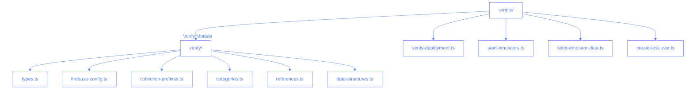
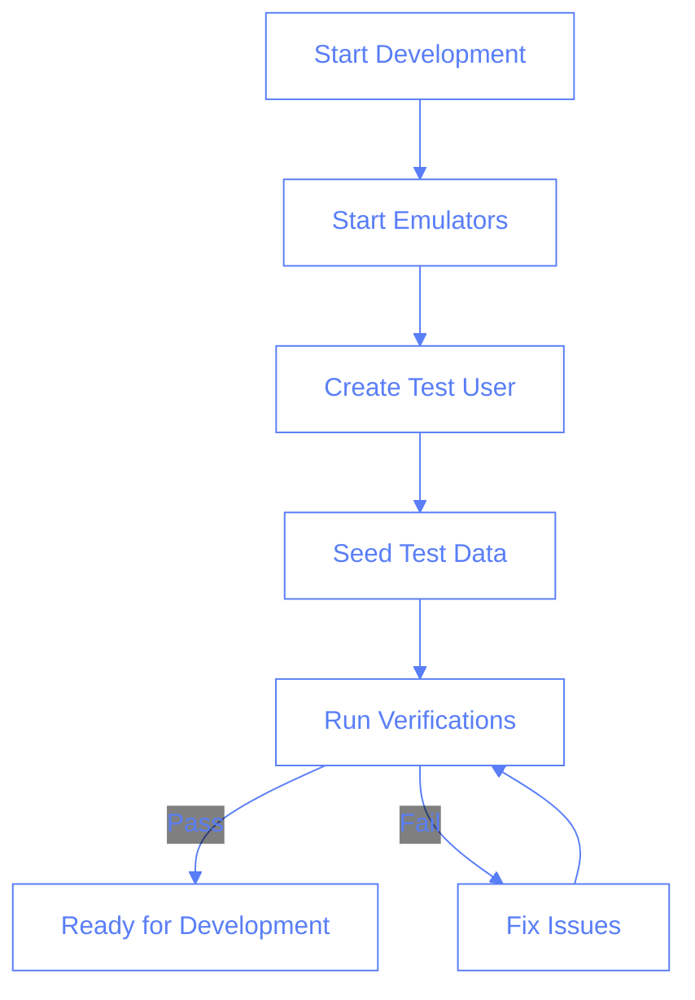

# Scripts Architecture

This document outlines the architecture and organization of our Node.js scripts, focusing on the verification system and other utility scripts.

## Directory Structure



## Module Dependencies

```mermaid
%%{init: {'theme': 'base', 'themeVariables': {
    'primaryColor': '#ffffff',
    'primaryTextColor': '#597ef7',
    'primaryBorderColor': '#597ef7',
    'lineColor': '#597ef7',
    'textColor': '#597ef7',
    'mainBkg': 'transparent',
    'nodeBorder': '#597ef7',
    'clusterBkg': 'transparent',
    'labelTextColor': '#597ef7',
    'titleColor': '#597ef7',
    'clusterBorder': '#fff',
    'edgeLabelBackground': 'transparent'
}}}%%

graph LR
    A[verify-deployment.ts] --> B[firebase-config.ts]
    C[collection-prefixes.ts] --> B
    D[categories.ts] --> B
    E[references.ts] --> B
    F[data-structures.ts] --> B

    C --> G[types.ts]
    D --> G
    E --> G
    F --> G

    A --> H[@/consts]
    D --> H
```

## Script Purposes

### Verification Scripts

- `verify-deployment.ts`: Main verification orchestrator
- `verify/types.ts`: Shared type definitions
- `verify/firebase-config.ts`: Firebase initialization
- `verify/collection-prefixes.ts`: Collection name verification
- `verify/categories.ts`: Category validation
- `verify/references.ts`: Reference integrity checks
- `verify/data-structures.ts`: Schema validation

### Utility Scripts

- `start-emulators.ts`: Firebase emulator initialization
- `seed-emulator-data.ts`: Test data seeding
- `create-test-user.ts`: Test user creation

## Configuration

### Package.json Scripts

```json
{
  "scripts": {
    "verify-deployment": "tsx scripts/verify-deployment.ts",
    "emulators": "NODE_ENV=development tsx scripts/start-emulators.ts",
    "create-test-user": "tsx scripts/create-test-user.ts",
    "seed-data": "NODE_ENV=development tsx scripts/seed-emulator-data.ts"
  }
}
```

### TypeScript Configuration

```json
{
  "compilerOptions": {
    "target": "ES2022",
    "module": "ESNext",
    "moduleResolution": "Node",
    "baseUrl": ".",
    "paths": {
      "@/*": ["../src/*"]
    }
  }
}
```

## Best Practices

1. **Module Organization**

   - Keep related functionality together
   - Use clear, descriptive file names
   - Maintain single responsibility principle

2. **Configuration Management**

   - Use environment variables for configuration
   - Keep Firebase config centralized
   - Share types across modules

3. **Error Handling**

   - Consistent error reporting
   - Clear error messages
   - Proper error propagation

4. **Code Style**
   - Use TypeScript for type safety
   - Follow ESLint rules
   - Maintain consistent formatting

## Development Workflow



## Adding New Scripts

1. Create new script file in appropriate directory
2. Add TypeScript types if needed
3. Update documentation
4. Add npm script if needed
5. Test in development environment

## Common Issues and Solutions

1. **Module Resolution**

   - Use `@/*` for src imports
   - Use relative paths for local imports
   - Check tsconfig paths configuration

2. **Environment Variables**

   - Load .env file in scripts
   - Use proper NODE_ENV
   - Check BUSINESS_ID is set

3. **Firebase Configuration**
   - Initialize Firebase once
   - Share Firebase instance
   - Use emulators in development
