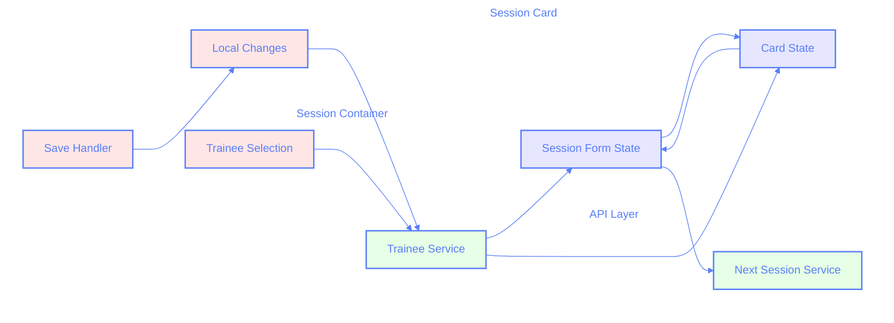
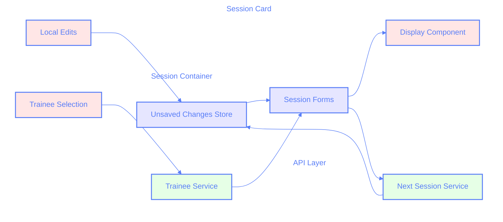

# Session Card State Management Analysis

## Current Implementation

The current implementation has parallel data flows that can lead to race conditions and state synchronization issues.



### Current Issues

1. **Duplicate Data Fetching**

   - Both parent and child components fetch trainee data
   - Network overhead and potential race conditions

2. **Complex State Synchronization**

   - Two-way data flow between parent and child
   - Hard to track the source of truth

3. **Scattered Unsaved Changes Logic**
   - Changes tracked at card level but need to sync with parent
   - Save/delete operations need to clear unsaved state

## Proposed Solution



### Key Improvements

1. **Single Source of Truth**

   - Parent container owns all data fetching
   - Session Card becomes a controlled component
   - Clear separation between data and display logic

2. **Centralized Unsaved Changes**

   - New Unsaved Changes Store at container level
   - Tracks changes by session card ID
   - Automatically cleared on save/delete

3. **Simplified Data Flow**
   - One-way data flow from parent to child
   - Local edits tracked separately from main state
   - Clear ownership of state updates

### Implementation Details

```typescript
// Types
interface UnsavedChanges {
	[sessionId: string]: {
		traineeId: string;
		timestamp: number;
		changes: Partial<SessionForm>;
	};
}

// Container Level
const SessionContainer = () => {
	const [unsavedChanges, setUnsavedChanges] = useState<UnsavedChanges>({});
	const [sessions, setSessions] = useState<SessionForm[]>([]);

	const handleTraineeSelect = async (sessionId: string, traineeId: string) => {
		const traineeData = await traineesService.get(traineeId);

		// Update session data
		setSessions((prev) =>
			prev.map((session) =>
				session.id === sessionId
					? { ...session, ...traineeData.nextSession }
					: session
			)
		);

		// Track as unsaved change
		setUnsavedChanges((prev) => ({
			...prev,
			[sessionId]: {
				traineeId,
				timestamp: Date.now(),
				changes: traineeData.nextSession,
			},
		}));
	};

	const handleSave = async (sessionId: string) => {
		await saveSession(sessionId);
		// Clear unsaved changes for this session
		setUnsavedChanges((prev) => {
			const { [sessionId]: _, ...rest } = prev;
			return rest;
		});
	};

	return sessions.map((session) => (
		<SessionCard
			key={session.id}
			session={session}
			hasUnsavedChanges={!!unsavedChanges[session.id]}
			onTraineeSelect={(traineeId) =>
				handleTraineeSelect(session.id, traineeId)
			}
			onSave={() => handleSave(session.id)}
		/>
	));
};

// Card Level
const SessionCard = ({
	session,
	hasUnsavedChanges,
	onTraineeSelect,
	onSave,
}: SessionCardProps) => {
	// Local state only for UI purposes
	const [isEditing, setIsEditing] = useState(false);

	return (
		<div className={`card ${hasUnsavedChanges ? "unsaved" : ""}`}>
			{/* Card UI */}
		</div>
	);
};
```

### Migration Strategy

1. **Phase 1: Centralize State**

   - Move all API calls to container level
   - Implement unsaved changes store
   - Keep existing card-level state temporarily

2. **Phase 2: Simplify Cards**

   - Convert cards to controlled components
   - Remove duplicate API calls
   - Update UI to reflect centralized state

3. **Phase 3: Cleanup**
   - Remove unused state management code
   - Update tests to reflect new data flow
   - Document new patterns

### Benefits

1. **Better Performance**

   - Reduced network calls
   - More efficient state updates
   - Better React rendering optimization

2. **Improved Reliability**

   - No race conditions
   - Predictable state updates
   - Easier to debug

3. **Enhanced User Experience**
   - Consistent unsaved changes indicator
   - Faster response to user actions
   - More reliable save/delete operations
