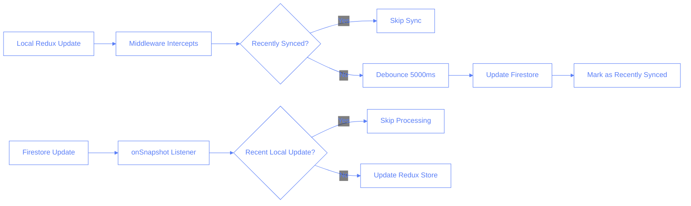
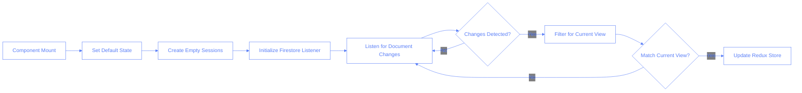
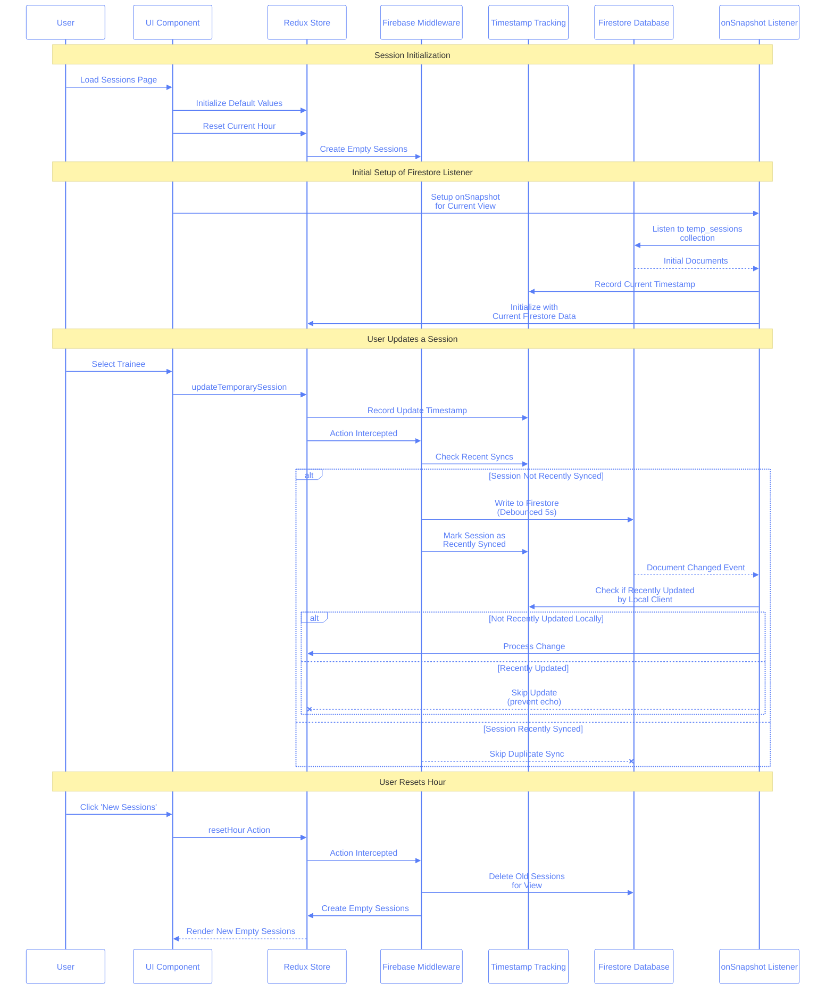

# Firestore Real-Time Synchronization

This document outlines the implementation of bidirectional real-time synchronization between our Redux store and Firestore database, focusing on the challenges encountered and solutions implemented.

## Flow Charts

### Bidirectional Sync Flow



### Session Initialization Flow



### Temporary Sessions UML Sequence Diagram



## Infinite Loop Challenge

One of the key challenges in implementing bidirectional synchronization was preventing infinite loops between Redux and Firestore. This loop occurs when:

1. A Redux state change triggers the middleware
2. Middleware updates Firestore
3. Firestore change triggers the onSnapshot listener
4. Listener updates Redux state
5. Loop repeats from step 1

This created not only performance issues but also potential data inconsistencies and excessive Firestore reads/writes.

### Solution Components

Our solution involved three key components:

#### 1. Enhanced Redux Middleware

```typescript
// In sessionsFirebaseMiddleware.ts
const recentlySyncedSessions = new Set<string>();

const middleware: Middleware = (store) => (next) => {
	let debounceTimerId: NodeJS.Timeout | null = null;

	return (action) => {
		// Process the action first
		const result = next(action);

		// Check if it's a session update action
		if (action.type === "sessions/updateSession") {
			const session = action.payload;
			const sessionId = session.id;

			// Skip if recently synced
			if (recentlySyncedSessions.has(sessionId)) {
				console.log(
					`🔄 Skipping sync for recently synced session ${sessionId}`
				);
				return result;
			}

			// Debounce to prevent rapid updates
			if (debounceTimerId) {
				clearTimeout(debounceTimerId);
			}

			debounceTimerId = setTimeout(() => {
				// Update Firestore
				updateFirestore(session);

				// Mark as recently synced
				recentlySyncedSessions.add(sessionId);

				// Clear from recent syncs after 5 seconds
				setTimeout(() => {
					recentlySyncedSessions.delete(sessionId);
				}, 5000);

				debounceTimerId = null;
			}, 5000);
		}

		return result;
	};
};
```

#### 2. Optimized Firestore Listener

```typescript
// In sessions-container.tsx
useEffect(() => {
	const updatedSessions = new Set<string>();
	const localUpdateTimestamps = new Map<string, number>();

	// Only set up listener if we have all required values
	if (!selectedDate || !selectedHour || !selectedRoom || !selectedStudio) {
		return;
	}

	// Create the query with proper filters
	const collectionName = `temp-${process.env.NEXT_PUBLIC_ENVIRONMENT}-sessions`;
	const sessionsRef = collection(db, collectionName);
	const q = query(
		sessionsRef,
		where("date", "==", selectedDate),
		where("hourId", "==", selectedHour),
		where("roomId", "==", selectedRoom),
		where("studioId", "==", selectedStudio)
	);

	// Set up the listener
	const unsubscribe = onSnapshot(q, (snapshot) => {
		console.log(`🔥 Firestore: Received ${snapshot.docs.length} documents`);

		// Skip if no changes
		if (snapshot.empty) {
			console.log("🔥 Firestore: Snapshot is empty");
			return;
		}

		// Process each document
		snapshot.docChanges().forEach((change) => {
			const session = change.doc.data();
			const sessionId = session.id;

			// Skip if this session was recently updated locally
			const lastLocalUpdate = localUpdateTimestamps.get(sessionId) || 0;
			const now = Date.now();
			const timeSinceLocalUpdate = now - lastLocalUpdate;

			if (timeSinceLocalUpdate < 5000) {
				console.log(
					`🔄 Skipping update for session ${sessionId} - was updated locally ${timeSinceLocalUpdate}ms ago`
				);
				return;
			}

			// Skip if we've already processed this update
			if (updatedSessions.has(sessionId)) {
				console.log(`🔄 Skipping duplicate update for session ${sessionId}`);
				return;
			}

			// Mark as updated
			updatedSessions.add(sessionId);

			// Process the session update
			if (change.type === "added" || change.type === "modified") {
				// Update Redux state
				dispatch(updateSession(session));

				// Track this as a local update
				localUpdateTimestamps.set(sessionId, Date.now());

				// Remove from updatedSessions set after 2 seconds to allow future updates
				setTimeout(() => {
					updatedSessions.delete(sessionId);
				}, 2000);
			}
		});
	});

	// Clean up listener on unmount
	return () => {
		unsubscribe();
	};
}, [selectedDate, selectedHour, selectedRoom, selectedStudio, dispatch]);
```

#### 3. Initial Sessions Setup

```typescript
// In sessions-container.tsx
useEffect(() => {
	// Log component state
	console.log("🏁 Component mount - selectedDate:", selectedDate);
	console.log("🏁 Component mount - selectedHour:", selectedHour);
	console.log("🏁 Component mount - selectedRoom:", selectedRoom);
	console.log("🏁 Component mount - selectedStudio:", selectedStudio);

	// Set default values if undefined
	if (!selectedDate) {
		const today = new Date().toISOString().split("T")[0];
		dispatch(setSelectedDate(today));
	}

	if (!selectedHour) {
		const currentHour = new Date().getHours().toString();
		dispatch(setSelectedHour(currentHour));
	}

	if (!selectedRoom) {
		dispatch(setSelectedRoom("1"));
	}

	if (!selectedStudio) {
		dispatch(setSelectedStudio("1"));
	}

	// Create empty sessions only once on mount
	setTimeout(() => {
		console.log("⏰ Creating empty sessions for current hour");
		resetCurrentHour();
	}, 500);

	// No automatic refresh on mount - let onSnapshot handle updates
}, []);
```

## Technical Implementation

The implementation uses several key techniques to prevent loops and ensure efficient synchronization:

### 1. Debouncing and Throttling

- **Middleware Debounce (5000ms):** Prevents rapid successive updates to Firestore
- **Update Tracking:** Uses a Set to track recently updated sessions
- **Timestamp Tracking:** Uses a Map to record when each session was last updated locally

### 2. Update Filtering

- **Recent Update Check:** Skips processing Firestore updates for sessions that were recently updated locally
- **Duplicate Update Prevention:** Tracks processed sessions to avoid processing the same update multiple times
- **Filter Validation:** Ensures sessions match the current view's filters before processing

### 3. State Initialization

- **Default Values:** Sets default values for date, hour, room, and studio on component mount
- **Empty Session Creation:** Creates empty sessions for the current hour on initialization
- **Listener Setup:** Establishes the Firestore listener after initialization

## Best Practices

1. **Redux Updates**

   - Use middleware to intercept session updates
   - Debounce updates to prevent rapid firing
   - Track which sessions have been synced recently

2. **Firestore Listener**

   - Use query filters to limit the data received
   - Skip processing for recently updated sessions
   - Track processed updates to prevent duplicates
   - Clean up listeners on component unmount

3. **Performance**
   - Use timestamps to track update recency
   - Implement cleanup timers to prevent memory leaks
   - Add detailed logging for debugging purposes

## The Fixed Session Update Flow

With our solution in place, the session update flow now works as follows:

1. **Local Update (Redux):**

   - User makes a change in the UI
   - Redux state is updated
   - Middleware intercepts the update
   - If the session was recently synced, skip Firestore update
   - Otherwise, debounce for 5000ms
   - Update Firestore
   - Mark session as recently synced

2. **Remote Update (Firestore):**
   - Firestore document changes
   - onSnapshot listener receives the change
   - Check if session was recently updated locally
   - If recently updated, skip processing (likely an echo)
   - If not, update Redux state
   - Mark session as recently processed
   - Track as a local update with timestamp

This bidirectional flow ensures data consistency across all clients while preventing infinite loops and unnecessary processing.

## Bugs Hall of Fame

### The Infinite Loop Bug (May 2024)

#### Bug Description

When sessions were updated, the application would enter an infinite loop of updates between Redux and Firestore causing:

- Excessive console logs showing continuous syncing
- Poor performance
- Excessive Firestore reads/writes
- High CPU usage

#### Root Cause Analysis

1. **Circular Dependency**

   - Redux state changes triggered Firestore updates
   - Firestore updates triggered Redux state changes
   - No mechanism existed to break the cycle

2. **Missing Update Tracking**
   - The system couldn't distinguish between user-initiated updates and updates from Firestore
   - Every update was processed as new, even if it was just echoing a previous update

#### The Fix

1. **Tracking Update Sources**

   ```typescript
   // Track sessions that were recently updated locally
   const localUpdateTimestamps = new Map<string, number>();

   // In Firestore listener
   if (timeSinceLocalUpdate < 5000) {
   	console.log(`🔄 Skipping update - recently updated locally`);
   	return;
   }
   ```

2. **Debouncing and Update Filtering**

   ```typescript
   // In middleware
   if (recentlySyncedSessions.has(sessionId)) {
   	console.log(`🔄 Skipping sync for recently synced session`);
   	return result;
   }

   // Debounce Firestore updates
   debounceTimerId = setTimeout(() => {
   	updateFirestore(session);
   	// Mark as recently synced
   }, 5000);
   ```

3. **Session Processing Tracking**

   ```typescript
   // Track which sessions we've already processed
   const updatedSessions = new Set<string>();

   // Skip already processed sessions
   if (updatedSessions.has(sessionId)) {
   	console.log(`🔄 Skipping duplicate update`);
   	return;
   }
   ```

#### Key Learnings

1. **Bidirectional Sync Challenges**

   - Bidirectional sync requires breaking potential infinite loops
   - Must track update sources to prevent echo effects
   - Debouncing is essential for performance

2. **Update Tracking**

   - Track timestamps of local updates
   - Use Set and Map data structures for efficient lookups
   - Implement cleanup timers to prevent memory leaks

3. **Debugging Approach**
   - Add detailed logging for each step of the sync process
   - Track update sources and timestamps
   - Monitor Firestore read/write operations
   - Test with multiple clients simultaneously

### The Persistent Loop Bug (June 2024)

#### Bug Description

Despite the initial fixes, the application still exhibited symptoms of an infinite loop:

- Console logs showing continuous "syncing sessions" messages
- Updates from Firestore triggering unnecessary state updates
- Redundant document processing

#### Root Cause Analysis

1. **Redundant Data Fetching**

   - Component was fetching data on mount and on selection changes
   - This was redundant with the Firestore listener, creating duplicate updates

2. **Insufficient Update Filtering**

   - The debounce mechanism alone wasn't enough to prevent loops
   - The system needed more robust filtering of echoed updates

3. **Manual Refresh Triggering Updates**
   - The manual refresh function was triggering unnecessary Firestore operations

#### The Fix

1. **Removed Redundant Data Fetching**

   ```typescript
   // Removed the useEffect that loaded sessions on component mount
   // Let the onSnapshot listener handle the initial data load

   // Instead, added initialization code for empty sessions
   useEffect(() => {
   	// Set default values if undefined
   	// ...

   	// Create empty sessions only once on mount
   	setTimeout(() => {
   		console.log("⏰ Creating empty sessions for current hour");
   		resetCurrentHour();
   	}, 500);

   	// No automatic refresh on mount - let onSnapshot handle updates
   }, []);
   ```

2. **Enhanced Middleware with Expiring Cache**

   ```typescript
   // In sessionsFirebaseMiddleware.ts
   const recentlySyncedSessions = new Set<string>();

   // When a session is synced to Firestore
   recentlySyncedSessions.add(sessionId);

   // Clear from recent syncs after timeout
   setTimeout(() => {
   	recentlySyncedSessions.delete(sessionId);
   }, 5000);
   ```

3. **Simplified Hour Change Handling**

   ```typescript
   // Updated to avoid triggering additional fetch operations
   const handleHourChange = (hour: string) => {
   	dispatch(setSelectedHour(hour));
   	// Let the onSnapshot listener handle data refresh
   };
   ```

4. **Added Manual Controls**

   ```tsx
   // Added a "New Sessions" button for explicit user control
   <Button
   	onClick={handleResetHour}
   	className="bg-green-500 hover:bg-green-600"
   >
   	New Sessions
   </Button>
   ```

#### Key Learnings

1. **Component Initialization**

   - One-time initialization should be clearly separated from real-time updates
   - Default values should be set before attempting to fetch data
   - Empty sessions should be created explicitly, not as part of the data sync flow

2. **User Control**

   - Provide explicit controls for operations that affect multiple records
   - Separate read operations from write operations in the UI

3. **Single Source of Truth**
   - Rely on a single mechanism for data synchronization (the Firestore listener)
   - Avoid redundant data fetching operations

## Latest Improvements

Based on our experiences with the bidirectional sync challenges, we've made several additional improvements to further stabilize the system:

### Enhanced Timestamp-Based Filtering

We've improved the update filtering mechanism to use more precise timestamps and thresholds:

```typescript
// Track both local updates and their timestamps
const updatedSessions = new Set<string>();
const localUpdateTimestamps = new Map<string, number>();

// More precise timestamp comparison
const lastLocalUpdate = localUpdateTimestamps.get(sessionId) || 0;
const now = Date.now();
const timeSinceLocalUpdate = now - lastLocalUpdate;

if (timeSinceLocalUpdate < 5000) {
	console.log(
		`🔄 Skipping update for session ${sessionId} - was updated locally ${timeSinceLocalUpdate}ms ago`
	);
	return;
}
```

### Improved Debugging with Colorful Logging

We've enhanced our logging to provide clearer indications of what's happening in the sync process:

```typescript
// Session filtering logs
console.log(`🔍 Session ${sessionId} filters:`);
console.log(
	`  📅 Date: ${session.date} === ${selectedDate}: ${
		session.date === selectedDate
	}`
);
console.log(
	`  🕒 Hour: ${session.hourId} === ${selectedHour}: ${
		session.hourId === selectedHour
	}`
);
console.log(
	`  🏢 Room: ${session.roomId} === ${selectedRoom}: ${
		session.roomId === selectedRoom
	}`
);
console.log(
	`  🏛️ Studio: ${session.studioId} === ${selectedStudio}: ${
		session.studioId === selectedStudio
	}`
);
```

### Memory Leak Prevention

We've added cleanup timers to ensure that tracked sessions are removed from the cache to prevent memory leaks:

```typescript
// Add session to tracking set
updatedSessions.add(sessionId);

// Remove after timeout to allow future updates
setTimeout(() => {
	updatedSessions.delete(sessionId);
}, 2000);

// For middleware
setTimeout(() => {
	recentlySyncedSessions.delete(sessionId);
}, 5000);
```

### Clean Initialization and Reset

We've improved the initialization and reset flow to ensure clean state:

```typescript
// Create empty sessions only once on mount with a timeout
setTimeout(() => {
	console.log("⏰ Creating empty sessions for current hour");
	resetCurrentHour();
}, 500);

// Added explicit New Sessions button
<Button onClick={handleResetHour} className="bg-green-500 hover:bg-green-600">
	New Sessions
</Button>;
```

### The Duplicate Sessions Bug (June 2024)

#### Bug Description

When selecting a trainee in an empty session card after generating new sessions:

- The trainee appeared in the selected card as expected
- But another duplicate card with the same trainee was also created at the bottom of the screen
- This resulted in two separate session cards for the same trainee in the same hour

#### Root Cause Analysis

1. **Inconsistent Session ID Handling**

   - When a trainee was selected on an empty session, a completely new ID was generated
   - The original empty session was never properly removed or replaced
   - This created two separate session entities with different IDs but the same trainee

2. **Lack of Session Correlation**

   - The system couldn't correlate that a session with trainee was meant to replace an empty slot
   - There was no mechanism to track the relationship between an empty session and its "filled" version

3. **Conflicting Syncing Paths**
   - The Firestore listener saw the new session as a completely separate entity
   - The Redux store was maintaining both the original updated card and the new Firestore session

#### The Fix: Session Correlation System

We implemented a comprehensive solution that maintains session correlation throughout the system:

1. **Correlation IDs and Tracking**

   ```typescript
   // Track if this is a conversion from an empty session
   const isEmptySessionConversion = session.tempId.startsWith("empty-");

   // Use a naming convention for converted sessions
   const newTempId = isEmptySessionConversion
   	? `converted-${session.tempId.substring(6)}-${traineeId}`
   	: session.tempId;

   // Store the original empty session ID for correlation
   const updatedSession = {
   	...session,
   	tempId: newTempId,
   	originalEmptyId: isEmptySessionConversion ? session.tempId : undefined,
   	lastUpdated: Date.now(),
   };
   ```

2. **Explicit Empty Session Removal**

   ```typescript
   // If this was an empty session conversion, remove the original empty session first
   if (isEmptySessionConversion) {
   	// Create a temporary empty session just to remove it
   	const emptySession = {
   		...session,
   		tempId: session.tempId,
   	};

   	// Update Redux state to remove the empty session
   	updateSession(
   		selectedDate,
   		selectedHour,
   		selectedRoom,
   		{ ...emptySession, _isBeingRemoved: true },
   		selectedStudio
   	);
   }
   ```

3. **Enhanced Redux State Management**

   ```typescript
   // Special handling for session removal flag
   if (session._isBeingRemoved) {
   	console.log(`🗑️ Removing session from Redux: ${session.tempId}`);
   	state.sessions[date][hour][room][studio].temporary = state.sessions[date][
   		hour
   	][room][studio].temporary.filter((s) => s.tempId !== session.tempId);
   	return;
   }

   // Handle session replacement by originalEmptyId
   if (session.originalEmptyId) {
   	emptySessionIndex = state.sessions[date][hour][room][
   		studio
   	].temporary.findIndex((s) => s.tempId === session.originalEmptyId);

   	if (emptySessionIndex !== -1) {
   		replacingEmptySession = true;
   		// Replace the empty session with the converted one
   		state.sessions[date][hour][room][studio].temporary[emptySessionIndex] =
   			mergedSession;
   	}
   }
   ```

4. **Duplicate Detection in Firestore Listener**

   ```typescript
   // Check for duplicate sessions
   if (tempSession.traineeId) {
   	const duplicate = localSessions.find(
   		(s) =>
   			s.traineeId === tempSession.traineeId &&
   			s.tempId !== tempSession.tempId &&
   			s.tempId.startsWith("converted-")
   	);

   	if (duplicate) {
   		console.log(
   			`⚠️ Detected potential duplicate session for trainee ${tempSession.traineeId}`
   		);
   		// If the existing session was recently created, skip this update
   		if (duplicate.lastUpdated && now - duplicate.lastUpdated < 10000) {
   			console.log(`⏭️ Skipping duplicate session from Firestore`);
   			return;
   		}
   	}
   }
   ```

5. **Timestamp-Based Prioritization**

   ```typescript
   // Determine which one to keep - prefer converted sessions
   if (existingSessionForTrainee.tempId.startsWith("converted-")) {
   	console.log(`👑 Redux: Keeping converted session`);
   	// Skip the Firestore version
   	return;
   } else {
   	// Replace the existing session in the map
   	console.log(`♻️ Redux: Replacing existing session with newer one`);
   	traineeToSessionMap.set(session.traineeId, session);
   }
   ```

#### Key Implementation Details

1. **Session Type Identification**

   - `empty-*` - Empty slot sessions (never synced to Firestore)
   - `converted-*` - Sessions that were converted from empty sessions
   - These prefixes allow for clear tracking of session origins

2. **Session Correlation Metadata**

   - We added `originalEmptyId` to track which empty session a converted session is replacing
   - This maintains the relationship even when IDs change

3. **Explicit Session Removal**

   - Added a special `_isBeingRemoved` flag to handle session deletion properly
   - This ensures empty sessions are properly removed when replaced

4. **Trainee-Based Deduplication**
   - Track sessions by trainee ID to prevent duplicates
   - Prioritize converted sessions over automatically synced ones from Firestore
   - Use timestamps to make smart decisions when conflicts occur

#### Benefits

1. **Single Trainee, Single Session**

   - Each trainee now correctly appears in only one session card
   - The session visibly updates in-place rather than creating duplicates

2. **Preserved User Intent**

   - User-selected trainees in specific positions on the screen stay in those positions
   - Empty sessions properly convert to filled sessions without duplicates

3. **Real-time Sync Still Works**
   - The fix maintains real-time syncing capabilities across clients
   - Other users still see updates when trainee selections are made

## Multiple Choice Questions

1. What causes the infinite loop between Redux and Firestore?

   - [ ] A. Too many documents in Firestore
   - [ ] B. Slow internet connection
   - [ ] C. Redux updates Firestore, which updates Redux, creating a cycle
   - [ ] D. Component re-rendering too frequently

2. Which data structure is used to track recently updated sessions?

   - [ ] A. Array
   - [ ] B. Object
   - [ ] C. Set
   - [ ] D. Queue

3. How long is the debounce time in the middleware?

   - [ ] A. 1000ms (1 second)
   - [ ] B. 3000ms (3 seconds)
   - [ ] C. 5000ms (5 seconds)
   - [ ] D. 10000ms (10 seconds)

4. What is the primary purpose of the `localUpdateTimestamps` Map?

   - [ ] A. Improve performance
   - [ ] B. Track when sessions were last updated locally to prevent echoing updates
   - [ ] C. Store session data
   - [ ] D. Calculate time differences

5. Why do we use a Set to track updated sessions?

   - [ ] A. It's faster than arrays for lookups
   - [ ] B. It automatically prevents duplicates
   - [ ] C. It uses less memory
   - [ ] D. Both A and B

6. What can cause redundant data fetching in a React application with Firestore?

   - [ ] A. Using multiple listeners for the same data
   - [ ] B. Fetching data in useEffect hooks and also having real-time listeners
   - [ ] C. Not using proper query filters
   - [ ] D. Using the wrong database reference

7. Why is it important to have a dedicated "New Sessions" button instead of automatic resets?

   - [ ] A. It gives users more control over when data is reset
   - [ ] B. It prevents accidental data loss
   - [ ] C. It avoids triggering unnecessary sync operations
   - [ ] D. All of the above

8. What causes duplicate session cards to appear when selecting a trainee after generating new sessions?

   - [ ] A. Race conditions in React's rendering
   - [ ] B. Firestore latency causing delayed updates
   - [ ] C. Lack of session correlation between empty sessions and their filled versions
   - [ ] D. Redux store getting out of sync with the database

9. How does the session correlation system prevent duplicates?
   - [ ] A. By using unique timestamps for each session
   - [ ] B. By tracking relationships between empty and converted sessions
   - [ ] C. By blocking Firestore updates
   - [ ] D. By refreshing the page automatically

## Answers

1. C - Redux updates Firestore, which updates Redux, creating a cycle
2. C - Set
3. C - 5000ms (5 seconds)
4. B - Track when sessions were last updated locally to prevent echoing updates
5. D - Both A and B
6. B - Fetching data in useEffect hooks and also having real-time listeners
7. D - All of the above
8. C - Lack of session correlation between empty sessions and their filled versions
9. B - By tracking relationships between empty and converted sessions
