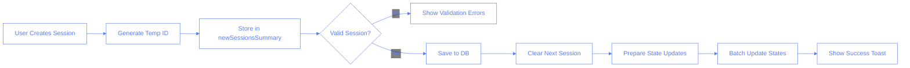
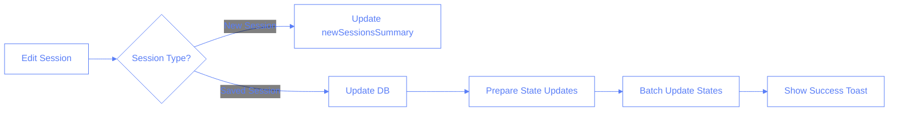

# Session State Management

This document outlines how temporary sessions are managed in the application before being committed to the database.

For details on how the sessions are synchronized with Firestore in real-time, see the [Firestore Real-Time Synchronization](./firestore-sync-solution.md) document.

## Flow Charts

### Basic Session Creation Flow



### Session Update Flow



## Implementation Details

### State Structure

```typescript
// In useSessions hook
const [sessions, setSessions] = useState<Session[]>(initialSessions);
const [temporarySessions, setTemporarySessions] = useState<SessionForm[]>([]);

// Session update handlers
const handleFormFieldUpdate = (
	session: SessionForm,
	key: string,
	value: any
) => {
	// Updates session in temporarySessions array
};

const handleTraineeSelection = async (
	session: SessionForm,
	traineeId: string
) => {
	// Updates trainee and loads next session data
};

const handleInstructorSelection = async (
	session: SessionForm,
	instructorId: string
) => {
	// Updates instructor in temporarySessions
};
```

### Key Benefits

1. **Instant UI Updates**

   - Changes are reflected immediately in the UI via React state
   - No loading states needed for form interactions

2. **Data Safety**

   - Nothing is committed to DB until fully validated
   - Clear separation between temporary and saved sessions
   - Each session type has its own state array

3. **Better UX**
   - Users can work on multiple sessions at once
   - Form state persists across navigation
   - Easy to implement draft saving

### Validation Layer

Before committing to the database, we validate:

- No time conflicts with existing sessions
- All required fields are filled
- Valid instructor and trainee IDs
- Valid date and time format
- Business rules (e.g., operating hours)

### Error Handling

When errors occur:

1. Keep temporary version in temporarySessions state
2. Show error toast to user (using our existing useToast hook)
3. Allow retry functionality
4. Provide clear error messages

## Technical Implementation

The implementation uses:

- React's useState for state management
- React Hook Form for form handling
- Custom hooks for business logic
- TypeScript for type safety

### State Updates

To prevent cascading updates and ensure consistent state, we use a batched update approach:

```typescript
// ❌ BAD PRACTICE: Separate state updates cause multiple re-renders
const onSaveSession = async (sessionToSave: SessionForm) => {
	// Save to DB
	const session = await sessionsService.add(newSession);

	// Multiple separate state updates trigger cascading re-renders
	setDailyHourToSessions((prev) => ({
		...prev,
		[selectedDate]: {
			...prev[selectedDate],
			[selectedHour]: updatedSessions,
		},
	}));

	// This triggers another re-render
	setNewSessionsSummary((prev) =>
		prev.filter((s) => s.tempId !== sessionToSave.tempId)
	);

	// This might trigger yet another re-render
	await traineesService.updateNextSession(sessionToSave.traineeId, {
		categories: {},
		comments: "",
	});
};

// ✅ GOOD PRACTICE: Batch state updates to ensure single re-render
const onSaveSession = async (sessionToSave: SessionForm) => {
	// First, handle async operations
	const session = await sessionsService.add(newSession);

	// Silently clear next session
	await traineesService.updateNextSession(sessionToSave.traineeId, {
		categories: {},
		comments: "",
	});

	// Prepare all state updates
	const newDailyHourToSessions = {
		...dailyHourToSessions,
		[selectedDate]: {
			...dailyHourToSessions[selectedDate],
			[selectedHour]: updatedSessions,
		},
	};

	const newSessionsSummaryUpdated = newSessionsSummary.filter(
		(s) => s.tempId !== tempId
	);

	// Single state update with all changes
	setState((prev) => ({
		...prev,
		dailyHourToSessions: newDailyHourToSessions,
		newSessionsSummary: newSessionsSummaryUpdated,
	}));
};
```

### Preventing Cascading Updates

The system uses several techniques to prevent unwanted updates:

1. **Batched State Updates**

   ```typescript
   // ❌ BAD PRACTICE: Multiple state updates cause cascading effects
   const handleSessionSave = async () => {
   	setDailyHourToSessions(newSessions); // Triggers re-render #1
   	setNewSessionsSummary(updatedSummary); // Triggers re-render #2
   	setTraineeNextSession(clearedSession); // Triggers re-render #3
   };

   // ✅ GOOD PRACTICE: Single batched update
   const handleSessionSave = async () => {
   	setState((prev) => ({
   		...prev,
   		dailyHourToSessions: newSessions,
   		newSessionsSummary: updatedSummary,
   		traineeNextSession: clearedSession,
   	})); // Single re-render
   };
   ```

2. **Memoized Calculations**

   ```typescript
   // ❌ BAD PRACTICE: Recalculating for all hours unnecessarily
   const hourTrainees = useMemo(() => {
   	return CLOCK_HOURS.reduce((acc, hour) => {
   		// Calculate trainees for every hour even when unnecessary
   		acc[hour] = calculateTraineesForHour(hour);
   		return acc;
   	}, {});
   }, [hourSessionsMap, newSessionsSummary]);

   // ✅ GOOD PRACTICE: Calculate only for current hour
   const hourTrainees = useMemo(() => {
   	// Only calculate for selected hour
   	const hour = selectedHour;
   	return {
   		[hour]: calculateTraineesForHour(hour),
   	};
   }, [hourSessionsMap, newSessionsSummary, selectedHour]);
   ```

3. **Update Order**

   ```typescript
   // ❌ BAD PRACTICE: Mixing async operations with state updates
   const saveSession = async () => {
     setIsLoading(true);
     setDailyHourToSessions(newSessions);  // State update before DB operation
     await sessionsService.add(newSession); // DB operation might fail
     setNewSessionsSummary([]); // State already changed, inconsistent if DB fails
   };

   // ✅ GOOD PRACTICE: Clear order of operations
   const saveSession = async () => {
     setIsLoading(true);
     try {
       // 1. Handle all async operations first
       const savedSession = await sessionsService.add(newSession);
       await traineesService.updateNextSession(...);

       // 2. Prepare state updates
       const newStates = prepareStateUpdates(savedSession);

       // 3. Single batched update
       setState((prev) => ({
         ...prev,
         ...newStates
       }));
     } finally {
       setIsLoading(false);
     }
   };
   ```

### Custom Hooks

```typescript
// Main sessions management hook
const useSessions = ({
	currentRoom,
	initialSessions = [],
	toast,
	nextSession,
	traineeIdToTrainee = {},
}: UseSessionsProps): UseSessionsResult => {
	const [sessions, setSessions] = useState<Session[]>(initialSessions);
	const [temporarySessions, setTemporarySessions] = useState<SessionForm[]>([]);

	// ... handlers and logic
};
```

### Best Practices

1. **State Updates**

   - Always batch related state updates together
   - Use setState callback form for dependent updates
   - Clear async operations before state updates

2. **Performance**

   - Minimize re-renders through batched updates
   - Use proper memoization for derived data
   - Keep state updates predictable

3. **Error Handling**
   - Handle async operations before state updates
   - Maintain consistent state even during errors
   - Provide clear error feedback to users

## Bugs Hall of Fame

### The Cascading Updates Bug (March 2024)

#### Bug Description

When saving a session in one card, it would trigger unwanted updates in other cards, specifically:

- Saving the first card would update the second card
- Saving the fourth card would update the fifth card
- The updates mainly affected trainee selection and categories
- Changes occurred immediately without user interaction

#### Root Cause Analysis

1. **Multiple State Updates**

```typescript
// The problematic code
setDailyHourToSessions(...);  // First re-render
setNewSessionsSummary(...);   // Second re-render
traineesService.updateNextSession(...);  // Potential third re-render
```

2. **Cascading Effects**

- Each state update triggered a re-render
- Re-renders caused memoized values to recalculate:
  ```typescript
  const hourSessions = useMemo(() => {...}, [dailyHourToSessions, newSessionsSummary]);
  const hourTrainees = useMemo(() => {...}, [hourSessionsMap, newSessionsSummary]);
  ```
- New memoized values caused all cards to receive new props
- Cards with empty trainee fields would pick up values from the updated props

#### The Fix

1. **Batched State Updates**

```typescript
// Single state update
setState((prev) => ({
	...prev,
	dailyHourToSessions: newDailyHourToSessions,
	newSessionsSummary: newSessionsSummaryUpdated,
}));
```

2. **Proper Update Order**

```typescript
// 1. Handle async operations first
const session = await sessionsService.add(newSession);
await traineesService.updateNextSession(...);

// 2. Prepare state updates
const newStates = prepareStateUpdates(session);

// 3. Single batched update
setState((prev) => ({
  ...prev,
  ...newStates
}));
```

#### Key Learnings

1. **State Management**

   - Always batch related state updates together
   - Be cautious of cascading effects in complex state relationships
   - Consider the entire component tree when updating state

2. **React Rendering**

   - Multiple setState calls can cause unnecessary re-renders
   - Props changes trigger re-renders in child components
   - Memoization dependencies should be carefully considered

3. **Best Practices**

   - Handle async operations before state updates
   - Use batched updates for related state changes
   - Keep state updates predictable and atomic
   - Test with multiple instances of the same component

4. **Debugging Approach**
   - Follow the data flow through the component tree
   - Look for unintended side effects of state updates
   - Consider the timing and order of updates
   - Test edge cases with multiple component instances

#### Prevention Strategies

1. **Code Review Focus**

   - Look for multiple setState calls that could be batched
   - Check memoization dependencies
   - Review component update lifecycles
   - Consider side effects of state updates

2. **Testing Requirements**

   - Test with multiple instances of the same component
   - Verify state updates don't affect unrelated components
   - Check for unwanted prop changes
   - Test async operation ordering

3. **Architecture Guidelines**
   - Keep state updates atomic and predictable
   - Use proper state management patterns
   - Document state update flows
   - Consider component isolation
