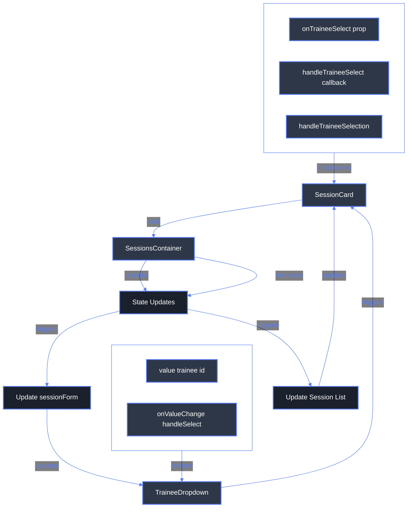

# Trainee Selection Flow

## Overview

This document explains the technical flow of trainee selection in the session management system, from the UI interaction to state updates and back to UI reflection.

## Flow Diagram



## Technical Flow Explanation

### 1. User Interaction (TraineeDropdown)

- Component: `TraineeDropdown.tsx`
- Function: `handleSelect` (internal callback)

```typescript
const handleSelect = useCallback(
	async (value: string) => {
		console.log("TraineeDropdown: Selecting trainee:", value);
		await onTraineeSelect(value);
	},
	[onTraineeSelect]
);
```

### 2. Session Card Handler (SessionCard)

- Component: `SessionCard.tsx`
- Function: `handleTraineeSelect` (internal callback)

```typescript
const handleTraineeSelect = useCallback(
	async (traineeId: string) => {
		if (onTraineeSelect) {
			await onTraineeSelect(traineeId);
		}
	},
	[onTraineeSelect]
);
```

### 3. Container Logic (SessionsContainer)

- Component: `sessions-container.tsx`
- Function: `handleTraineeSelection` (main logic)

```typescript
const handleTraineeSelection = useCallback(async (traineeId: string, session: SessionForm) => {
  const selectedTrainee = traineeIdToTrainee[traineeId];
  const updatedSession = {
    ...session,
    traineeId,
    trainee: selectedTrainee,
    status: 'pending',
    tempId: session.tempId || Date.now().toString(),
  };

  // Update states
  setNewSessionsSummary(prev => {...});
  setSessionForm(prev => {...});
}, [traineeIdToTrainee]);
```

## State Management

### Session Form State

- Location: SessionsContainer
- Purpose: Tracks the currently active session form
- Updates: Through `setSessionForm`

### New Sessions Summary State

- Location: SessionsContainer
- Purpose: Maintains list of all new (unsaved) sessions
- Updates: Through `setNewSessionsSummary`

## Props Flow

### TraineeDropdown Props

- `trainee`: Current trainee object
- `traineeOptions`: Available trainees
- `onTraineeSelect`: Callback for selection
- `sameHourPeople`: People already booked

### SessionCard Props

- `trainee`: Selected trainee
- `onTraineeSelect`: Selection handler
- `traineeOptions`: Available trainees

## Common Issues and Solutions

### 1. State Update Synchronization

**Issue**: Updates to `newSessionsSummary` and `sessionForm` need to be synchronized
**Solution**: Use `tempId` for consistent session tracking

### 2. UI Update Triggers

**Issue**: UI not reflecting changes immediately
**Solution**: Ensure proper prop updates and memo usage

### 3. State Propagation

**Issue**: State changes not reflecting in child components
**Solution**: Verify prop passing and callback chains

## Best Practices

1. Always use `tempId` for tracking unsaved sessions
2. Implement proper error handling at each level
3. Use console logging for debugging state updates
4. Maintain clear separation of concerns between components
5. Use memoization for performance optimization

## Debugging Tips

1. Check console logs at each step:
   - TraineeDropdown selection
   - SessionCard handling
   - SessionsContainer state updates
2. Verify state updates in React DevTools
3. Monitor prop changes in child components
4. Validate session object structure at each step
