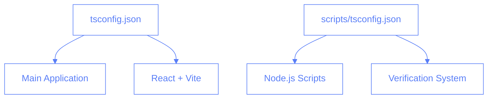

# TypeScript Configuration

This document outlines our TypeScript configuration strategy for both the React application and Node.js scripts.

## Overview

Our project uses two TypeScript configurations:

1. Main application configuration (`tsconfig.json`)
2. Scripts configuration (`scripts/tsconfig.json`)



## Main Application Configuration

The main `tsconfig.json` is optimized for our React + Vite application:

```json
{
  "compilerOptions": {
    "target": "ES2020",
    "useDefineForClassFields": true,
    "lib": ["ES2020", "DOM", "DOM.Iterable"],
    "module": "ESNext",
    "skipLibCheck": true,
    "moduleResolution": "bundler",
    "allowImportingTsExtensions": true,
    "resolveJsonModule": true,
    "isolatedModules": true,
    "noEmit": true,
    "jsx": "react-jsx",
    "strict": true,
    "noUnusedLocals": true,
    "noUnusedParameters": true,
    "noFallthroughCasesInSwitch": true,
    "baseUrl": ".",
    "paths": {
      "@/*": ["./src/*"]
    }
  },
  "include": ["src"],
  "exclude": ["node_modules", "scripts"]
}
```

### Key Features

1. **Modern JavaScript Support**

   - ES2020 target
   - DOM and DOM.Iterable libraries
   - Class fields support

2. **React Configuration**

   - JSX support
   - React-specific settings

3. **Module Resolution**

   - Bundler-based resolution
   - Path aliases for clean imports
   - JSON module support

4. **Type Safety**
   - Strict mode enabled
   - Unused code checks
   - Switch case fallthrough prevention

## Scripts Configuration

The `scripts/tsconfig.json` is tailored for Node.js scripts:

```json
{
  "compilerOptions": {
    "target": "ES2022",
    "module": "ESNext",
    "moduleResolution": "Node",
    "allowSyntheticDefaultImports": true,
    "esModuleInterop": true,
    "strict": true,
    "skipLibCheck": true,
    "baseUrl": ".",
    "paths": {
      "@/*": ["../src/*"]
    },
    "types": ["node"]
  },
  "include": ["./**/*.ts"],
  "exclude": ["node_modules"]
}
```

### Key Features

1. **Node.js Optimization**

   - Node.js module resolution
   - ES2022 target for modern Node features
   - Node.js type definitions

2. **Module Compatibility**

   - ESM support
   - CommonJS interop
   - Synthetic default imports

3. **Path Resolution**
   - Access to main app source via @/\* alias
   - Relative path support
   - Node.js-specific module resolution

## Path Aliases

Both configurations use the `@/*` alias to reference the main application's source code:

```typescript
// In React components
import { Button } from '@/components/ui/button';

// In scripts
import { COLLECTIONS } from '@/consts';
```

## Best Practices

1. **Configuration Separation**

   - Keep configurations separate for different environments
   - Don't mix React and Node.js settings
   - Use appropriate module resolution for each context

2. **Path Aliases**

   - Use `@/*` consistently across the project
   - Keep paths relative within each context
   - Avoid deep imports from node_modules

3. **Type Safety**

   - Enable strict mode in all configurations
   - Use appropriate lib and types settings
   - Keep skipLibCheck enabled for performance

4. **Module Resolution**
   - Use bundler for React application
   - Use Node for scripts
   - Configure ESM properly

## Common Issues

1. **Path Resolution**

   ```typescript
   // ❌ Wrong
   import { Button } from '../../components/ui/button';

   // ✅ Right
   import { Button } from '@/components/ui/button';
   ```

2. **Module Imports**

   ```typescript
   // ❌ Wrong
   import firebase from 'firebase';

   // ✅ Right
   import { initializeApp } from 'firebase/app';
   ```

3. **Type Definitions**

   ```typescript
   // ❌ Wrong
   const data: any = fetchData();

   // ✅ Right
   interface Data {
     id: string;
     name: string;
   }
   const data: Data = fetchData();
   ```

## Maintenance

1. **Regular Updates**

   - Keep TypeScript version up to date
   - Update lib versions as needed
   - Review and update paths configuration

2. **Performance**

   - Monitor build times
   - Optimize include/exclude patterns
   - Use incremental builds when possible

3. **Compatibility**
   - Test with all Node.js versions in use
   - Verify React compatibility
   - Check third-party package support
