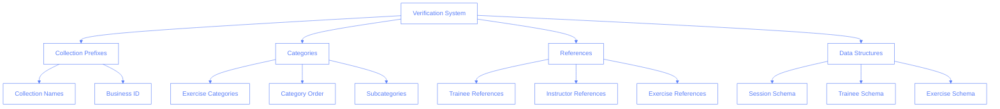
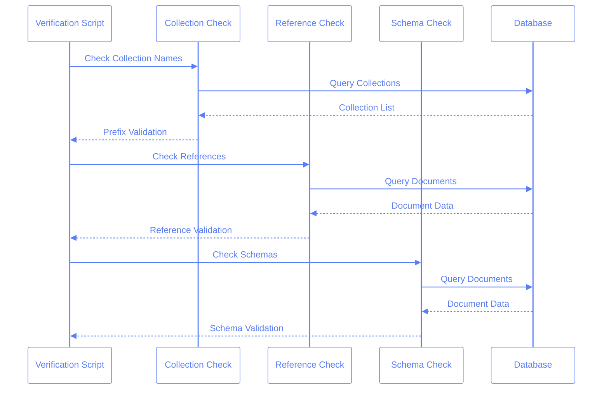

# Verification System

This document outlines our database verification system that ensures data integrity and schema compliance.

## Overview

The verification system is a critical component that validates our Firestore database structure, references, and data integrity. It runs as part of our deployment process and can be executed locally for development.



## Verification Components

### 1. Collection Prefixes

Verifies that collection names follow our naming convention:

```typescript
interface CollectionPrefix {
  collection: string;
  requiresPrefix: boolean;
}

const collections: CollectionPrefix[] = [
  { collection: 'instructors', requiresPrefix: true },
  { collection: 'trainees', requiresPrefix: true },
  { collection: 'exercises', requiresPrefix: false },
  { collection: 'sessions', requiresPrefix: true },
];
```

### 2. Categories

Validates exercise categories and their order:

```typescript
const CATEGORY_ORDER = [
  'warmup',
  'mat',
  'reformer',
  'cadillac',
  'chair',
  'barrels',
] as const;

const WARMUP_SUBCATEGORY_ORDER = ['standing', 'sitting', 'lying'] as const;
```

### 3. References

Ensures referential integrity:

```typescript
interface Reference {
  sourceCollection: string;
  targetCollection: string;
  field: string;
}

const references: Reference[] = [
  {
    sourceCollection: COLLECTIONS.sessions,
    targetCollection: COLLECTIONS.trainees,
    field: 'traineeId',
  },
  {
    sourceCollection: COLLECTIONS.sessions,
    targetCollection: COLLECTIONS.instructors,
    field: 'instructorId',
  },
];
```

### 4. Data Structures

Validates document schemas:

```typescript
interface SessionSchema {
  traineeId: string;
  instructorId: string;
  date: Timestamp;
  exercises: {
    id: string;
    category: (typeof CATEGORY_ORDER)[number];
    subcategory?: (typeof WARMUP_SUBCATEGORY_ORDER)[number];
    notes?: string;
  }[];
}

interface TraineeSchema {
  name: string;
  email: string;
  nextSession?: {
    date: Timestamp;
    instructorId: string;
  };
}
```

## Verification Process



## Running Verifications

### Local Development

```bash
# Start emulators
npm run emulators

# Run verification
npm run verify-deployment
```

### CI/CD Pipeline

```yaml
verify:
  runs-on: ubuntu-latest
  steps:
    - uses: actions/checkout@v2
    - uses: actions/setup-node@v2
    - run: npm ci
    - run: npm run verify-deployment
```

## Error Handling

The verification system uses a consistent error reporting format:

```typescript
interface VerificationError {
  type: 'collection' | 'reference' | 'schema';
  message: string;
  details?: unknown;
}

interface VerificationResult {
  success: boolean;
  errors: VerificationError[];
}
```

Example error messages:

```typescript
// Collection prefix error
{
  type: 'collection',
  message: 'Collection "trainees" missing business ID prefix',
  details: { collection: 'trainees', businessId: 'xyz' }
}

// Reference error
{
  type: 'reference',
  message: 'Invalid trainee reference in session',
  details: { sessionId: '123', traineeId: '456' }
}

// Schema error
{
  type: 'schema',
  message: 'Invalid exercise category',
  details: {
    sessionId: '123',
    exercise: { category: 'invalid' }
  }
}
```

## Best Practices

1. **Running Verifications**

   - Run before deployments
   - Run after data migrations
   - Run during development when making schema changes

2. **Error Handling**

   - Log errors with context
   - Include document IDs in error messages
   - Provide actionable error messages

3. **Performance**

   - Use batch operations for queries
   - Implement early termination for critical errors
   - Cache results when possible

4. **Maintenance**
   - Update schemas when data model changes
   - Keep reference checks current
   - Document new verification rules

## Common Issues

1. **Missing Business ID**

   ```typescript
   // ❌ Wrong
   const collection = 'trainees';

   // ✅ Right
   const collection = `${BUSINESS_ID}_trainees`;
   ```

2. **Invalid References**

   ```typescript
   // ❌ Wrong
   await addSession({ traineeId: 'invalid' });

   // ✅ Right
   const trainee = await getTrainee(traineeId);
   if (trainee) {
     await addSession({ traineeId });
   }
   ```

3. **Schema Violations**

   ```typescript
   // ❌ Wrong
   const exercise = { category: 'unknown' };

   // ✅ Right
   const exercise = {
     category: CATEGORY_ORDER[0],
     subcategory: WARMUP_SUBCATEGORY_ORDER[0],
   };
   ```

## Adding New Verifications

1. Create verification function
2. Add to verification pipeline
3. Update documentation
4. Add test cases
5. Update error handling
