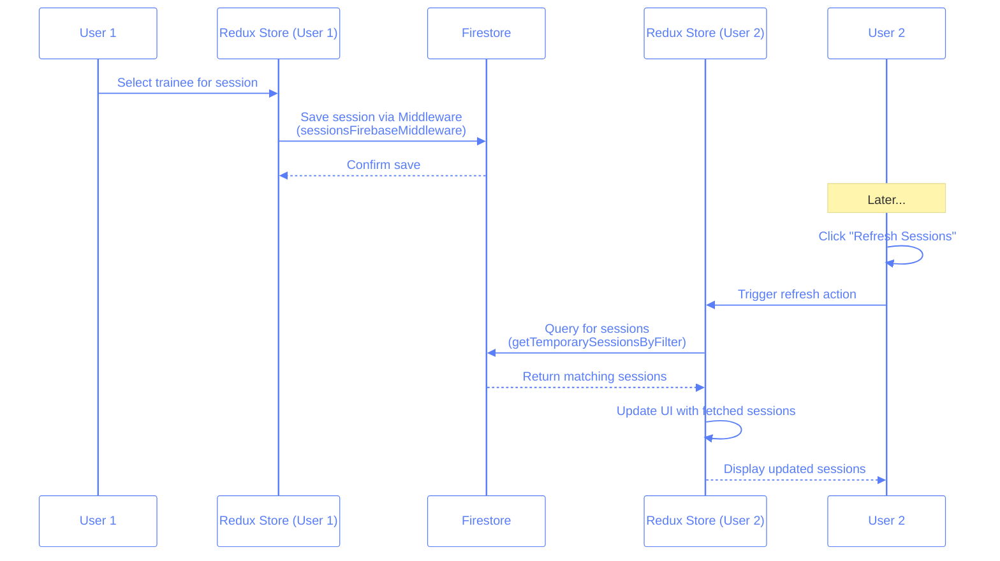

# Temporary Sessions Sync Mechanism

This document explains how temporary sessions are synchronized between users in the Pilates Studio app, the issues identified, and how to fix them.

## What are Temporary Sessions?

Temporary sessions are ephemeral session records stored in Firestore that allow users to see and interact with session changes. They have these key characteristics:

- Stored in collections named either `temp_sessions` or `{BUSINESS_ID}:temp_sessions` (depending on configuration)
- Have a unique `tempId` field
- Contain scheduling data (trainee, instructor, datetime, room, studio)
- Are synced between users through manual refresh

## How Manual Sync Works

The app uses a manual refresh approach rather than real-time listeners to retrieve and update session data:



### Key Components in the Flow

1. **Session Creation/Update**:

   - User selects a trainee for an empty session
   - Redux updates local state via `updateTemporarySession` action
   - `sessionsFirebaseMiddleware` detects the change and calls `sessionsService.addTemporary()`
   - Session is saved to Firestore

2. **Session Retrieval**:
   - User clicks "Refresh Sessions" button
   - `refreshTemporarySessionsForCurrentView` function is called
   - Function calls `sessionsService.getTemporarySessionsByFilter()`
   - Redux is updated with fetched sessions via `refreshTemporarySessions` action

## Issues Identified

Based on the console logs and code review, we've identified several issues:

### 1. Date/Time Mismatch

Sessions are being saved with one date but queried with another:

```
// Saved session datetime
datetime: "2025-02-12 07:00"

// Query filter
{date: '2025-04-21', hour: '07:00', room: "1", studio: "2"}
```

This mismatch means the app can't find sessions that exist in Firestore when users try to refresh.

### 2. Type Inconsistency in Filters

Room and studio IDs may be inconsistently treated as strings vs numbers:

```
// Room/studio filter in Redux
roomId: 1, studioId: 2  // numbers

// What Firestore expects
roomId: "1", studioId: "2"  // strings
```

This causes queries to fail when the types don't match.

### 3. Collection Name Configuration

The collection name depends on environment variables:

```javascript
const TEMP_COLLECTION_NAME = USE_BUSINESS_ID
	? `${BUSINESS_ID}:temp_sessions`
	: "temp_sessions";
```

If these variables are inconsistent between users or environments, they'll be looking at different collections.

### 4. Debuggability Issues

The logs show that even though the app attempts to debug issues by checking all sessions, it doesn't always correctly correlate the results with specific issues.

### 5. Multiple Refresh Needed

Test logs show that often a second refresh is needed to see sessions:

```javascript
// IMPORTANT: Second click of the refresh button - this is usually needed to see the sessions
console.log("🔄 User 2: Second click of Refresh Sessions button...");
```

## Implemented Solutions

We've implemented several fixes to address these issues:

### 1. Auto Double-Refresh Mechanism

Instead of requiring users to click the refresh button twice, we've automated this process:

```javascript
// Implemented in usePersistentSessions.ts
const refreshTemporarySessionsForCurrentView = useCallback(
	async (isSecondAttempt = false) => {
		// Normal refresh logic...

		// Automatically perform a second refresh if this was the first attempt
		if (!isSecondAttempt && !isPerformingSecondRefresh) {
			setIsPerformingSecondRefresh(true);

			// Wait 2 seconds before performing the second refresh
			setTimeout(async () => {
				console.log("🔄 Performing automatic second refresh...");
				try {
					await refreshTemporarySessionsForCurrentView(true);
				} catch (secondRefreshError) {
					console.error(
						"❌ Error during automatic second refresh:",
						secondRefreshError
					);
				} finally {
					setIsPerformingSecondRefresh(false);
				}
			}, 2000);
		}
	}
);
```

### 2. Consistent Type Handling

We've enforced string conversion for IDs in both filtering and storage:

```javascript
// When querying
const roomStr = String(room);
const studioStr = String(studio);

// When retrieving from Firestore
const results = querySnapshot.docs.map((doc) => {
	const data = doc.data();
	return {
		...data,
		tempId: doc.id,
		roomId: data.roomId ? String(data.roomId) : undefined,
		studioId: data.studioId ? String(data.studioId) : undefined,
	};
});
```

### 3. Enhanced Error Logging

We've added detailed diagnostic logging to help identify issues:

```javascript
// If no results found, try to diagnose why
if (results.length === 0) {
	console.log("❓ Debug: No sessions found. Possible reasons:");
	console.log(`1. No sessions exist in collection "${TEMP_COLLECTION_NAME}"`);
	console.log(
		`2. Date format mismatch (expected: "${date} ${normalizedHour}")`
	);
	console.log(
		`3. Room/Studio ID type mismatch (expected: roomId="${roomStr}", studioId="${studioStr}")`
	);

	// Sample a few sessions from collection to help debugging
	// ...
}
```

### 4. Debug Mode UI

Added a debug mode UI to help diagnose sync issues:


The debug mode:

- Shows all sessions in Firestore regardless of filters
- Highlights any filter mismatches in red
- Displays collection name and environment details
- Can be toggled on/off with a button

```jsx
{
	debugMode && (
		<div className="bg-slate-800 text-white p-2 rounded-md text-xs font-mono mb-4 overflow-x-auto">
			<h3 className="font-bold mb-2">Debug Info:</h3>
			{/* Environment & filter details */}
			<div className="mt-2">
				<h4 className="font-bold">
					All Sessions in Database ({debugSessions.length}):
				</h4>
				<div className="mt-1 max-h-80 overflow-y-auto">
					{debugSessions.map((session) => (
						<div
							key={session.tempId}
							className="border-t border-slate-700 py-1"
						>
							{/* Session details with mismatch highlighting */}
						</div>
					))}
				</div>
			</div>
		</div>
	);
}
```

### 5. Environmental Information Display

Added visual indicators to show which collection is being used:

```jsx
{
	isDevelopment && (
		<div className="text-xs text-slate-400 mt-1 ml-2">
			<span>
				Collection:{" "}
				{import.meta.env.VITE_USE_BUSINESS_ID === "true"
					? `${import.meta.env.VITE_BUSINESS_ID}:temp_sessions`
					: "temp_sessions"}
			</span>
			<span className="ml-3">
				Date: {selectedDate} | Hour: {selectedHour} | Room: {selectedRoom} |
				Studio: {selectedStudio}
			</span>
		</div>
	);
}
```

## Best Practices

1. **Always stringify IDs**: Convert all IDs to strings when storing and querying.
2. **Log key parts of queries**: Include extensive logging for date, room, and studio parameters.
3. **Double check date formats**: Ensure dates are in YYYY-MM-DD format consistently.
4. **Verify collection names**: Make sure all clients use the same collection name in each environment.
5. **Test multiple refresh scenarios**: The auto double-refresh mechanism helps handle race conditions.
6. **Use debug mode for troubleshooting**: Enable debug mode to see all sessions and filter mismatches.

## Troubleshooting Guide

If sessions are still not syncing properly:

1. **Check for date mismatches**: Debug mode will highlight if the date in Firestore doesn't match the current filter.
2. **Verify ID types**: Ensure roomId and studioId are consistently treated as strings.
3. **Check collection name**: Make sure the environment variables are set correctly.
4. **Look for stale data**: Old sessions might have incorrect formats. Use the debug mode to identify these.

## Answers

1. Why use manual refresh instead of real-time listeners?

   - [ ] A. It uses less bandwidth
   - [ ] B. It's more reliable in poor network conditions
   - [x] C. It gives users control over when to sync data
   - [ ] D. It's required by Firestore security rules

2. What's the primary cause of sessions not appearing after refresh?

   - [x] A. Date/time format mismatch between storage and query
   - [ ] B. Network connectivity issues
   - [ ] C. Wrong Firestore collection being used
   - [ ] D. Session data being corrupted

3. Why convert room and studio IDs to strings?

   - [ ] A. It saves storage space
   - [x] B. Firestore queries need consistent types for comparison
   - [ ] C. It's required by TypeScript
   - [ ] D. It makes debugging easier

4. Why is a double refresh sometimes needed?

   - [ ] A. First refresh clears the cache
   - [x] B. Race conditions in the data fetching process
   - [ ] C. Redux needs time to process the first update
   - [ ] D. Browser rendering limitations

5. What's the best approach to fix the sync issues?
   - [ ] A. Completely replace manual refresh with real-time listeners
   - [ ] B. Switch to a different database system
   - [x] C. Fix data type consistency and implement automatic double refresh
   - [ ] D. Create a completely new data structure for sessions
