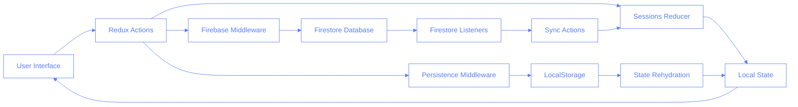

# User Synchronization Feature

## Description

The User Synchronization feature enables real-time data synchronization between multiple users of the Pilates Studio App. This ensures that all users have access to the most up-to-date information about trainees, sessions, and schedules regardless of which user made the changes.

Key capabilities:

- Real-time session updates across multiple clients
- Persistence of temporary data during synchronization
- Conflict resolution for simultaneous edits
- Automatic session data refresh when changes are detected
- Debounced updates to prevent excessive Firestore operations

## Tech Description and Schemas

The synchronization system is built on Firebase Firestore's real-time capabilities combined with Redux for local state management. The architecture follows a middleware pattern where Redux actions are intercepted, processed, and synchronized with Firestore.

### Architecture



### Data Flow

1. **User Interaction**: A user interacts with the application (e.g., creates, updates, or deletes a session)
2. **Redux Action**: The interaction dispatches a Redux action
3. **Middleware Interception**: Both the Firebase middleware and persistence middleware intercept the action
4. **Debounce Check**: The Firebase middleware checks if the session should be synced (using a debounce mechanism)
5. **Firestore Update**: If debounce check passes, the middleware updates the Firestore database
6. **Local Storage Update**: The persistence middleware updates the local storage
7. **Real-time Listener**: Other clients' Firestore listeners detect the change
8. **State Update**: The listeners dispatch synchronization actions to update the local Redux state
9. **UI Refresh**: The UI updates to reflect the changes

### Firestore Collections Structure

The sync feature uses two key collections in Firestore:

1. **`sessions`**: Stores permanent sessions that have been fully committed to the database

   - Each document has a unique document ID
   - Contains complete session data including trainee information, datetime, room, and exercise data
   - Used for long-term storage and historical reference

2. **`temp_sessions`**: Dedicated collection for temporary sessions that are still being edited
   - Documents are identified by their `tempId` field
   - Only sessions with valid `traineeId` values are synchronized to this collection
   - Sessions with `tempId` starting with "empty-" are excluded from synchronization
   - Collection includes additional metadata fields:
     - `lastUpdated`: Timestamp used for conflict resolution
     - `convertedFromEmpty`: Flag indicating if the session was converted from an empty placeholder
     - `originalEmptyId`: Reference to the original empty session ID (if applicable)

The separation between these collections allows for efficient real-time synchronization of in-progress sessions while maintaining a clean permanent database.

### Business ID Handling

The system supports two configuration modes for collection naming:

```typescript
// Old collection name with business ID prefix (when USE_BUSINESS_ID is true)
const OLD_COLLECTION_NAME = `${BUSINESS_ID}:sessions`;
const TEMP_OLD_COLLECTION_NAME = `${BUSINESS_ID}:temp_sessions`;

// New collection name without prefix (when USE_BUSINESS_ID is false)
const NEW_COLLECTION_NAME = "sessions";
const TEMP_NEW_COLLECTION_NAME = "temp_sessions";
```

When not using the business ID prefix, documents are filtered using a `studioId` field instead.

### Session Document Structure

Each session document in Firestore includes:

```typescript
interface Session {
	id?: string; // Firestore document ID for permanent sessions
	tempId: string; // Unique ID for temporary sessions
	traineeId: string; // ID of the associated trainee
	trainee: TraineeData; // Embedded trainee data for quick access
	datetime: string; // Format: "YYYY-MM-DD HH:MM"
	room: string; // Room identifier
	studioId: string; // Studio/business identifier
	instructorId?: string; // Optional instructor association
	instructor?: InstructorData; // Optional embedded instructor data
	categories: {
		// Exercise data organized by category
		[categoryId: string]: {
			completed: boolean;
			exercises: {
				[exerciseId: string]: {
					completed: boolean;
					notes?: string;
				};
			};
		};
	};
	comments?: string; // Optional session notes
	lastUpdated: number; // Timestamp for conflict resolution
	lastSynced?: number; // Timestamp of last sync with Firestore
}
```
