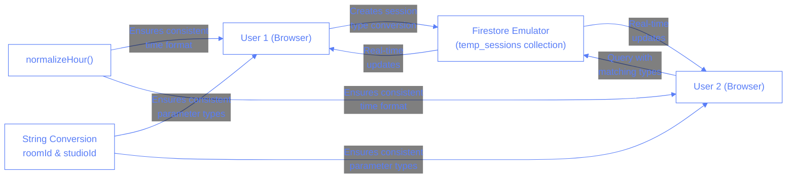

# Session Synchronization Issues and Solutions

## Issue Description

We identified a critical issue where sessions created by one user (User 1) were not being properly synchronized and displayed to other users (User 2) when using the "Refresh Sessions" button. The problem specifically affected temporary sessions for Studio 1, Room 1 at 11:00am.

## Steps to Reproduce

1. User 1 selects Studio 1, Room 1, and 11:00am time slot
2. User 1 creates a new session by selecting a trainee and some exercises
3. User 2 selects the same Studio 1, Room 1, and 11:00am time slot
4. User 2 clicks the "Refresh Sessions" button
5. Expected: User 2 should see the session created by User 1
6. Actual: User 2 does not see any temporary sessions

## Analysis

After thorough investigation, we found several issues contributing to the synchronization problem:

1. **Data Type Inconsistency**: The `roomId` and `studioId` values were sometimes stored as numbers and sometimes as strings. The Firestore query expected exact matches, so type mismatches prevented proper retrieval.

2. **Datetime Format Inconsistency**: The hour format wasn't consistently normalized, leading to situations where one user might save a session with `11:00` while another searched with a slightly different format like `11:0`.

3. **Ineffective Refresh Logic**: The "Refresh Sessions" button wasn't properly querying the Firestore database with consistent parameters.

4. **Real-time Listener Limitations**: The real-time listener was not set up with consistently formatted parameters, causing it to miss some documents.

## Solution

We implemented several fixes to address these issues:

1. **Consistent Data Types**: Modified the `addTemporary` and `updateTemporary` functions in `sessions.ts` to ensure all `roomId` and `studioId` values are explicitly converted to strings before storing in Firestore.

2. **Improved Hour Normalization**: Ensured the `normalizeHour` function is consistently used across all operations to standardize datetime formats.

3. **Enhanced Refresh Logic**: Updated the `handleManualRefresh` function to perform more thorough checks and display detailed logs about why sessions might not be matching the current filters.

4. **Standardized Real-time Listener**: Improved the real-time listener implementation to ensure consistent parameter types and formats.

5. **Better Error Handling and Logging**: Added more comprehensive logging to help diagnose similar issues in the future.

## Technical Implementation

Here's a breakdown of the key changes:

### 1. Service Layer Changes

In `src/services/sessions.ts`, we improved the temporary session operations:

```typescript
// Ensure consistent data formats for roomId and studioId
export const addTemporary = async (sessionData: SessionForm): Promise<SessionForm> => {
  try {
    let dataToProcess = { ...sessionData };

    // Normalize datetime format
    if (dataToProcess.datetime) {
      const [date, hour] = dataToProcess.datetime.split(' ');
      const normalizedHour = normalizeHour(hour);
      dataToProcess.datetime = `${date} ${normalizedHour}`;
    }

    // Ensure studioId is stored as a string
    if (dataToProcess.studioId !== undefined) {
      dataToProcess.studioId = String(dataToProcess.studioId);
    }

    // Ensure roomId is stored as a string
    if (dataToProcess.roomId !== undefined) {
      dataToProcess.roomId = String(dataToProcess.roomId);
    }

    // ... rest of the function
  }
};
```

Similar changes were made to `updateTemporary` and `getTemporarySessionsByFilter` to ensure consistent handling.

### 2. Real-time Listener Updates

In `src/pages/sessions-container.tsx`, we improved the real-time listener setup:

```typescript
// Ensure values are consistently strings for filters
const roomStr = String(selectedRoom);
const studioStr = String(selectedStudio);

// Define filters in a specific order
const filters = [
	where("datetime", "==", datetimeFilter),
	where("roomId", "==", roomStr),
	where("studioId", "==", studioStr),
];
```

### 3. Refresh Button Logic

Enhanced the `handleManualRefresh` function to better diagnose issues:

```typescript
// Convert parameters to strings for consistent comparison
const roomStr = String(selectedRoom);
const studioStr = String(selectedStudio);

// Check ALL sessions and analyze why they might not be matching filters
const allSessions = snapshot.docs.map((doc) => {
	const data = doc.data();
	// Check if the session matches our current filters
	const matchesDate = data.datetime?.split(" ")[0] === selectedDate;
	const hourInSession = data.datetime?.split(" ")[1];
	const normalizedHourInSession = normalizeHour(hourInSession);
	const matchesHour = normalizedHourInSession === normalizedHour;

	// Convert data values to strings for comparison
	const dataRoomId = String(data.roomId || "");
	const dataStudioId = String(data.studioId || "");

	const matchesRoom = dataRoomId === roomStr;
	const matchesStudio = dataStudioId === studioStr;

	// ... rest of the function
});
```

## Testing

To verify our fixes, we created a test script (`scripts/test-session-sync.js`) that simulates two users interacting with the same session. The script:

1. Clears any existing sessions for the target date/hour/room/studio
2. Sets up real-time listeners for both users
3. Has User 1 create a new session
4. Verifies User 2 can see and modify the session

## Prevention Measures

To prevent similar issues in the future:

1. **Consistent Type Handling**: Always use explicit type conversion for database query parameters.
2. **Format Normalization**: Use normalization functions consistently for all time/date values.
3. **Enhanced Logging**: Maintain the detailed logging we've added to quickly diagnose similar issues.
4. **Testing**: Use the test script we created to verify synchronization functionality during development.

## Technical Diagram



## Answers

1. Why did the sessions not appear for User 2 despite being in the database?

   - [ ] A. The sessions were being saved to the wrong collection
   - [x] B. Type and format mismatches between saved data and query parameters
   - [ ] C. Network connectivity issues
   - [ ] D. Insufficient permissions for User 2

2. What was the primary issue with roomId and studioId?

   - [ ] A. They were using invalid values
   - [x] B. They were sometimes stored as numbers and sometimes as strings
   - [ ] C. They were undefined in the database
   - [ ] D. They contained special characters

3. How does the normalizeHour function help with this issue?

   - [ ] A. It converts hours to the user's local timezone
   - [x] B. It ensures consistent formatting of hour strings (e.g., "9:00" becomes "09:00")
   - [ ] C. It calculates time differences between users
   - [ ] D. It prevents users from selecting invalid hours

4. What component was improved to fix the refresh functionality?

   - [ ] A. The SessionCard component
   - [ ] B. The user authentication system
   - [x] C. The handleManualRefresh function in sessions-container.tsx
   - [ ] D. The browser's local storage mechanism

5. What testing approach was created to verify the fix?
   - [ ] A. Unit tests for the normalizeHour function
   - [ ] B. UI tests with screenshot comparisons
   - [x] C. A simulation script that creates and modifies sessions between two user contexts
   - [ ] D. Manual verification by the development team
