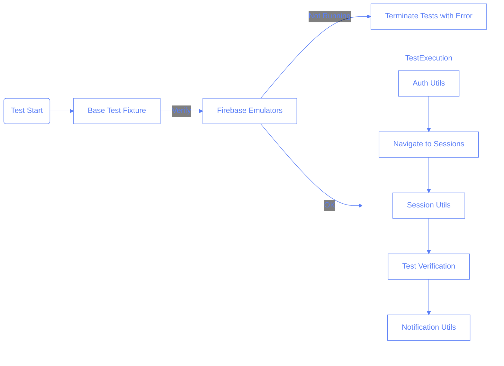

# Test Structure Documentation

## Overview

This document outlines the reorganized test structure for the Pilates Studio App, focusing on modular test utilities, automatic emulator verification, and clean test organization.

## Directory Structure

```
pilates-studio-app/tests/
├── fixtures/               # Test fixtures and extensions
│   ├── base-test.ts        # Base test with emulator verification
│   └── test-template.ts    # Template for new test files
├── utils/                  # Modular utility functions
│   ├── auth.ts             # Authentication utilities
│   ├── emulator.ts         # Firebase emulator utilities
│   ├── notifications.ts    # Toast notification utilities
│   ├── sessions.ts         # Session management utilities
│   └── setupScreenshots.ts # Screenshot utilities
├── setup/                  # Test setup code
│   └── global-setup.ts     # Global setup code run before tests
└── spec files              # Test specification files
```

## Key Features

### 1. Automatic Emulator Verification in All Tests

The most important improvement is the base test fixture that automatically verifies emulators are running for every test, without requiring test authors to remember to add this code:

```typescript
// fixtures/base-test.ts
import { test as base } from "@playwright/test";
import { ensureEmulatorsRunning } from "../utils/emulator";

// Extend the base test to create a test fixture that ensures emulators are running
export const test = base.extend({
	// Ensure emulators are running before the first test
	emulatorsRunning: [
		async () => {
			console.log(
				"🚦 Verifying Firebase emulators are running for this test..."
			);
			await ensureEmulatorsRunning();
			console.log("✅ All required emulators are running");
			return true;
		},
		{ scope: "worker" },
	],
});

// Re-export expect for convenience
export { expect } from "@playwright/test";
```

This approach means:

1. Every test gets emulator verification automatically
2. Test authors don't need to remember to add verification code
3. Tests have a consistent structure
4. Verification happens once per worker, making tests more efficient

### 2. Usage in Test Files

Test files import this base fixture instead of directly from Playwright:

```typescript
// Import from base-test instead of from '@playwright/test'
import { test, expect } from "./fixtures/base-test";
import { login } from "./utils/auth";
// ...other imports

test.describe("My Test Suite", () => {
	test("my test case", async ({ page, emulatorsRunning }) => {
		// Verification already happened, we can assert it was successful
		expect(emulatorsRunning).toBe(true);

		// Test code continues...
	});
});
```

### 3. Template for New Tests

To make it easier to follow the pattern, we provide a template file that test authors can copy:

```typescript
// tests/fixtures/test-template.ts
import { test, expect } from "./base-test";
import { login } from "../utils/auth";
import { setupScreenshots } from "../utils/setupScreenshots";

test.describe("Test Suite Name", () => {
	test("test case name", async ({ page, emulatorsRunning }) => {
		// Ensure emulators are running
		expect(emulatorsRunning).toBe(true);

		// Set up screenshots for test
		const saveScreenshot = setupScreenshots("test-name");

		// Login (if needed)
		await login(page);

		// Test steps go here...
	});
});
```

### 4. Modular Utility Functions

Utilities are organized by purpose into specific files:

#### Emulator Utils (`emulator.ts`)

```typescript
export async function verifyEmulators(): Promise<boolean> {
	/* ... */
}
export async function ensureEmulatorsRunning(): Promise<void> {
	/* ... */
}
export async function seedEmulator(): Promise<void> {
	/* ... */
}
export async function clearEmulator(): Promise<void> {
	/* ... */
}
```

#### Session Utils (`sessions.ts`)

```typescript
export async function addNewSession(page: Page) {
	/* ... */
}
export async function fillBasicSessionForm(page: Page, sessionCard: any) {
	/* ... */
}
export async function selectHour(page: Page, hour = "09:00") {
	/* ... */
}
```

#### Notification Utils (`notifications.ts`)

```typescript
export async function waitForToastNotification(
	page: Page,
	expectedText: string,
	timeout = 10000
): Promise<boolean> {
	/* ... */
}
// ...other notification utilities
```

## Technical Diagram



## Best Practices for Writing Tests

1. **Always import from base-test**: Use `import { test, expect } from "./fixtures/base-test"` instead of importing directly from Playwright.

2. **Use the emulatorsRunning fixture**: Include `emulatorsRunning` in your test parameters and assert it's true at the beginning of your test.

3. **Follow the template pattern**: Start with a copy of the template file when creating new tests.

4. **Be specific about what you're testing**: Each test should have a clear, specific purpose.

5. **Use screenshots liberally**: Take screenshots at key points in your test for easier debugging.

6. **Use appropriate utilities**: Import and use the specialized utility functions instead of writing custom code.

7. **Provide meaningful assertions**: Make sure your assertions clearly communicate what you're checking.

## When to Write a New Utility Function

Consider creating a new utility function when:

1. You find yourself repeating the same code in multiple tests
2. The operation is complex and would benefit from abstraction
3. The functionality might be used in future tests
4. It would make test code more readable by hiding implementation details

## Questions and Answers

1. Why use a base test fixture instead of a beforeAll hook?

   - [ ] A. It's faster
   - [x] B. It's automatically applied to all tests that use it and only runs once per worker
   - [ ] C. It's easier to implement
   - [ ] D. It's required by Playwright

2. What happens if the Firebase emulators aren't running?

   - [ ] A. Tests continue but skip emulator-dependent tests
   - [ ] B. Tests continue but may fail later with unclear errors
   - [x] C. Tests terminate immediately with a clear error message
   - [ ] D. Tests pause and wait for emulators to start

3. How do test authors benefit from this approach?

   - [ ] A. Tests run faster
   - [ ] B. Less code to write overall
   - [x] C. Don't need to remember to add emulator verification to each test
   - [ ] D. All of the above

4. What's the recommended approach for creating a new test file?
   - [ ] A. Write it from scratch
   - [x] B. Copy the test-template.ts file and modify it
   - [ ] C. Duplicate an existing test file
   - [ ] D. Use the Playwright test generator
