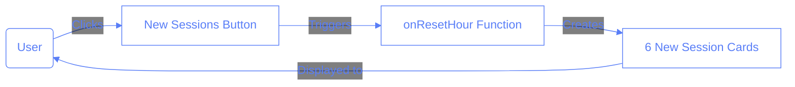

# UI Change: From '+' Button to 'New Sessions' Button

## Overview

This document outlines a significant UI change in the Pilates Studio Application where the previous `+` button for adding new sessions has been replaced with a more descriptive `New Sessions` button.

## Change Description

**Previous Implementation:**

```jsx
<Button
	variant="default"
	onClick={onAddCard}
	disabled={isAddingCard}
	className="text-white z-10 bg-slate-600 border-slate-400 m-2"
>
	{isAddingCard ? "..." : "+"}
</Button>
```

**New Implementation:**

```jsx
<Button
	variant="outline"
	onClick={() => {
		console.log("🔄 New Sessions button clicked");
		onResetHour();
	}}
	className="text-white z-10 bg-slate-600 border-slate-400 m-2 hover:bg-red-600/20"
>
	New Sessions
</Button>
```

## Technical Explanation

The change was implemented in the `SessionControls.tsx` component. The key differences include:

1. **Function Change**: Instead of calling `onAddCard()`, the new button calls `onResetHour()`.
2. **Button Style**: Changed from `variant="default"` to `variant="outline"`.
3. **Hover State**: Added a reddish hover effect with `hover:bg-red-600/20`.
4. **Descriptive Label**: Changed from the symbol `+` to the descriptive text `New Sessions`.

## Reason for Change

The change was made to improve user experience in the following ways:

1. **Clarity**: The `New Sessions` label clearly communicates the button's function, whereas the `+` symbol was ambiguous.
2. **Functionality**: The button now resets the hour and creates new session cards, which better aligns with the actual behavior.
3. **Accessibility**: Text labels are more accessible than symbolic representations.

## Technical Schema



## Impact on Testing

The UI change affected automated tests that were looking for the `+` button. The `test-utils.ts` file has been updated to search for the `New Sessions` button instead, with fallback mechanisms for backward compatibility.

## How to Use

To create new session cards:

1. Navigate to the Sessions page
2. Click the `New Sessions` button in the control bar
3. The system will create 6 empty session cards for the selected hour

## Questions and Answers

1. Why was the `+` button replaced with `New Sessions`?

   - [ ] A. It was a purely aesthetic decision
   - [ ] B. To reduce button size on mobile
   - [x] C. To provide clearer functionality indication
   - [ ] D. To match industry standards

2. What happens when you click the `New Sessions` button?

   - [ ] A. Adds a single new session
   - [x] B. Creates 6 new session cards
   - [ ] C. Opens a form to configure a new session
   - [ ] D. Duplicates the current session

3. Which function gets called when the `New Sessions` button is clicked?
   - [ ] A. onAddCard()
   - [x] B. onResetHour()
   - [ ] C. onRefresh()
   - [ ] D. createNewSession()
